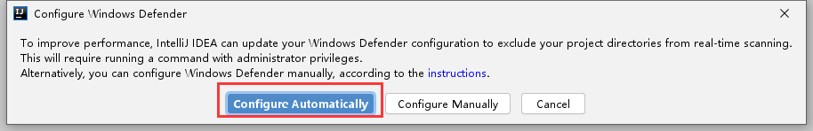

# [IDEA加载项目时提示Windows Defender might be impacting your build performance](https://blog.csdn.net/xjx891111/article/details/107456565) 

> IDE 已检测到启用了实时保护的 Microsoft Defender。它可能会严重降低 IDE 性能。建议将以下路径添加到 Defender 文件夹排除列表:

DEA加载项目时提示Windows Defender might be impacting your build performance. IntelliJ IDEA checked the following directories

原因：
这个是提示 windows defender（防火墙） 可能会影响性能，idea检查出下面这些文件夹 ：
一个是idea的设置路径，
一个是代码路径

大概能明白就是idea觉得windows defender 扫描 那两个文件夹会影响性能。看到这里就明白了，把这两个加到 windows defender的白名单即可 。

解决方案：
1.点击fix…,然后弹出对话框，选择：configure automatically ,ok.如图：

点击之后，右下角出现提示，一般就成功了，以后就不会弹出了。如图：

如果不成功，可以手动设置防火墙白名单。如图：

