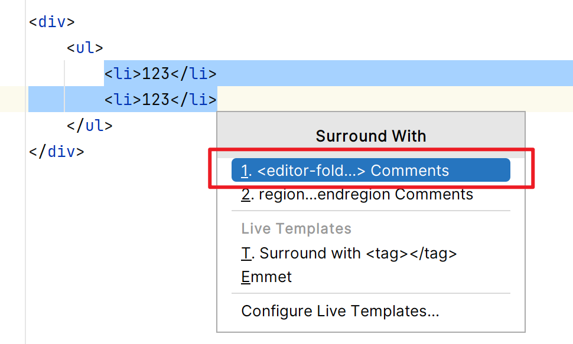
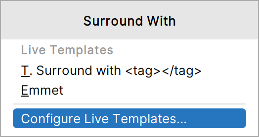
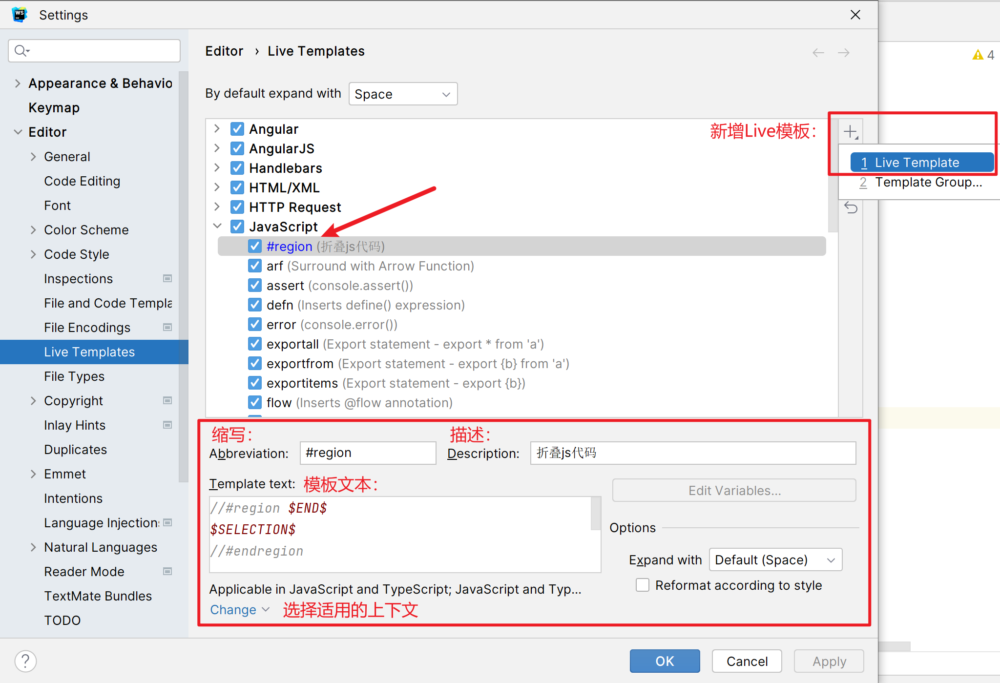
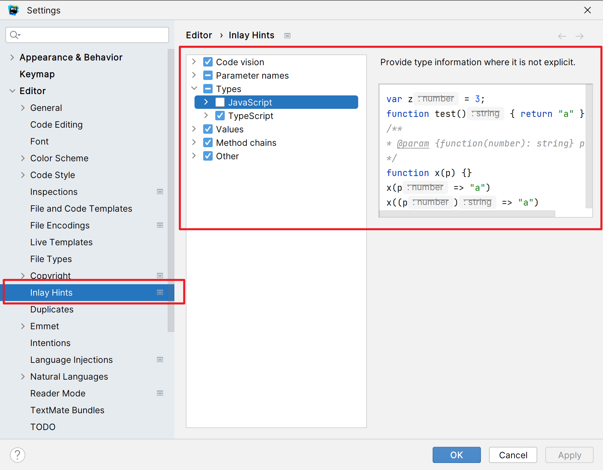

## 折叠代码块

CSS中：

```css
div {
    /*region 背景色*/
    background: #000c17;
    /*endregion*/
}
```

HTML中：

```html
<!--<editor-fold desc="折叠描述">-->
<ul>
    <li>123</li>
    <li>123</li>
</ul>
<!--</editor-fold>-->
```

JS中（两种均可）：

```js
//#region 声明变量a
let a = 2;
//#endregion    
//region 声明变量b
let b = 2;
//endregion
```

### 快捷键实现

使用这段代码包裹后，可以在 **Structure视图**中，看到你代码块的部分。也可以通过`Ctrl`+`F12` 查看当前类的代码结构。

在WebStorm中，使用快捷键 **`Ctrl + Alt + T`** 可以打开代码包围菜单，该功能允许您选择一种包围代码的结构，例如条件语句（if-else）、循环（for、while）、try-catch等。这样，您可以快速将选定的代码块包围在所选结构中，提高编码效率。

但对目前WebStorm（2023.1.3版本）代码包围菜单，只有HTML语言的**折叠代码块模板**，没有CSS、JS的，并且HTML的选中内容开头、结尾有空格也没有包围模板。



所以就需要自定义模板：

1. 首先，召唤出**代码包围菜单**，点击最下面的**配置Live模板**。

   

2. 以新增`JS`模板为例：在`JavaScript`模板组下，新增`Live模板`，配置如下：

   

   适用上下文选择使用到`JS`或`TS `语法的上下文。

   占位符解释：

   - `$SELECTION$`：表示选定的代码块。选定的代码将替换为该占位符。
   - `$END$`：表示插入包围结构之后的光标位置。

3. 点击”OK“。在`JS`中测试如下：

   - 输入`#`，可出现提示模板，回车即可应用。
   - `Ctrl + Alt + T`，也可看到实时模板中自定义的模板。

参考官网：[创建实时模板](https://www.jetbrains.com/help/webstorm/creating-and-editing-live-templates.html) [试试模板变量](https://www.jetbrains.com/help/webstorm/template-variables.html#predefined_functions) 


## 关掉方法的参数类型的提示

设置中搜索`Hints`（提示）即可。


