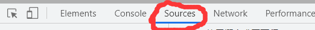
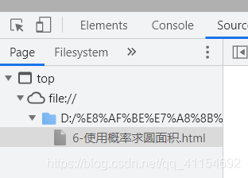
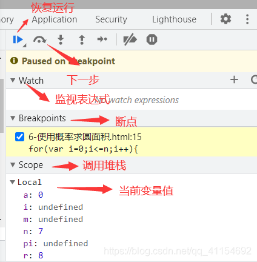

# 浏览器开发者工具

## `Sources ` 

当你在浏览器中右击网页并选择检查时，打开的是开发者工具。其中，Sources 选项卡可以列出网页中的所有文件资源，例如 HTML、CSS、JavaScript、图像和视频等。在 Sources 选项卡中，你可以查看这些资源的代码、调试 JavaScript 代码、设置断点和监视变量等。

在前端学习中，很多时候有些代码出了问题却难以便捷的找到，只能一行一行的寻找，很浪费时间。那么有什么快捷的方法呢？浏览器给我们提供了sources工具让我们能更快的调试自己的代码，更快的找到代码的问题点。

现在市场的浏览器都有调试器功能，这里我用谷歌浏览器做一个示范，使用调试器首先在浏览器中F12或者鼠标右键打开代码检查功能，然后点击sources打开调试器，如图：

进入之后，在左侧文件列表点击自己需要调试的文件，点击打开。如图

打开之后中部出现文件代码，可以选择自己要查看的断点（代码运行到这个地方会暂停），如下图：

在右侧则可以让代码一步一步逐渐运行，并且显示每一步变量的数值变化，可以很方便的查看代码到底是那一行出了问题，如下图（如果逐步运行无法点击，请刷新）

1. 点击恢复运行，恢复运行状态，不再暂停；
2. 点击下一步运行下一步
3. 如果想特别监视某一个变量或者表达式，可以点击监视表达式的添加，自行添加想监视的变量和表达式。
4. 断点则是当前选择的断点
5. 调用堆栈则是当前代码变量使用的存储空间
6. Local是运行该步骤是变量的值