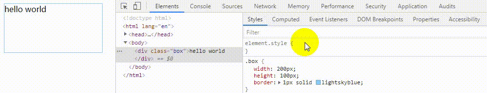
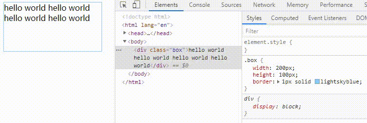
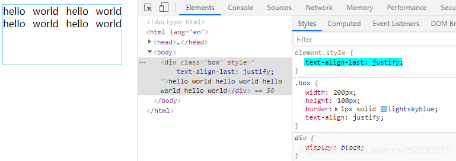
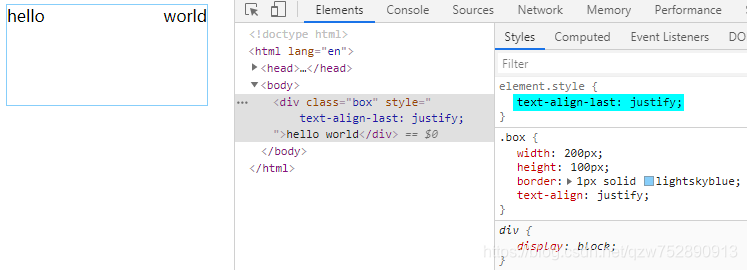
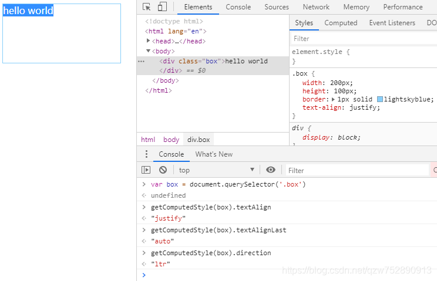
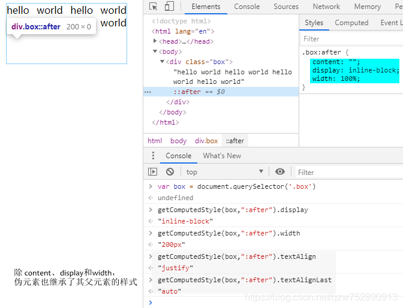
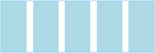
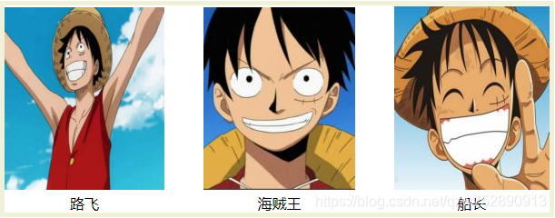
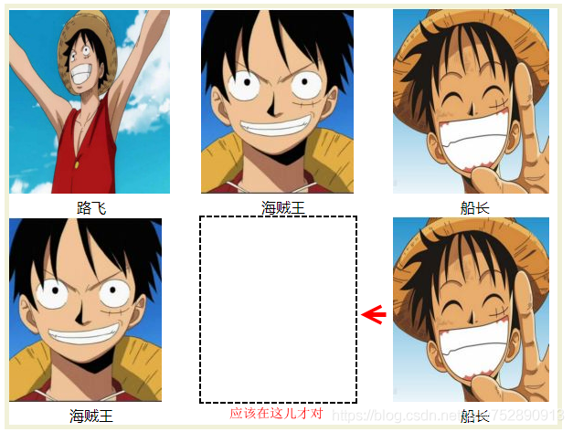
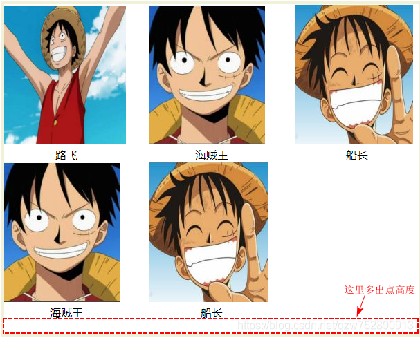

# text-align:justify实现两端对齐

#### text-align

**text-align** 作用在 块级元素上，用来控制 块级元素 里 内联元素 的水平对齐方式。
有**4**个属性值。

- `left`
  内联元素左侧 与 块级元素左侧 对齐，即左对齐
- `right`
  内联元素右侧 与 块级元素右侧对齐，即右对齐
- `center`
  内联元素中心 与 块级元素中心 对齐，即居中对齐
- `justify`
  内联元素左侧与块级元素左侧对齐，且内联元素右侧与块级元素右侧对齐， 即两端对齐

来直观地感受下。

```css
.box{
  width:200px;height:100px;
  border:1px solid lightskyblue
}
```

```html
<body>
  <div class="box">hello world</div>
</body>
```



#### 问题

`left`|`right`|`center`时，OK；但`justify`时，文本“hello world”没有两端对齐。
我们让 文本长一点，“hello world hello world hello world hello world”。



这时 文本分两行了，且第一行的文本两端对齐了，但**最后一行**的文本没有两端对齐。

#### 解决方法

既然最后一行没有两端对齐，那我们就想办法让最后一行对齐。
有两种解决方法。

##### 第一种 text-align-last

```css
.box{
  width:200px;height:100px;
  border:1px solid lightskyblue;

  text-align:justify;
  text-align-last:justify;
}
```





**text-align-last** 也作用在 块级元素上，用来控制 块级元素内 最后一行 的对齐方式。
最后一行也是内联元素，像 文本、span 等 display 为 inline | inline-block 的元素。
有**7**个属性值。

- `left`
  最后一行左侧 与 内容盒子左侧 对齐，即左对齐

- `right`
  最后一行右侧 与 内容盒子右侧 对齐，即右对齐

- `center`
  最后一行中心 与 内容盒子中心 对齐，即居中对齐

- `justify`
  最后一行左侧 与 内容盒子左侧对齐，最后一行右侧 与 内容盒子右侧对齐，即两端对齐

- `auto`

  text-align值为`left`，此时`text-align-last:auto`相当于 `text-align-last:left`；
  text-align值为`right`，此时`text-align-last:auto`相当于 `text-align-last:right`；

  text-align值为`center`，此时`text-align-last:auto`相当于 `text-align-last:center`；
  text-align值为`justify`，text-align-last这会儿突然就傲娇了，不随text-align了。此时，`text-align-last:auto`相当于 `text-align-last:start`；

- `start`
  direction值为`ltr`，此时`text-align-last:start`相当于`text-align-last:left`，左对齐；
  direction值为`rtl`，此时`text-align-last:start`相当于`text-align-last:right`，右对齐；

- `end`
  direction值为`ltr`，此时`text-align-last:end`相当于`text-align-last:right`，右对齐；
  direction值为`rtl`，此时`text-align-last:end`相当于`text-align-last:left`，左对齐；

我们重新回到问题。
此时的 text-align值为`justify`，text-align-last值为`auto`，direction值为`ltr`，所以最终的效果是，最后一行左对齐，即最后的文本左侧 与 内容盒子左侧对齐，没毛病。
蓝色部分就是 内容盒子



##### 第二种 使用伪元素

让伪元素成为最后一行。

```css
.box{
  width:200px;height:100px;
  border:1px solid lightskyblue;
  text-align:justify;
}
.box:after{
  content:"";
  display:inline-block;
  width:100%;
}
```



#### 实例：两端对齐 等间隔

##### 实例1

```css
  .container{
    list-style: none;
    margin:0;
    padding:0;
    width:300px;
    height:100px;
    border:1px solid lightskyblue;
    text-align:justify;
    text-align-last:justify;
  }
  .box{
    width:50px;
    height:inherit;
    background-color:lightblue;
    display:inline-block;
  }
```

```html
<body>
<ul class="container">
  <li class="box"></li>
  <li class="box"></li>
  <li class="box"></li>
  <li class="box"></li>
  <li class="box"></li>
</ul>
</body>
```



```css
  .container{
    list-style: none;
    margin:0;padding:0;
    width:600px;
    border:5px solid rgb(241, 241, 217);
    background-color:#fff;
    text-align:justify;
    text-align-last:justify;
  }
  .content{
    display:inline-block;
    text-align:center;
    width:180px;
  }
  .note{
    text-align-last:center;
  }
```

```html
<body>
  <ul class="container">
    <li class="content">
      
      <div class="note">路飞</div>
    </li>
    <li class="content">
      
      <div class="note">海贼王</div>
    </li>    
    <li class="content">
      
      <div class="note">船长</div>
    </li>   
  </ul>
</body>
```



**问题**

```html
<body>
  <ul class="container">
    <li class="content">
      
      <div class="note">路飞</div>
    </li>
    <li class="content">
      
      <div class="note">海贼王</div>
    </li>    
    <li class="content">
      
      <div class="note">船长</div>
    </li>  
    <li class="content">
      
      <div class="note">海贼王</div>
    </li>    
    <li class="content">
      
      <div class="note">船长</div>
    </li> 
  </ul>
</body>
```



###### 解决方法

一行有3列，所以使用3个空的标签来占位，`<li class="content"></li>`。

```html
  <ul class="container">
    <li class="content">
      
      <div class="note">路飞</div>
    </li>
    <li class="content">
      
      <div class="note">海贼王</div>
    </li>    
    <li class="content">
      
      <div class="note">船长</div>
    </li>  
    <li class="content">
      
      <div class="note">海贼王</div>
    </li>    
    <li class="content">
      
      <div class="note">船长</div>
    </li> 
    <li class="content"></li>
    <li class="content"></li>
    <li class="content"></li>
  </ul>
```



多出的高度是 幽灵节点捣的鬼！
将`ul.container`的`font-size`设置为`0`，`li.content`的`font-size`设置为`16px`即可。
综上，css样式如下：

```css
  .container{
    list-style: none;
    margin:0;padding:0;
    width:600px;
    border:5px solid rgb(241, 241, 217);
    background-color:#fff;
    text-align:justify;
    text-align-last:justify;
    font-size:0;
  }
  .content{
    display:inline-block;
    text-align:center;
    width:180px;
    font-size:16px;
  }
  .note{
    text-align-last:center;
  }
```

#### 参考文章

[text-align](https://developer.mozilla.org/zh-CN/docs/Web/CSS/text-align)
[text-align-last](https://developer.mozilla.org/zh-CN/docs/Web/CSS/text-align-last)