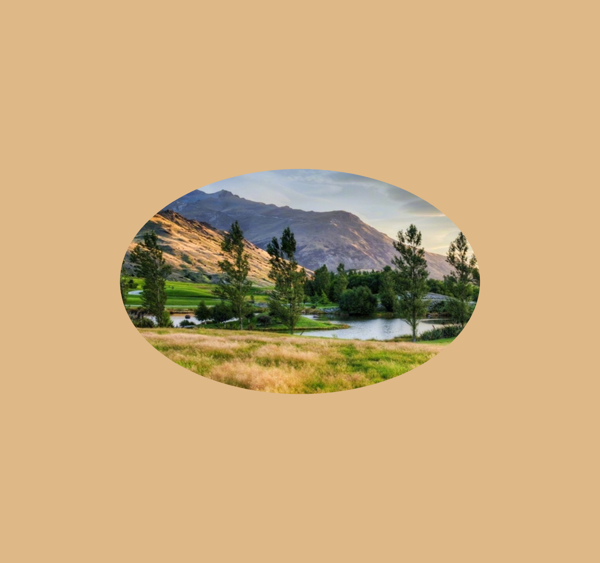
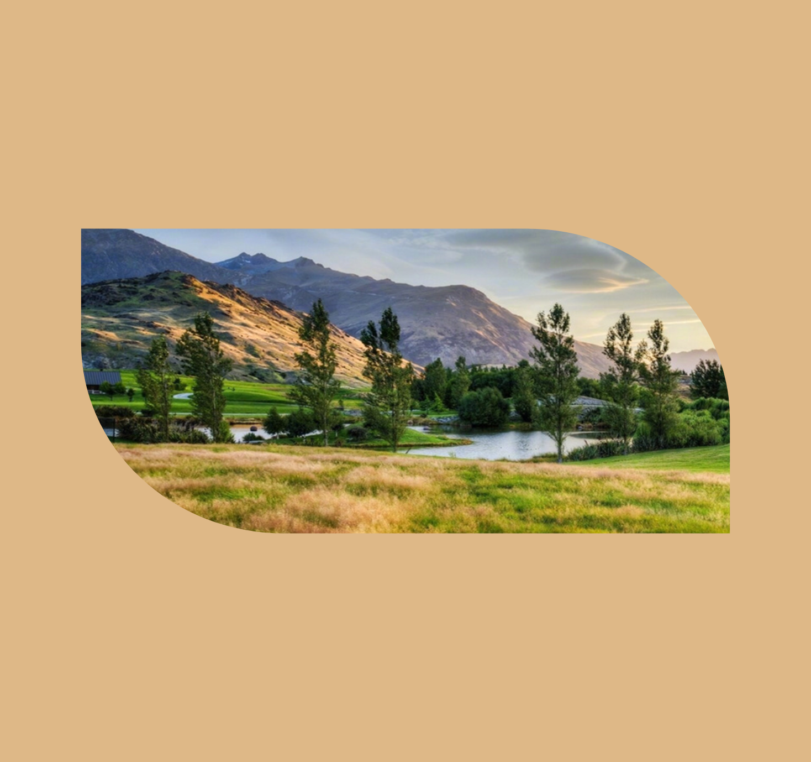
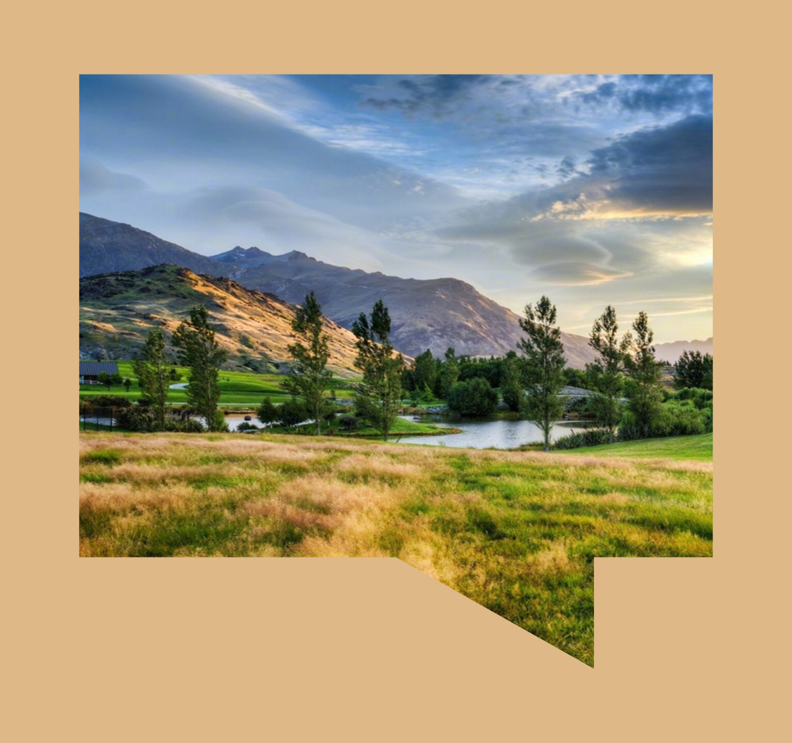

## 三角形


```html
<style>
    * {
        padding: 0;
        margin: 0;
    }
    body {
        width: 100vw;
        height: 100vh;
    }
    div.clip_class {
        width: 100%;
        height: 100%;
        background: url('./img01.jpg') 0 0 no-repeat;
        clip-path: polygon(0 100%, 50% 0, 100% 100%); /* 三角形 */
        background-size: cover;
    }
</style>
<div class="clip_class"></div>
```

### 分析

首先，和位置属性非常相像，我们需要考虑`X`和`Y`的值。`X:0` 以及 `Y:0` 表示从元素的左上角开始，并从那里移动。 `X:100%` 表示元素右边， `Y:100%` 表示元素的底部。

Got it~所以，上面创建的路径，它实际上创建了如下的点：

```bash
x: 0, y:100%
x: 50%, y: 0
x: 100%, y: 100%
```

这条简单的路径从左下角的坐标点开始，水平移动到`50%`的位置，然后垂直向上到达顶部的坐标点，接着水平移动到`100%`的位置，最后垂直向下回到底部，到达第三个坐标点。这样子用三个点就完成了一个三角形！

所以边界之外的所有东西都会被直接剪裁，无法显示。而元素本身仍然保持其尺寸，只是它的表示层改变了。

# 形状

## 圆形


```css
clip-path: circle(40% at 50% 50%); /* 圆形 */
```

> 要创建圆形，我们需要在圆形中输入三个值。圆心的**`x`轴**和**`y`轴**坐标，以及圆的**半径**。先定义圆的半径，再使用关键词**`at`**来定义圆心的`x`和`y`坐标。

## 椭圆



```css
clip-path: ellipse(30% 20% at 50% 50%); /* 椭圆 */
```

> 为了省略，只需要提供四个值。椭圆的`x`轴半径和`y`轴半径（或形状），后面跟一个`at`关键字，用于分开另外一组用于定义椭圆位置的`x`和`y`坐标。

## inset



```css
clip-path: inset(30% 10% 30% 10% round 0 25% 0 25%); /* inset */
```

> 因为多边形边缘锐利，所以它可能不是你想要的东西，你想创建的是圆角矩形，所以我们来看看Inset的值。Inset使用四个值（对应“**上 右 下 左**”的顺序）来设置**圆角半径**。
>
> 上面的各个值分别对应：
>
> ```css
> inset(<top> <right> <bottom> <left> round <top-radius> <right-radius> <bottom-radius> <left-radius>)
> ```
>
> 简写：
>
> ```css
> clip-path: inset(30% 10% round 0 25%); /* inset */
> ```

## 快速参考

- **Circle:** *circle(radius at x-axis y-axis)*
- **Ellipse:** *ellipse(x-rad y-rad at x-axis y-axis)*
- **Polygon:** *polygon(x-axis y-axis, x-axis y-axis, … )*
- **Inset:** *inset(top right bottom left round top-radius right-radius bottom-radius left-radius)*

# 创建形状

因为圆形和圆角形状被限制了只能有几个参数值，所以多边形是我们创建复杂形状的最好选择。多边形有定义多个点的能力，有助于我们以各种方式来裁剪元素。

## 漫画文本框



```css
clip-path: polygon(10% 10%, 90% 10%, 90% 75%, 75% 75%, 75% 90%, 50% 75%, 10% 75%); /* 漫画文本框 */
```

## 五角星


```css
clip-path: polygon(50% 0%, 63% 38%, 100% 38%, 69% 59%, 82% 100%, 50% 75%, 18% 100%, 31% 59%, 0 38%, 37% 38%); /* 五角星 */
```

## 动画


```html
<style>
    * {
        padding: 0;
        margin: 0;
    }
    body {
        width: 100vw;
        height: 100vh;
        background-color: burlywood;
    }
    div.clip_class {
        width: 100%;
        height: 100%;
        background: url('./img01.jpg') 0 0 no-repeat;
        clip-path: polygon(20% 0%, 0% 0%, 0% 50%, 0% 80%, 0% 100%, 50% 100%, 80% 100%, 100% 100%, 100% 50%, 100% 0%, 80% 0%, 50% 0%); /* 动画 */
        background-size: cover;
        transition: clip-path 0.5s;
    }
    div.clip_class:hover {
        clip-path: polygon(20% 0%, 0% 20%, 30% 50%, 0% 80%, 20% 100%, 50% 70%, 80% 100%, 100% 80%, 70% 50%, 100% 20%, 80% 0%, 50% 30%);
    }
</style>
<div class="clip_class"></div>
```

> 我们可以给形状应用一个`hover`，并用过渡属性来创建平滑的效果。但是我们需要记住，我们创建的初始默认状态，必须同所有的`hover`状态都使用相同的坐标系。

# 案例


```html
<style>
    :root {
        --nav: rgba(238, 236, 225, 0.95);
        --height: 108px;
    }
    body {
        font-family: 'Playfair Display', serif;
        font-weight: 300;
        background: #ffeac4;
    }
    header {
        height: 300px;
        background-image: url(./img01.jpg);
        background-size: cover;
        background-position: bottom;
        margin: 0 auto;
        /* 相对定位(relative)：相对于自己原来的位置进行偏移，作为绝对定位(absolute)的父元素 */
        position: relative;
        /* x轴多出部分不显示 */
        overflow-x: hidden;
    }
    header nav {
        /* 绝对定位(absolute) */
        position: absolute;
        bottom: calc(50% - 54px);
        width: 100%;
    }
    header nav ul {
        width: 600px;
        font-size: 0;
        padding: 0;
        margin: 0 auto;
        /* 相对定位(relative) */
        position: relative;
    }
    header nav ul:before {
        top: var(--height);
        height: var(--height);
        display: block;
        position: relative;
        left: -100%;
        content: "";
        background: var(--nav);
    }
    header nav ul:after {
        width: 100%;
        height: var(--height);
        display: block;
        position: absolute;
        left: 99.5%;
        top: var(--height);
        content: "";
        background: var(--nav);
    }
    header nav ul li {
        display: inline-block;
        width: 20.25%;
        margin: 0 -1px;
        text-align: center;
        background: var(--nav);
        font-size: 21px;
        clip-path: polygon(50% 0, 70% 0, 100% 0, 100% 100%, 70% 100%, 50% 100%, 30% 100%, 0 100%, 0 0, 30% 0);
        transition: all .3s;
    }
    header nav ul li:hover {
        clip-path: polygon(50% 20%, 70% 0, 100% 0, 100% 100%, 70% 100%, 50% 80%, 30% 100%, 0 100%, 0 0, 30% 0);
    }
    header nav a {
        padding: 26px 0;
        width: 100%;
        display: block;
        text-decoration: none;
        color: #222;
    }
    header nav a i.fa {
        transform: none;
    }
</style>
<!-- 引入字体图标 -->
<link rel="stylesheet" href="https://maxcdn.bootstrapcdn.com/font-awesome/4.3.0/css/font-awesome.min.css">
<header>
    <nav>
        <ul>
            <li>
                <a href="#">
                    <i class="fa fa-diamond"></i><br>
                    Home
                </a>
            </li>
            <li>
                <a href="#">
                    <i class="fa fa-bolt"></i><br>
                    Info
                </a>
            </li>
            <li>
                <a href="#">
                    <i class="fa fa-briefcase"></i><br>
                    Work
                </a>
            </li>
            <li>
                <a href="#">
                    <i class="fa fa-heartbeat"></i><br>
                    Contact
                </a>
            </li>
            <li>
                <a href="#">
                    <i class="fa fa-sun-o"></i><br>
                    Gallery
                </a>
            </li>
        </ul>
    </nav>
</header>
```

