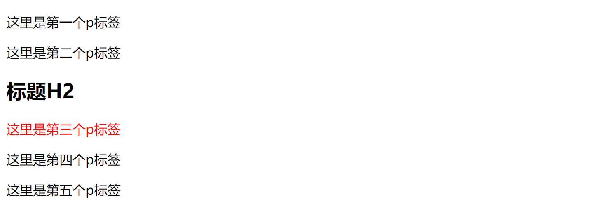
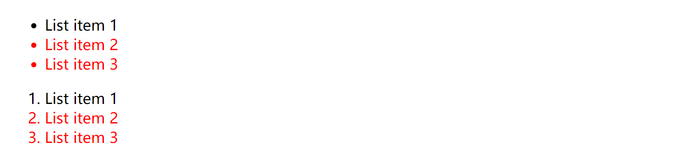
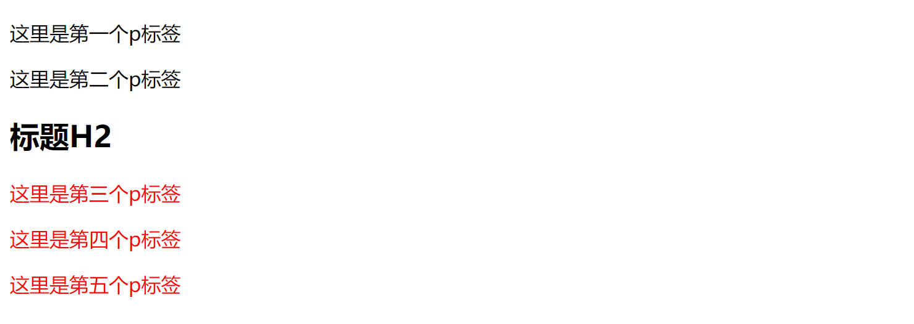
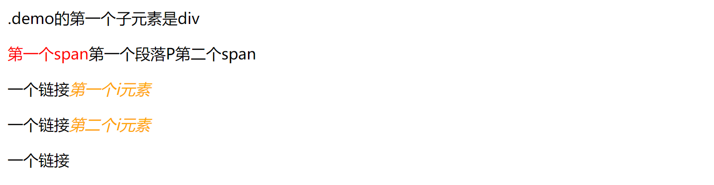
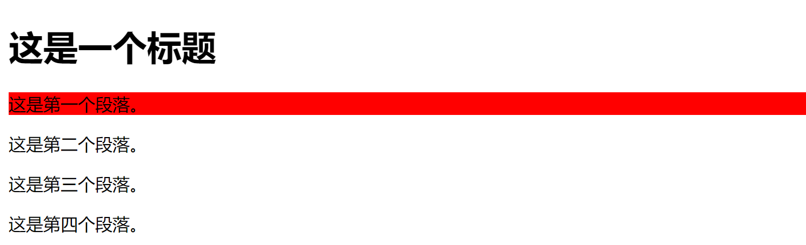
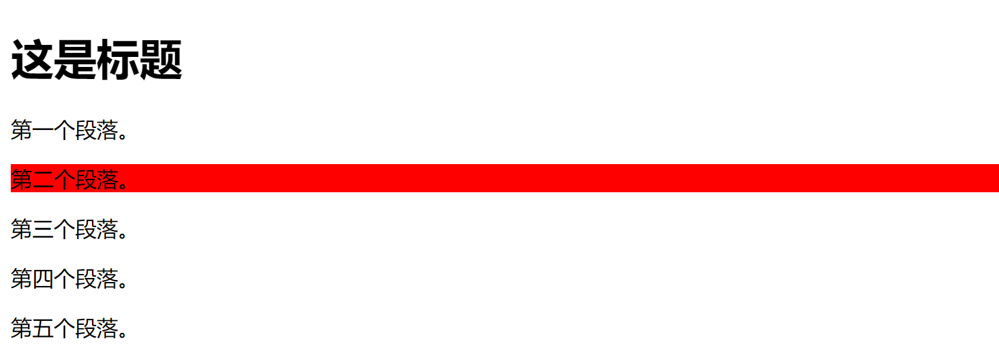

# css常见选择器：+、~、>、:first-child，:nth-child()的用法

## 相邻兄弟选择器(+)

> 注：前端面包屑导航中经常用到该选择器。

定义：相邻兄弟选择器（Adjacent sibling selector）可选择紧接在另一元素后的元素，且二者有相同父元素。

#### 代码：

```html
<style>
  h2 + p {
    color: red;
  }
</style>
<p>这里是第一个p标签</p>
<p>这里是第二个p标签</p>
<h2>标题H2</h2>
<p>这里是第三个p标签</p>
<p>这里是第四个p标签</p>
<p>这里是第五个p标签</p>
```

#### 结果：



#### 代码：

```html
<style>
  li + li {
    color: red;
  }
</style>
<ul>
  <li>List item 1</li>
  <li>List item 2</li>
  <li>List item 3</li>
</ul>
<ol>
  <li>List item 1</li>
  <li>List item 2</li>
  <li>List item 3</li>
</ol>
```

#### 结果：



## 兄弟选择器（~），又称匹配选择器

定义：作用是查找某一个指定元素的后面的**所有兄弟结点**

#### 代码：

```html
<style>
  h2 ~ p {
    color: red;
  }
</style>
<p>这里是第一个p标签</p>
<p>这里是第二个p标签</p>
<h2>标题H2</h2>
<p>这里是第三个p标签</p>
<p>这里是第四个p标签</p>
<p>这里是第五个p标签</p>
```

#### 结果：



> **通过这两个例子，可以发现虽然这两个选择器都表示兄弟选择器，但是‘+’选择器则表示某元素后相邻的兄弟元素，也就是紧挨着的，是单个的（特殊情况：循环多个）。而‘~’选择器则表示某元素后所有同级的指定元素，强调所有的。**

## 子选择器(>)

定义：只能选择作为某元素儿子元素的元素（直接子元素），不包括孙元素、曾孙元素等等等。

## :first-child

定义：用于选取属于其父元素的首个子元素的指定选择器

嗯，乍一看好像说的不是很明白，因此这个选择器很容易让人误解，通常会有两种误解：

- 误解一：认为E:first-child选中E元素的第一个子元素。
- 误解二：认为E:first-child选中E元素的父元素的第一个E元素。

正确的理解应该是：只要E元素是它的父级的第一个子元素，就选中。

它需要同时满足两个条件：

1. **第一个子元素** 
2. **这个子元素刚好是E** 

#### 代码：

```html
<style>
  span:first-child {
    color: red;
  }
  p:first-child {
    color: blue;
  } /*p元素的父元素的第一个子元素是div而不是p元素，因此该样式不起作用*/
  i:first-child {
    color: orange;
  }
</style>
<div class="demo">
  <div>.demo的第一个子元素是div</div>
  <!--第一个span元素是它的父级P元素的第一个span，颜色变红色-->
  <p><span>第一个span</span>第一个段落P<span>第二个span</span></p>
  <!--第一个i元素是它的父级a元素的第一个i，颜色变橙色-->
  <p>一个链接<i>第一个i元素</i></p>
  <!--第二个i元素是它的父级a元素的第一个i，颜色变橙色-->
  <p>一个链接<i>第二个i元素</i></p>
  <p>一个链接</p>
</div>
```


#### 结果：



## :nth-child(n)

定义：该选择器选取父元素的第 N 个子元素，**与类型无关**。

#### 代码

```html
<style>
  p:nth-child(2) {
    background: #ff0000;
  }
</style>
<div>
  <h1>这是一个标题</h1>
  <p>这是第一个段落。</p>
  <p>这是第二个段落。</p>
  <p>这是第三个段落。</p>
  <p>这是第四个段落。</p>
</div>
```

#### 结果



> ### :nth-child(n)的详细用法：
>
> nth-child(3) 表示选择列表中的第三个元素。
>
> nth-child(2n)表示列表中的偶数标签，即选择第2、第4、第6……标签
>
> nth-child(2n-1) 表示选择列表中的奇数标签，即选择 第1、第3、第5、第7……标签
>
> **nth-child(n+3) 表示选择列表中的标签从第3个开始到最后（>=3）**
>
> **nth-child(-n+3) 表示选择列表中的标签从0到3，即小于3的标签(<=3)**
>
> nth-last-child(3) 表示选择列表中的倒数第3个标签

## :nth-of-type(n)

定义:选择器匹配属于父元素的特定类型的第 N 个子元素的每个元素，**与元素类型有关**

#### 代码

```html
<style>
  p:nth-of-type(2) {
    background: #ff0000;
  }
</style>
<h1>这是标题</h1>
<p>第一个段落。</p>
<p>第二个段落。</p>
<p>第三个段落。</p>
<p>第四个段落。</p>
<p>第五个段落。</p>
```

#### 结果



## 属性选择器

定义：可以为拥有指定属性的 HTML 元素设置样式，而不仅限于 class 和 id 属性。

### 属性选择器

下面的例子为带有title属性的所有元素设置样式：

```css
[title] {
  color: red;
}
```

### 属性和值选择器

下面的例子为 title="W3School" 的所有元素设置样式：

```css
[title="W3School"] {
  color: red;
}
```

#### 代码

```html
<style type="text/css">
  [title~="hello"] {
    color: red;
  }
</style>
<h1>可以应用样式：</h1>
<h2 title="hello world">Hello world</h2>
<p title="student hello">Hello W3School students!</p>
```

#### 结果


### 设置表单样式

若需为不带 class 或 id 的表单设置样式，属性选择器会很有用：

#### 实例

```css
input[type="text"] {
  width: 150px;
  display: block;
  margin-bottom: 10px;
  background-color: yellow;
}

input[type="button"] {
  width: 120px;
  margin-left: 35px;
  display: block;
}
```

## 所有 CSS 属性选择器

| 选择器                                                       | 例子                | 例子描述                                                |
| :----------------------------------------------------------- | :------------------ | :------------------------------------------------------ |
| [`attribute`](https://www.w3school.com.cn/cssref/selector_attribute.asp) | [target]            | 选择带有 target 属性的所有元素。                        |
| [`attribute=value`](https://www.w3school.com.cn/cssref/selector_attribute_value.asp) | [target=_blank]     | 选择带有 target="_blank" 属性的所有元素。               |
| [`attribute~=value`](https://www.w3school.com.cn/cssref/selector_attribute_value_contain.asp) | [title~=flower]     | 选择带有包含 "flower" 一词的 title 属性的所有元素。     |
| [`attribute|=value`](https://www.w3school.com.cn/cssref/selector_attribute_value_start.asp) | [lang\|=en]         | 选择带有以 "en" 开头的 lang 属性的所有元素。            |
| [`attribute^=value`](https://www.w3school.com.cn/cssref/selector_attr_begin.asp) | a[href^="https"]    | 选择其 href 属性值以 "https" 开头的每个 <a> 元素。      |
| [`attribute$=value`](https://www.w3school.com.cn/cssref/selector_attr_end.asp) | a[href$=".pdf"]     | 选择其 href 属性值以 ".pdf" 结尾的每个 <a> 元素。       |
| [`attribute*=value`](https://www.w3school.com.cn/cssref/selector_attr_contain.asp) | a[href*="w3school"] | 选择其 href 属性值包含子串 "w3school" 的每个 <a> 元素。 |
