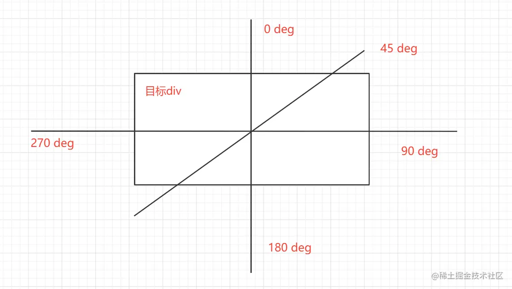
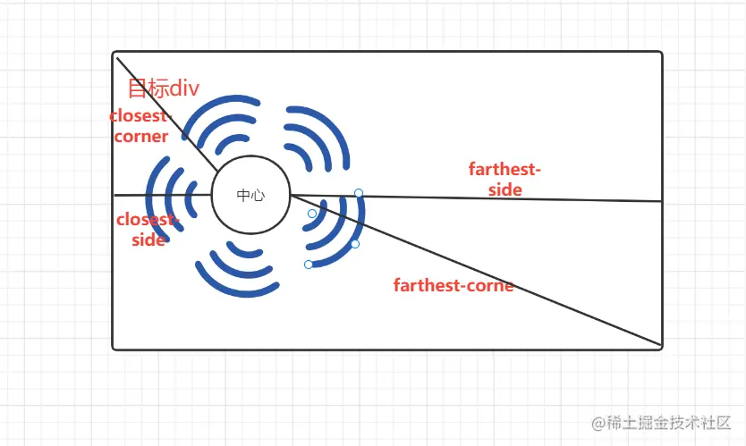

# CSS背景色渐变

渐变类型：

1. 线性渐变（向下/向上/向左/向右/对角线）

2. 径向渐变（由其中心定义）

## 一、线性渐变：linear-gradient

通过属性 linear-gradient 定义线性渐变

```css
background-image: linear-gradient( 方向/角度 , 颜色1，颜色2，颜色3....); 
```

### 方向：在关键字 to 后面加上 top、bottom、right、left 中的某一个关键字或多个关键字。 

- 从上到下（默认）

  ```css
  background-image: linear-gradient(#FF0000,#FFF200, #1E9600);
  ```

  <div style="width: 300px;height: 300px;background-image: linear-gradient(#FF0000,#FFF200, #1E9600);"></div>
  
- 从下到上

  ```css
  background-image: linear-gradient(to top, #FF0000,#FFF200, #1E9600);
  ```

  <div style="width: 300px;height: 300px;background-image: linear-gradient(to top, #FF0000,#FFF200, #1E9600);"></div>

- 从左到右

  ```css
  background-image: linear-gradient(to right, #FF0000,#FFF200, #1E9600);
  ```

- 从右到左

  ```css
  background-image: linear-gradient(to left, #FF0000,#FFF200, #1E9600);
  ```

- 从左上到右下
  
  ```css
  background-image: linear-gradient(to right bottom , #FF0000,#FFF200, #1E9600);
  ```


### 方向：使用角度来定义方向

除了使用关键字to +方向名词外，我们还可以使用角度去任意的规定。

在一个平面上角度只有360度，就是一个圆。

使用角度来取代预定义的方向（向下、向上、向右、向左、向右下等等）。值 0deg 等于向上（to top）。值 90deg 等于向右（to right）。值 180deg 等于向下（to bottom）。

我们填的是终点的的角度，起点为对角线的角度



如：表示从起点从225度到45度结束的渐变。

```css
background-image: linear-gradient(45deg, #FF0000,#FFF200, #1E9600);
```

<div style="width: 300px;height: 300px;background-image: linear-gradient(45deg, #FF0000,#FFF200, #1E9600);"></div>

### 平铺的线性渐变

#### 颜色：可以使用rgb模式，这样就可以使用透明度了。

```css
background-image: linear-gradient(to right, rgba(255,0,0,0), rgba(255,0,0,1));
```

#### repeating-linear-gradient() 

**repeating-linear-gradient()** 函数用于重复线性渐变 例如： 从左下角开始绘制渐变，前20像素是橙色，此后直至30像素的位置过渡到红色，然后直至40像素的位置再过渡到紫色。绘制完这个渐变后，浏览器会像平铺图像那样把这个渐变铺满整个背景。

```css
background-image: repeating-linear-gradient(45deg, #F27121 20px, #E94057 30px, #8A2387 40px);
```

<div style="width: 300px;height: 300px;background-image: repeating-linear-gradient(45deg, #F27121 20px, #E94057 30px, #8A2387 40px);"></div>

## 二、径向渐变（由其中心定义）：radial-gradient

径向渐变就是沿着圆周或者椭圆周向外扩散的渐变。有一种水波扩散的感觉。

我们通过 radial-gradient();来定义一个径向的渐变。

```css
background-image: radial-gradient(shape size at position, start-color, ..., last-color);
```

shape 为椭圆形，size 为最远角，position 为中心。

**shape** 参数定义形状。它可接受 circle 或 ellipse 值。默认值为 ellipse（椭圆）。

**size** 参数定义渐变的大小。它可接受四个值：

closest-side ：从中心点向外扩展渐变，到离中心点最近的一边结束。 

farthest-side ：以离渐变中心点最远的那一边计算圆的半径。

closest-corner ：以离渐变中心点最近的元素顶角计算渐变的范围。

farthest-corner ：以离渐变中心点最远的顶角计算圆的半径。



### 均匀间隔的色标（默认）

```css
background-image: radial-gradient(#d63c21, #e0d865);
```

<div style="width: 300px;height: 300px;background-image: radial-gradient(#d63c21, #e0d865);"></div>

当我改变为圆形，并换上合适的颜色

```css
background-image: radial-gradient(circle, red, yellow, green);
```

<div style="width: 300px;height: 300px;background-image: radial-gradient(circle, red, yellow, green);"></div>

### 设置径向渐变的中心点

用关键字 at 后面加上 position 属性支持的定位关键字和数值，指定渐变中心的位置。

调整大小和颜色百分比后 例如：(中心点设置在元素的距离左上角（60% 55%）。并以 以离渐变中心点最远的顶角计算圆的半径。)

```css
background-image: radial-gradient(farthest-corner at 60% 55%, red, yellow, black);
```

<div style="width: 300px;height: 300px;background-image: radial-gradient(farthest-corner at 60% 55%, red, yellow, black);"></div>

### 平铺的径向渐变

```css
background-image: repeating-radial-gradient(circle at 20% 40%,#eea2a2 20px, #57c6e1 20px, #b49fda 40px, #7ac5d8 40px, #b49fda 60px, #4F9C9C 60px, #57c6e1 80px, #99CCCC 80px, #eea2a2 100px);
```

<div style="width: 300px;height: 300px;background-image: repeating-radial-gradient(circle at 20% 40%,#eea2a2 20px, #57c6e1 20px, #b49fda 40px, #7ac5d8 40px, #b49fda 60px, #4F9C9C 60px, #57c6e1 80px, #99CCCC 80px, #eea2a2 100px);"></div>