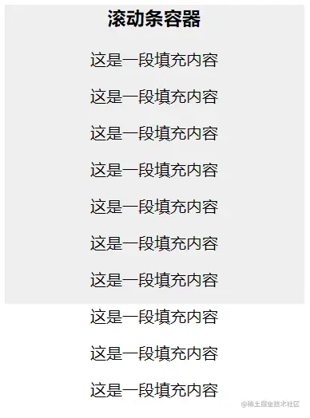
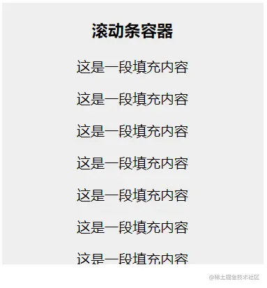
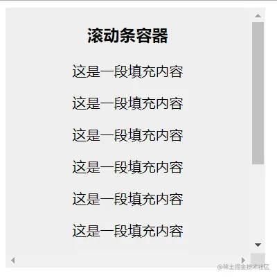
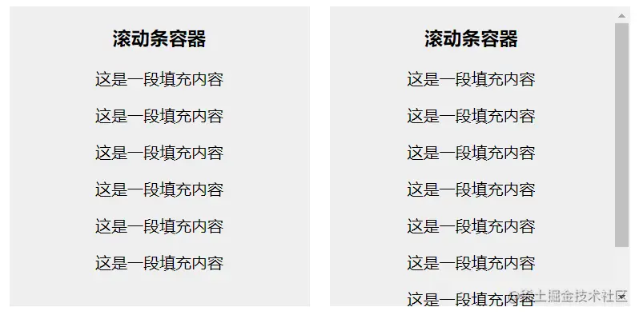
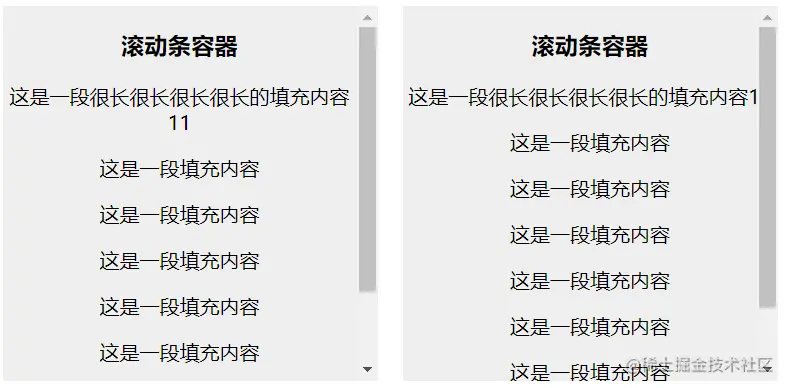
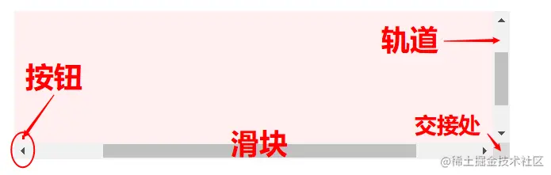
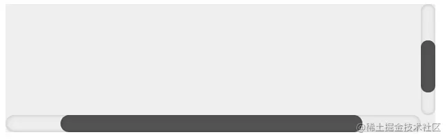
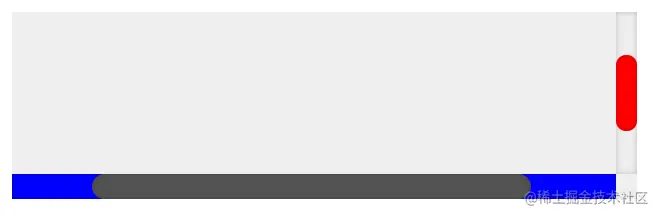
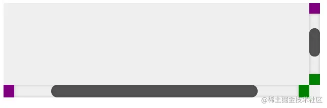
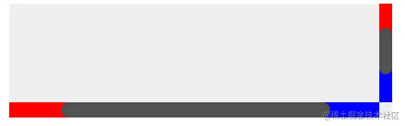

# css如何显示滚动条

`overflow`属性规定当内容溢出元素框时发生的事情。

这个属性定义溢出元素内容区的内容会如何处理。如果值为`scroll`，不论是否需要，用户代理都会提供一种滚动机制。因此，有可能即使元素框中可以放下所有内容也会出现滚动条。

属性值：

`visible`默认值。内容不会被修剪，会呈现在元素框之外。

`hidden`内容会被修剪，并且其余内容是不可见的。

`scroll`内容会被修剪，但是浏览器会显示滚动条以便查看其余的内容。

`auto`如果内容被修剪，则浏览器会显示滚动条以便查看其余的内容。

`inherit`规定应该从父元素继承`overflow`属性的值。

# css设置滚动条(显示手机浏览器的滚动条)

**在需要设置滚动的元素上设置如下**

下面以垂直方向滚动为例，父元素为ul，需要先设置高度。

```css
ul{
	height: 260px;
	overflow-y: scroll;
	overflow-x: hidden;
}
ul::-webkit-scrollbar { 
	/* 隐藏默认的滚动条 */
	-webkit-appearance: none;
}
ul::-webkit-scrollbar:vertical { 
	/* 设置垂直滚动条宽度 */
	width: 2px;
}


/* 这里不需要用到这个 */
ul::-webkit-scrollbar:horizontal{
	/* 设置水平滚动条厚度 */
	height: 2px;
}

ul::-webkit-scrollbar-thumb { 
	/* 滚动条的其他样式定制，注意，这个一定也要定制，否则就是一个透明的滚动条 */
	border-radius: 8px; 
	border: 2px solid rgba(255,255,255,.4); 
	background-color: rgba(0, 0, 0, .5);
}
```

# 滚动条样式的各个属性

### 关于滚动条

#### （1）先来看看`overflow`

> 这个属性用于：在内容超出容器时，如何处理内容的显示
>
> 可选值有：
>
> - 常用的：`visible`、`hidden`、`scroll`、`auto`、`overlay`
> - 不常用的：`unset`、`inherit`、`initial`、`revert`
>
> 其它的：
>
> - `overflow`生效，容器必须有一个指定的高度
>
> - `overflow`实际是`overflow-x`和`overflow-y`的简写
>
>   ```css
>   div {
>       overflow: hidden;
>       /*
>       overflow-x: hidden;
>       overflow-y: hidden;
>       */
>   }
>   ```
>
>   - 也可以设置两个属性值，将分别作用于`x`轴和`y`轴
>
>     ```css
>     div {
>         overflow: auto hidden;
>         /*
>         overflow-x: auto;
>         overflow-y: hidden;
>         */
>     }
>     ```

##### （a）visible

- `visible`是默认的值，它不会对元素内容作处理，溢出内容会直接显示在容器外部



##### （b）hidden

- `hidden`会对溢出内容作裁剪，超出容器的部分不可见，且不会出现滚动条，页面也无法滚动



##### （c）scroll

- `scroll`也会对内容作裁剪，但同时也会在容器上呈现出**滚动条**，可以滚动滚动条来显示溢出的内容



##### （d）auto

- `auto`会在内容有溢出时才显示滚动条，没有溢出则不显示滚动条



##### （e）overlay

- `overlay`同`auto`
  - 不同的是，`auto`显示的滚动条会在容器内**占据一个位置**，会导致内容发生位移
  - 而`overlay`则是会覆盖在容器右侧，**不会占据位置**



#### （2）然后看看滚动条样式

> 原生的滚动条样式可能并不是那么美观，所以，有时候需要自定义滚动条样式，让其更符合我们的UI设计

##### （a）伪元素属性

- 美化滚动条样式，主要涉及以下几个**伪元素属性**（注，这里以chrome浏览器作示例）
- `::-webkit-scrollbar`：
  - 用于设置滚动条的整体样式
  - 在这里设置宽高，以控制滚动条尺寸，且必须要设置宽高，否则不生效
  - 宽高分别对应 y轴 和 x轴 的滚动条尺寸
  - 若宽高为0，则可隐藏滚动条，但仍可保持滚动
- `::-webkit-scrollbar-track`：
  - 滚动条轨道
  - 不设置则不出现轨道
- `::-webkit-scrollbar-track-piece`：
  - 没有滑块的滚动条轨道，或者说是内层轨道
  - 同滚动条轨道，
- `::-webkit-scrollbar-thumb`：
  - 滚动条滑块，即滚动条滚动的部分
  - 必须要设置，否则不会出现滑块
- `::-webkit-scrollbar-button`：
  - 滚动条两端的箭头按钮
  - 不设置则不出现
- `::-webkit-scrollbar-corner`：
  - X轴滚动条和Y轴滚动条的交接处
  - 不设置，默认为白色小方块，宽高随X轴和Y轴滚动条尺寸



```css
/* 滚动条所在容器 */
.scroll-container {
    margin: 10px;
    width: 500px;
    height: 150px;
    overflow: overlay;
    background-color: #eee;
    white-space: nowrap;
}

/* 滚动条整体 */
.scroll-container::-webkit-scrollbar {
    height: 20px;
    width: 20;
}
/* 两个滚动条交接处 -- x轴和y轴 */
.scroll-container::-webkit-scrollbar-corner {
    background-color: transparent;
}

/* 滚动条滑块 */
.scroll-container::-webkit-scrollbar-thumb {
    border-radius: 10px;
    -webkit-box-shadow: inset 0 0 5px rgba(0, 0, 0, 0.2);
    background: #535353;
}

/* 滚动条轨道 */
.scroll-container::-webkit-scrollbar-track {
    -webkit-box-shadow: inset 0 0 5px rgba(0, 0, 0, 0.2);
    border-radius: 10px;
    background: #ededed;
}

/* 滚动条两端按钮 */
.scroll-container::-webkit-scrollbar-button {
}
```



> 以上部分，可以用来配置大部分的滚动条样式了
>
> 不过更多的还需要搭配**伪类**来进行一些额外的配置

##### （b）伪类属性

- 为了更好的美化滚动条样式，可以搭配一些**伪类**属性来进行优化

  > 注：后面使用less语法，方便查看

- 分别设置水平和垂直方向上的滚动条

  - `:horizontal`：适用于任何水平方向上的滚动条
  - `:vertical`：适用于任何垂直方向的滚动条

  ```less
  ::-webkit-scrollbar-track {
      box-shadow: inset 0 0 5px rgba(0, 0, 0, 0.2);
      background: #eee;
      // 添加 horizonal ，单独设置水平方向上的 轨道
      &:horizontal {
          background-color: blue;
      }
  }
  ::-webkit-scrollbar-thumb {
      border-radius: 10px;
      box-shadow: inset 0 0 5px rgba(0, 0, 0, 0.2);
      background: #535353;
      // 添加 vertical ，单独设置垂直方向上的 滑块
      &:vertical {
          background-color: red;
      }
  }
  ```



- 分别设置左右（上下）按钮、区域

  - `:decrement`、`:start`：适用于按钮和内层轨道

    - 表示左（上）侧的按钮
    - 表示滑块左侧（上侧）的内层轨道区域

  - `:increment`、`:end`：适用于按钮和内层轨道

    - 表示右侧（下侧）按钮
    - 表示滑块右侧（下侧）的内层轨道区域

    > 注意：只对`::-webkit-scrollbar-button`、`::-webkit-scrollbar-track-piece`两个伪元素起作用

  ```less
  ::-webkit-scrollbar-button {
      // 左侧、上侧
      &:decrement {
          background-color: purple;
      }
      // 右侧、下侧
      &:increment {
          background-color: green;
      }
  }
  ::-webkit-scrollbar-track-piece {
      // 内层轨道 滑块左侧、上侧
      &:decrement {
          background-color: red;
      }
      // 内层轨道 滑块右侧、下侧
      &:increment {
          background-color: blue;
      }
  }
  ```





- `:window-inactive`：
  - 适用于所有滚动条，当焦点不在滚动条窗口的时候生效
- 这里还有一些其它伪类，暂时还不知道怎么用
  - `:double-button`：适用于按钮和轨道碎片。判断轨道结束的位置是否是一对按钮。也就是轨道碎片紧挨着一对在一起的按钮。
  - `:single-button`：适用于按钮和轨道碎片。判断轨道结束的位置是否是一个按钮。也就是轨道碎片紧挨着一个单独的按钮。
  - `:no-button`：表示轨道结束的位置没有按钮。
  - `:corner-present`：表示滚动条的角落是否存在。
- 另外，还可以搭配其它伪类，比如`:hover`、`:active`


