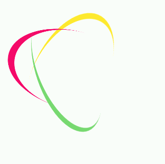

# 旋转加载动画效果



```html
<style>
    .loading {
        width: 120px;
        height: 120px;
        border-radius: 50%;
        perspective: 800px;
        position: relative;
    }
    .loading .item {
        width: 100%;
        height: 100%;
        border-radius: 50%;
        position: absolute;
    }
    .loading .item:first-child {
        border-bottom: 7px solid #fdea2e;
        transform: rotateX(35deg) rotateY(-45deg);
        animation: rotate-one 1s linear infinite;
    }
    .loading .item:nth-child(2) {
        border-right: 7px solid #f40968;
        transform: rotateX(50deg) rotateY(10deg);
        animation: rotate-two 1s linear infinite;
    }
    .loading .item:last-child {
        border-top: 7px solid #77d970;
        transform: rotateX(35deg) rotateY(55deg);
        animation: rotate-three 1s linear infinite;
    }
    @keyframes rotate-one {
        to {
            transform: rotateX(35deg) rotateY(-45deg) rotateZ(360deg);
        }
    }
    @keyframes rotate-two {
        to {
            transform: rotateX(50deg) rotateY(10deg) rotateZ(360deg);
        }
    }
    @keyframes rotate-three {
        to {
            transform: rotateX(35deg) rotateY(55deg) rotateZ(360deg);
        }
    }
</style>
<div class="loading">
    <div class="item"></div>
    <div class="item"></div>
    <div class="item"></div>
</div>
```