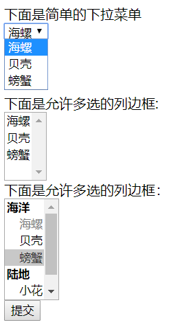

# 下拉框、列表框使用详解

### select创建列表框和下拉菜单， 必须与option 结合使用

**select 属性：**

- disable 禁用
- multiple 列表框和下拉框是否允许多选 ，支持boolean值属性，为true时则为列表框
- size 列表框可同时显示多少个列表项
- select 能包含的子元素

**option 属性**

- disabled 禁用
- selected 初始状态是否被选中
- optgroup 单项组，也就是把option分组
- lable 指定选项组的标签，必填属性
- disabled 禁用选项组所有标签

### option 中的 value 必须填，与select 中的name 形成参数对传给后台

来看看代码

```html
<form action="https://kxc0.github.io/" method="post">
	下面是简单的下拉菜单<br />
		<select id="skills" name="skills">
			<option value="luo">海螺</option>
			<option value="ke">贝壳</option>
			<option value="pang">螃蟹</option>
		</select><br/><br/><br/><br/>
	下面是允许多选的列边框:<br/>
		<select id="books" name="books" multiple size="4">
			<option value="luo">海螺</option>
			<option value="ke">贝壳</option>
			<option value="pang">螃蟹</option>

		</select><br />
		下面是允许多选的列边框：<br />
		<select id="lee" name="lee" multiple size="6">
			<optgroup label="海洋"  >
				<option value="luo" disabled>海螺</option>
			<option value="ke">贝壳</option>
			<option value="pang" selected>螃蟹</option>
			</optgroup>

			<optgroup label="陆地">
				<option value="fol">小花</option>
				<option value="gla">小草</option>
			</optgroup>

		</select><br />
		<button type="submit" >提交</button><br>
	</form>
```



注意：在写元素的name值时，最好根据元素实现的功能进行命名，做到“见名知意”，不要像我一样随手命名。

再写一下多行文本域 textarea元素的使用

**textarea 元素 多行文本域**

- cols 指定宽度，必填
- rows 指定高度，必填
- disable 禁用
- readonly
- maxlength 最多可输入字符数
- wrap 是否添加换行符，支持 hard 和 soft 两个属性值 （为hard时，必须指定cols属性，超出指定宽度自动换行）