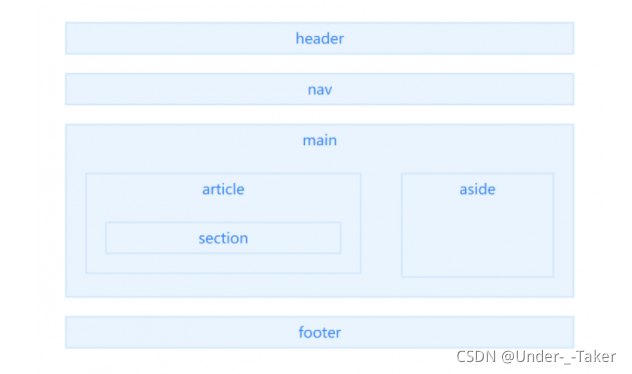
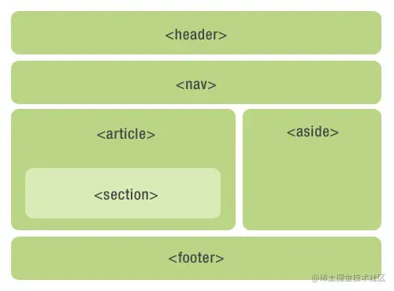

# [Html5 什么是语义化标签？ 常见的语义化标签有哪些？](https://blog.csdn.net/m0_51273200/article/details/120330863) 

h5 语义化标签的推出很好的解决了满屏的 div 布局，语义化顾名思义就是能让人一眼就看出来每一个标签的作用和含义，使用语义恰当的标签，使页面有良好的结构，页面元素有含义，能够让和搜索引擎都容易理解。一张图就可以清晰的展示语义化标签的作用，确实挺好，感觉像搭积木一样，一块一块的把整体搭建出来。

 




 以下是常见的语义化标签及其作用


```html
<header>   <!--：页眉通常包括网站标志、主导航、全站链接以及搜索框。-->
<nav>      <!--：标记导航，仅对文档中重要的链接群使用。-->
<main>     <!--：页面主要内容，一个页面只能使用一次。-->
<article>    <!--：定义外部的内容，其中的内容独立于文档的其余部分。-->
<section>   <!--：定义文档中的节。比如章节、页眉、页脚或文档中的其他部分。-->
<aside>    <!--：定义其所处内容之外的内容。如侧栏、文章链接、广告、相关产品列表等。-->
<footer>    <!--：页脚，只有当父级是body时，才是整个页面的页脚。--> 

<title>      <!--：页面主体内容。-->
<hn>       <!--：h1~h6，分级标题，<h1> 与 <title> 协调有利于搜索引擎优化。-->
<ul>       <!--：无序列表。-->
<li>        <!--：有序列表。-->
<small>     <!--：呈现小号字体效果，指定细则，输入免责声明、注解、署名、版权。-->
<strong>    <!--：和 em 标签一样，用于强调文本，但它强调的程度更强一些。-->
<em>      <!--：将其中的文本表示为强调的内容，表现为斜体。-->
<mark>     <!--：使用黄色突出显示部分文本。-->
<figure>    <!--：规定独立的流内容（图像、图表、代码等等）（默认有40px左右margin）。-->
<cite>      <!--：表示所包含的文本对某个参考文献的引用，比如书籍或者杂志的标题。-->
<blockquoto> <!--：定义块引用，块引用拥有它们自己的空间。-->
<q>        <!--：短的引述（跨浏览器问题，尽量避免使用）。-->
<time>      <!--：datetime属性遵循特定格式，文本必须是合法的时间格式。-->
<abbr>     <!--：简称或缩写。-->
<dfn>       <!--：定义术语元素，与定义必须紧挨着，可以在描述列表dl元素中使用。-->
<address>   <!--：作者、或组织的联系信息（电子邮件地址、指向联系信息页的链接）。-->
<del>       <!--：移除的内容。-->
<ins>       <!--：添加的内容。-->
<code>     <!--：标记代码。-->
<meter>    <!--：定义已知范围或分数值内的标量测量。（IE 不支持 meter 标签）-->
<progress>  <!--：定义运行中的进度（进程）。-->
```


总结语义化优点：

- 易于用户阅读，样式丢失的时候能让页面呈现清晰的结构。
- 有利于SEO，搜索引擎根据标签来确定上下文和各个关键字的权重。
- 方便其他设备解析，如盲人阅读器根据语义渲染网页
- 有利于开发和维护，语义化更具可读性，代码更好维护，与CSS3关系更和谐。


# [html5语义化标签](https://juejin.cn/post/6844903544995184653) 


HTML 5的革新之一：语义化标签一节元素标签。

在HTML 5出来之前，我们用`div`来表示页面章节，但是这些`div`都没有实际意义。（即使我们用css样式的id和class形容这块内容的意义）。这些标签只是我们提供给浏览器的指令，只是定义一个网页的某些部分。但现在，那些之前没“意义”的标签因为因为html5的出现消失了，这就是我们平时说的“语义”。

看下图没有用div标签来布局





html5的布局

嗯，如上图那个页面结构没有一个div，都是采用html5语义标签（用哪些标签，关键取决于你的设计目标）。

但是也不要因为html5新标签的出现，而随意用之，错误的使用肯定会事与愿违。所以有些地方还是要用div的，就是因为div没有任何意义的元素，他只是一个标签，仅仅是用来构建外观和结构。因此是最适合做容器的标签。

W3C定义了这些语义标签，不可能完全符合我们有时的设计目标，就像制定出来的法律不可能流传100年都不改变，更何况它才制定没多久，不可能这些语义标签对所以设计目标的适应。只是一定程度上的“通用”，我们的目标是让爬虫读懂重要的东西就够了。

结论：不能因为有了HTML 5标签就弃用了div，每个事物都有它的独有作用的。

节点元素标签因使用的地方不同，我将他们分为：**节元素标签**、**文本元素标签**、**分组元素标签**分开来讲解HTML5中新增加的语义化标签和使用总结。

## header元素

header 元素代表“网页”或“section”的页眉。
通常包含`h1-h6`元素或`hgroup`，作为整个页面或者一个内容块的标题。也可以包裹一节的目录部分，一个搜索框，一个`nav`，或者任何相关logo。

整个页面没有限制header元素的个数，可以拥有多个，可以为每个内容块增加一个header元素

```css
css复制代码<header>
    <hgroup>
        <h1>网站标题</h1>
        <h1>网站副标题</h1>
    </hgroup>
</header>
```

header的示例代码

header使用注意：

- 可以是“网页”或任意“section”的头部部分；
- 没有个数限制。
- 如果hgroup或h1-h6自己就能工作的很好，那就不要用header。

## footer元素

`footer`元素代表“网页”或“section”的页脚，通常含有该节的一些基本信息，譬如：作者，相关文档链接，版权资料。如果`footer`元素包含了整个节，那么它们就代表附录，索引，提拔，许可协议，标签，类别等一些其他类似信息。

```less
less复制代码<footer>
    COPYRIGHT@小北
</footer>
```

`footer`的示例代码

footer使用注意：

- 可以是“网页”或任意“section”的底部部分；
- 没有个数限制，除了包裹的内容不一样，其他跟header类似。

## hgroup元素

`hgroup`元素代表“网页”或“section”的标题，当元素有多个层级时，该元素可以将`h1`到`h6`元素放在其内，譬如文章的主标题和副标题的组合

```css
css复制代码<hgroup>
    <h1>这是一篇介绍HTML 5语义化标签和更简洁的结构</h1>
    <h2>HTML 5</h2>
</hgroup>
```

`hgroup`示例代码

hgroup使用注意：

- 如果只需要一个h1-h6标签就不用hgroup
- 如果有连续多个h1-h6标签就用hgroup
- 如果有连续多个标题和其他文章数据，h1-h6标签就用hgroup包住，和其他文章元数据一起放入header标签

## nav元素

`nav`元素代表页面的导航链接区域。用于定义页面的**主要导航部分**。

```css
css复制代码<nav>
    <ul>
        <li>HTML 5</li>
        <li>CSS3</li>
        <li>JavaScript</li>
    </ul>
</nav>
```

`nav`实例

但是我在有些时候却情不自禁的想用它，譬如：侧边栏上目录，面包屑导航，搜索样式，或者下一篇上一篇文章，但是事实上规范上说nav只能用在页面主要导航部分上。页脚区域中的链接列表，虽然指向不同网站的不同区域，譬如服务条款，版权页等，这些footer元素就能够用了。

nav使用注意：

- 用在整个页面主要导航部分上，不合适就不要用nav元素；

## aside元素

`aside`元素被包含在article元素中作为主要内容的附属信息部分，其中的内容可以是与当前文章有关的相关资料、标签、名次解释等。（特殊的section）

在article元素之外使用作为页面或站点全局的附属信息部分。最典型的是侧边栏，其中的内容可以是日志串连，其他组的导航，甚至广告，这些内容相关的页面。

```css
css复制代码<article>
    <p>内容</p>
    <aside>
        <h1>作者简介</h1>
        <p>小北，前端一枚</p>
    </aside>
</article>
```

`aside`实例

aside使用总结：

- aside在article内表示主要内容的附属信息，
- 在article之外则可做侧边栏，没有article与之对应，最好不用。
- 如果是广告，其他日志链接或者其他分类导航也可以用

## section元素

`section`元素代表文档中的“节”或“段”，“段”可以是指一篇文章里按照主题的分段；“节”可以是指一个页面里的分组。

section通常还带标题，虽然html5中section会自动给标题h1-h6降级，但是最好手动给他们降级。如下：

```css
css复制代码<section>
    <h1>section是啥？</h1>
    <article>
        <h2>关于section</h1>
        <p>section的介绍</p>
        <section>
            <h3>关于其他</h3>
            <p>关于其他section的介绍</p>
        </section>
    </article>
</section>
```

`section`示例代码

section使用注意：

一张页面可以用section划分为简介、文章条目和联系信息。不过在文章内页，最好用article。section不是一般意义上的容器元素，如果想作为样式展示和脚本的便利，可以用div。

- 表示文档中的节或者段；
- article、nav、aside可以理解为特殊的section，所以如果可以用article、nav、aside就不要用section，没实际意义的就用div

## article元素

`article`元素最容易跟`section`和`div`容易混淆，其实`article`代表一个在文档，页面或者网站中自成一体的内容，其目的是为了让开发者独立开发或重用。譬如论坛的帖子，博客上的文章，一篇用户的评论，一个互动的widget小工具。（特殊的section）

除了它的内容，`article`会有一个标题（通常会在`header`里），会有一个`footer`页脚。我们举几个例子介绍一下article，好更好区分article、section、div


```xml
xml复制代码<article>
    <h1>一篇文章</h1>
    <p>文章内容..</p>
    <footer>
        <p><small>版权：html5jscss网所属，作者：小北</small></p>
    </footer>
</article>
```

一篇简单文章的article示例代码


上例是最好简单的article标签使用情况，如果在article内部再嵌套article，那就代表内嵌的article是与它外部的内容有关联的，如博客文章下面的评论，如下：

```xml
xml复制代码<article>

    <header>
        <h1>一篇文章</h1>
        <p><time pubdate datetime="2012-10-03">2012/10/03</time></p>
    </header>

    <p>文章内容..</p>

    <article>
        <h2>评论</h2>

        <article>
            <header>
                <h3>评论者: XXX</h3>
                <p><time pubdate datetime="2012-10-03T19:10-08:00">~1 hour ago</time></p>
            </header>
            <p>哈哈哈</p>
        </article>

        <article>
            <header>
                <h3>评论者: XXX</h3>
                <p><time pubdate datetime="2012-10-03T19:10-08:00">~1 hour ago</time></p>
            </header>
            <p>哈？哈？哈？</p>
        </article>

    </article>

</article>
```

文章里的评论，一个article嵌套article来表示的实例

article内部嵌套article，有可能是评论或其他跟文章有关联的内容。那article内部嵌套section一般是什么情况呢。如下：

```css
css复制代码<article>

    <h1>前端技术</h1>
    <p>前端技术有那些</p>

    <section>
        <h2>CSS</h2>
        <p>样式..</p>
    </section>

    <section>
        <h2>JS</h2>
        <p>脚本</p>
    </section>

</article>
```

文章里的章节，一个article里的section实例

因为文章内section部分虽然也是独立的部分，但是它门只能算是*组成整体的一部分*，从属关系，article是大主体，section是构成这个大主体的一部分。本网站的全部文章都是article嵌套一个个section章节，这样能让浏览器更容易区分各个章节所包括的内容。

那section内部嵌套article又有哪些情况呢，如下

```less
less复制代码<section>
    
    <h1>介绍: 网站制作成员配备</h1>

    <article>
        <h2>设计师</h2>
        <p>设计网页的...</p>
    </article>

    <article>
        <h2>程序员</h2>
        <p>后台写程序的..</p>
    </article>

    <article>
        <h2>前端工程师</h2>
        <p>给楼上两位打杂的..</p>
    </article>

</section>
```

一个section里的article实例

设计师、程序员、前端工程师都是一个独立的整体，他们组成了网站制作基本配备，当然还有其他成员~~。设计师、程序员、前端工程师就像article，是一个个独立的整体，而section将这些自成一体的article包裹，就组成了一个团体。

article和section和例子就例举这么多了，具体情况具体分析，不易深究。漏了`div`d，其实`div`就是只是想用来把元素组合或者给它们加样式时使用。

article使用注意：

- 自身独立的情况下：用article
- 是相关内容：用section
- 没有语义的：用div

## HTML5其他结构元素标签

HTML5节元素标签包括`body article nav aside section header footer hgroup `，还有`h1-h6 address`。

- `address`代表区块容器，必须是作为联系信息出现，邮编地址、邮件地址等等,一般出现在footer。
- `h1-h6`因为hgroup，section和article的出现，h1-h6定义也发生了变化，允许一张页面出现多个h1。

我们在构造语义化和结构化的标签时的选择也变得有些不慎重。也就是说，我们不应该滥用超语义化的元素。