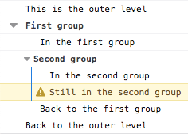

# [Console](https://developer.mozilla.org/zh-CN/docs/Web/API/Console) 

**`Console`** 对象提供了浏览器控制台调试的接口（如：Firefox 的 [Web Console](https://firefox-source-docs.mozilla.org/devtools-user/web_console/index.html)）。在不同浏览器上它的工作方式可能不一样，但通常都会提供一套共性的功能。

`Console` 对象可以从任何全局对象中访问到，如 浏览器作用域上的 [`Window`](https://developer.mozilla.org/zh-CN/docs/Web/API/Window)，以及通过属性控制台作为 workers 中的特定变体的 [`WorkerGlobalScope`](https://developer.mozilla.org/zh-CN/docs/Web/API/WorkerGlobalScope)。可以通过 [`Window.console`](https://developer.mozilla.org/zh-CN/docs/Web/API/Window/console) 引用，也可以简单的通过 `console` 引用。例：

JSCopy to Clipboard

```
console.log("Failed to open the specified link")
```

本页面记录了 `Console` 对象上的[方法](https://developer.mozilla.org/zh-CN/docs/Web/API/console#方法)并给出了几个 [Usage](https://developer.mozilla.org/zh-CN/docs/Web/API/console#usage) （用例）。

> **备注：** 此特性在 [Web Worker](https://developer.mozilla.org/zh-CN/docs/Web/API/Web_Workers_API) 中可用

> **备注：** 实际的 `console` 接口被定义为全小写的形式（比如不是这种形式 `Console` ），这是历史原因导致的。

## [方法](https://developer.mozilla.org/zh-CN/docs/Web/API/console#方法)

- [`Console.assert()`](https://developer.mozilla.org/zh-CN/docs/Web/API/console/assert)

  如果第一个参数为 `false` ，则将消息和堆栈跟踪记录到控制台。

- [`Console.clear()`](https://developer.mozilla.org/zh-CN/docs/Web/API/console/clear)

  清空控制台，并输出 `Console was cleared`。

- [`Console.count()`](https://developer.mozilla.org/zh-CN/docs/Web/API/console/count)

  以参数为标识记录调用的次数，调用时在控制台打印标识以及调用次数。

- [`Console.countReset()`](https://developer.mozilla.org/zh-CN/docs/Web/API/console/countReset)

  重置指定标签的计数器值。

- [`Console.debug()`](https://developer.mozilla.org/zh-CN/docs/Web/API/console/debug)

  在控制台打印一条 `"debug"` 级别的消息。

- [`Console.dir()`](https://developer.mozilla.org/zh-CN/docs/Web/API/console/dir)

  显示一个由特定的 Javascript 对象列表组成的可交互列表。这个列表可以使用三角形隐藏和显示来审查子对象的内容。.

- [`Console.dirxml()`](https://developer.mozilla.org/zh-CN/docs/Web/API/console/dirxml)

  打印 XML/HTML 元素表示的指定对象，否则显示 JavaScript 对象视图。

- [`Console.error()`](https://developer.mozilla.org/zh-CN/docs/Web/API/console/error)

  打印一条错误信息，使用方法可以参考 [string substitution](https://developer.mozilla.org/zh-CN/docs/Web/API/console#Using_string_substitutions)。

- `Console.exception()` 非标准 已弃用

  `error()` 方法的别称。

- [`Console.group()`](https://developer.mozilla.org/zh-CN/docs/Web/API/console/group)

  创建一个新的内联 [group](https://developer.mozilla.org/zh-CN/docs/Web/API/console#Using_groups_in_the_console), 后续所有打印内容将会以子层级的形式展示。调用 `groupEnd()`来闭合组。

- [`Console.groupCollapsed()`](https://developer.mozilla.org/zh-CN/docs/Web/API/console/groupCollapsed)

  创建一个新的内联 [group](https://developer.mozilla.org/zh-CN/docs/Web/API/console#Using_groups_in_the_console)。使用方法和 `group()` 相同，不同的是，`groupCollapsed()` 方法打印出来的内容默认是折叠的。调用`groupEnd()`来闭合组。

- [`Console.groupEnd()`](https://developer.mozilla.org/zh-CN/docs/Web/API/console/groupEnd)

  闭合当前内联 [group](https://developer.mozilla.org/zh-CN/docs/Web/API/console#Using_groups_in_the_console)。

- [`Console.info()`](https://developer.mozilla.org/zh-CN/docs/Web/API/console/info)

  打印资讯类说明信息，使用方法可以参考 [string substitution](https://developer.mozilla.org/zh-CN/docs/Web/API/console#Using_string_substitutions)。

- [`Console.log()`](https://developer.mozilla.org/zh-CN/docs/Web/API/console/log)

  打印内容的通用方法，使用方法可以参考 [string substitution](https://developer.mozilla.org/zh-CN/docs/Web/API/console#Using_string_substitutions)。

- [`Console.profile()`](https://developer.mozilla.org/zh-CN/docs/Web/API/console/profile) 非标准

  Starts the browser's built-in profiler (for example, the [Firefox performance tool](https://firefox-source-docs.mozilla.org/devtools-user/performance/index.html)). You can specify an optional name for the profile.

- [`Console.profileEnd()`](https://developer.mozilla.org/zh-CN/docs/Web/API/console/profileEnd) 非标准

  Stops the profiler. You can see the resulting profile in the browser's performance tool (for example, the [Firefox performance tool](https://firefox-source-docs.mozilla.org/devtools-user/performance/index.html)).

- [`Console.table()`](https://developer.mozilla.org/zh-CN/docs/Web/API/console/table)

  将列表型的数据打印成表格。

- [`Console.time()`](https://developer.mozilla.org/zh-CN/docs/Web/API/console/time)

  启动一个以入参作为特定名称的[计时器](https://developer.mozilla.org/zh-CN/docs/Web/API/console#Timers)，在显示页面中可同时运行的计时器上限为 10,000.

- [`Console.timeEnd()`](https://developer.mozilla.org/zh-CN/docs/Web/API/console/timeEnd)

  结束特定的 [计时器](https://developer.mozilla.org/zh-CN/docs/Web/API/console#Timers) 并以毫秒打印其从开始到结束所用的时间。

- [`Console.timeLog()`](https://developer.mozilla.org/zh-CN/docs/Web/API/console/timeLog)

  打印特定 [计时器](https://developer.mozilla.org/zh-CN/docs/Web/API/console#Timers) 所运行的时间。

- [`Console.timeStamp()`](https://developer.mozilla.org/zh-CN/docs/Web/API/console/timeStamp) 非标准

  添加一个标记到浏览器的 [Timeline](https://developer.chrome.com/devtools/docs/timeline) 或 [Waterfall](https://profiler.firefox.com/docs/) 工具。

- [`Console.trace()`](https://developer.mozilla.org/zh-CN/docs/Web/API/console/trace)

  输出一个 [stack trace](https://developer.mozilla.org/zh-CN/docs/Web/API/console#Stack_traces)。

- [`Console.warn()`](https://developer.mozilla.org/zh-CN/docs/Web/API/console/warn)

  打印一个警告信息，可以使用 [string substitution](https://developer.mozilla.org/zh-CN/docs/Web/API/console#Using_string_substitutions) 和额外的参数。

## [示例](https://developer.mozilla.org/zh-CN/docs/Web/API/console#示例)

### [输出文本到控制台](https://developer.mozilla.org/zh-CN/docs/Web/API/console#输出文本到控制台)

console 对象中较多使用的主要有四个方法 [`console.log()`](https://developer.mozilla.org/zh-CN/docs/Web/API/console/log), [`console.info()`](https://developer.mozilla.org/zh-CN/docs/Web/API/console/info), [`console.warn()`](https://developer.mozilla.org/zh-CN/docs/Web/API/console/warn), 和[`console.error()`](https://developer.mozilla.org/zh-CN/docs/Web/API/console/error)。每一个结果在日志中都有不同的样式，可以使用浏览器控制台的日志筛选功能筛选出感兴趣的日志信息。

有两种途径使用这些方法，可以简单的传入一组对象，其中的字符串对象会被连接到一起，输出到控制台。或者可以传入包含零个或多个的替换的字符串，后面跟着被替换的对象列表。

#### 打印单个对象

The simplest way to use the logging methods is to output a single object:

JSCopy to Clipboard

```
var someObject = { str: "Some text", id: 5 };
console.log(someObject);
```

打印结果类似下面：

```
[09:27:13.475] ({str:"Some text", id:5})
```

#### 打印多个对象

可以打印多个对象，就像下面一样：

JSCopy to Clipboard

```
var car = "Dodge Charger";
var someObject = { str: "Some text", id: 5 };
console.info("My first car was a", car, ". The object is:", someObject);
```

打印结果类似下面：

```
[09:28:22.711] My first car was a Dodge Charger . The object is: ({str:"Some text", id:5})
```

#### 使用字符串替换

可以在传递给 console 的方法的时候使用下面的字符以期进行参数的替换。

| Substitution string | Description                                                  |
| :------------------ | :----------------------------------------------------------- |
| `%o` or `%O`        | 打印 JavaScript 对象。在审阅器点击对象名字可展开更多对象的信息。 |
| `%d` or `%i`        | 打印整数。支持数字格式化。例如，`console.log("Foo %.2d", 1.1)` 会输出有先导 0 的两位有效数字：`Foo 01`。 |
| `%s`                | 打印字符串。                                                 |
| `%f`                | 打印浮点数。支持格式化，比如 `console.log("Foo %.2f", 1.1)` 会输出两位小数：`Foo 1.10` |

**备注：** Chrome 不支持精确格式化。

当要替换的参数类型和预期的打印类型不同时，参数会被转换成预期的打印类型。

```
for (var i=0; i<5; i++) {
  console.log("Hello, %s. You've called me %d times.", "Bob", i+1);
}
```

输出样例如下所示：

```
[13:14:13.481] Hello, Bob. You've called me 1 times.
[13:14:13.483] Hello, Bob. You've called me 2 times.
[13:14:13.485] Hello, Bob. You've called me 3 times.
[13:14:13.487] Hello, Bob. You've called me 4 times.
[13:14:13.488] Hello, Bob. You've called me 5 times.
```

#### 为控制台定义样式

可以使用 `%c` 为打印内容定义样式：

JSCopy to Clipboard

```
console.log("This is %cMy stylish message", "color: yellow; font-style: italic; background-color: blue;padding: 2px");
```

指令前的文本不会受到影响，但指令后的文本将会使用参数中声明的 CSS 样式。

`%c` 语法可用的属性如下 (至少在 Firefox 中是这样，别的浏览器会有诸多不同）：

- [`background`](https://developer.mozilla.org/zh-CN/docs/Web/CSS/background) 与其全写版本。
- [`border`](https://developer.mozilla.org/zh-CN/docs/Web/CSS/border) 与其全写版本。
- [`border-radius`](https://developer.mozilla.org/zh-CN/docs/Web/CSS/border-radius)
- [`box-decoration-break`](https://developer.mozilla.org/zh-CN/docs/Web/CSS/box-decoration-break)
- [`box-shadow`](https://developer.mozilla.org/zh-CN/docs/Web/CSS/box-shadow)
- [`clear`](https://developer.mozilla.org/zh-CN/docs/Web/CSS/clear) 和 [`float`](https://developer.mozilla.org/zh-CN/docs/Web/CSS/float)
- [`color`](https://developer.mozilla.org/zh-CN/docs/Web/CSS/color)
- [`cursor`](https://developer.mozilla.org/zh-CN/docs/Web/CSS/cursor)
- [`display`](https://developer.mozilla.org/zh-CN/docs/Web/CSS/display)
- [`font`](https://developer.mozilla.org/zh-CN/docs/Web/CSS/font) 与其全写版本。
- [`line-height`](https://developer.mozilla.org/zh-CN/docs/Web/CSS/line-height)
- [`margin`](https://developer.mozilla.org/zh-CN/docs/Web/CSS/margin)
- [`outline`](https://developer.mozilla.org/zh-CN/docs/Web/CSS/outline) 与其全写版本。
- [`padding`](https://developer.mozilla.org/zh-CN/docs/Web/CSS/padding)
- [`text-transform`](https://developer.mozilla.org/zh-CN/docs/Web/CSS/text-transform) 这类 `text-*` 属性
- [`white-space`](https://developer.mozilla.org/zh-CN/docs/Web/CSS/white-space)
- [`word-spacing`](https://developer.mozilla.org/zh-CN/docs/Web/CSS/word-spacing) 和 [`word-break`](https://developer.mozilla.org/zh-CN/docs/Web/CSS/word-break)
- [`writing-mode`](https://developer.mozilla.org/zh-CN/docs/Web/CSS/writing-mode)

**注意**：控制台信息的默认行为与行内元素相似。为了应用 `padding`、`margin` 这类效果，你应当这样设置`display: inline-block`。

### [在 console 中使用编组](https://developer.mozilla.org/zh-CN/docs/Web/API/console#在_console_中使用编组)

可以使用嵌套组来把视觉上相关的元素合并，以协助组织你的输出。使用`console.group()`创建新的嵌套块，或者用`console.groupCollapsed()` 创建默认折叠的块，这种块需要点击闭合按钮来展开才能读到。

直接调用 `console.groupEnd()`.就可以退出当前组。比如下面的代码：

JSCopy to Clipboard

```
console.log("This is the outer level");
console.group();
console.log("Level 2");
console.group();
console.log("Level 3");
console.warn("More of level 3");
console.groupEnd();
console.log("Back to level 2");
console.groupEnd();
console.debug("Back to the outer level");
```

执行结果：



### [定时器](https://developer.mozilla.org/zh-CN/docs/Web/API/console#定时器)

你可以使用定时器来计算一段特定操作的周期。使用 `console.time()` 方法以创建一个计时器，其唯一的参数表示了计时器的名字。使用 `console.timeEnd()` 方法以关闭计时器，并获取经过的毫秒数，其同样以计时器的名字作为参数。一个页面最多同时只能有 10,000 个计数器运行。

示例：:

JSCopy to Clipboard

```
console.time("answer time");
alert("Click to continue");
console.timeLog("answer time");
alert("Do a bunch of other stuff...");
console.timeEnd("answer time");
```

这段代码将会打印需要用户关闭 alert box 的时间，打印时间到控制台上，等用户关闭第二个 alert 后，把结束时间打印到控制台。


注意无论在开始还是结束的时候都会打印计时器的名字。

**备注：** 如果使用计时器来记录网络时间请求的话下面的内容很重要。计时器将会报告传输过程的整个时间，而网络面板里显示的时间只计算了请求头部所需要的时间。如果启用了响应体日志记录，那么列出的响应头部和响应体组合的时间应该与在控制台输出中看到的时间相符。

### [堆栈跟踪](https://developer.mozilla.org/zh-CN/docs/Web/API/console#堆栈跟踪)

控制台也支持输出堆栈，其将会显示到调用 [`console.trace()`](https://developer.mozilla.org/zh-CN/docs/Web/API/console/trace) 的点的调用路径。如下所示：

JSCopy to Clipboard

```
function foo() {
  function bar() {
    console.trace();
  }
  bar();
}

foo();
```

控制台的输出：


## [规范](https://developer.mozilla.org/zh-CN/docs/Web/API/console#规范)

| Specification                                                |
| :----------------------------------------------------------- |
| [Console Standard # console-namespace](https://console.spec.whatwg.org/#console-namespace) |