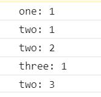
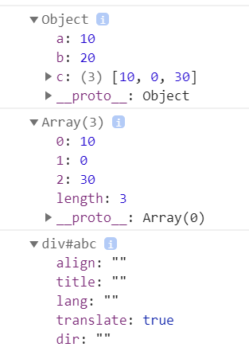
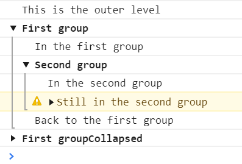
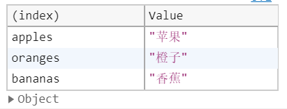
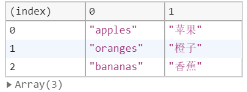
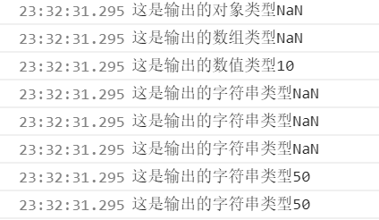
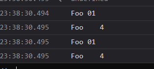
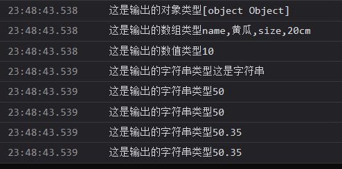
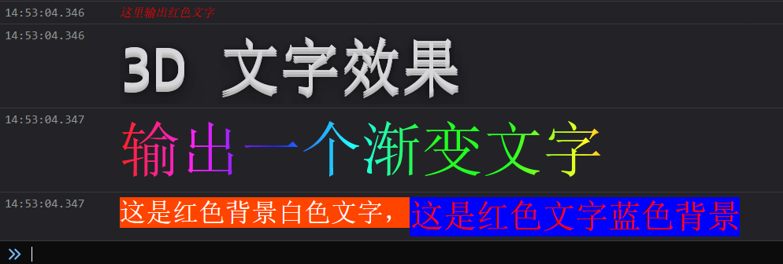

# [浏览器控制台调试之——`console`输出语法使用](https://blog.csdn.net/qq_37417446/article/details/106431569) 

> 我们在开发过程中经常会用到浏览器的控制台工具，来打印一些信息便于我们开发和调试，console对象为我们提供了很多的方法，能够使我们美化格式化打印的信息，对我们调试有所帮助。

## console方法

### log()

> `log()`：方法是我们最常用的方法，他是直接在控制台打印我们要显示的内容

**基本语法：**

```javascript
console.log(obj1 [, obj2, ..., objN);
console.log(msg [, subst1, ..., substN);
console.log('String: %s, Int: %d,Float: %f, Object: %o', str, ints, floats, obj)
console.log(`temp的值为: ${temp}`)
```

**参数说明：**

1. `obj1...objN`：一个用于输出的 JavaScript 对象列表。其中每个对象会以字符串的形式按照顺序依次输出到控制台。
2. `msg`：站位符，可以使用`console`提供的占位符来用后边的`substr1`参数进行替换。
3. `subst1...substN`：用于替换占位符的javascript对象
4. 中括号包起来，是可选的意思

**案例：**

```javascript
// 单个输出
var a = '这是一个消息';
console.log(a); // 这是一个消息
// 多个元素输出
console.log(1, 2, 3); // 1 2 3
// 使用占位符输出
console.log('%d + %d = %d',1,2,3);  // 1 + 2 = 3
// 使用不同类型的占位符
var str = "这是字符串";
var ints = 40;
var floats = 3.3;
var obj = {a: 10, b: 20, c:[1, 3, 4], d:{x:10, y:10}};
console.log('String: %s, Int: %d,Float: %f, Object: %o', str, ints, floats, obj);
//String: 这是字符串, Int: 40,Float: 3.300000, Object: Object { a: 10, b: 20, c: (3) […], d: {…} }

// 使用ES6的模版语法
var temp = '<div>这是一个div元素</div>';
console.log(`temp的值为: ${temp}`);
```

```js
const {str, ints, floats, obj} = {str: '字符串', ints: 12, floats: 12.12, obj: {a: 'item01', b: 'item02'}}
console.log('String: %s, Int: %d,Float: %f, Object: %o', str, ints, floats, obj)
// String: 字符串, Int: 12,Float: 12.12, Object: {a: 'item01', b: 'item02'}
```

> 使用格式化字符串的方式来输出每个变量的值。对应的格式化占位符有：
>
> - `%s`：用于字符串变量（str）的占位符。
> - `%d`：用于整数变量（ints）的占位符。
> - `%f`：用于浮点数变量（floats）的占位符。
> - `%o`：用于对象变量（obj）的占位符。
>
> 在JavaScript中，常见的占位符包括：
>
> - `%s`：用于字符串的占位符。
>
> - `%d` 或 `%i`：用于整数的占位符。
>
> - `%f`：用于浮点数的占位符。
>
> - `%o` 或 `%O`：用于对象的占位符。
>
> - `%c`：用于设置样式的占位符。
>
>   ```js
>   const str = "%c hello %c world";
>   const arg1 = "color: #fadfa3; background: #030307; padding: 5px 0;";
>   const arg2 = "background: pink; padding: 5px 0;";
>   console.log(str, arg1, arg2);
>   ```
>
> - `%j`：用于 JSON 序列化的占位符。
>
>   JSON序列化是指将数据对象转换为JSON字符串的过程。JSON（JavaScript Object Notation）是一种常用的数据交换格式，它以文本形式表示结构化的数据，并且易于读写和解析。
>
>   在编程中，当我们需要将一个对象或数据结构转换为字符串时，我们可以使用JSON序列化。这将会把对象中的键值对转换为对应的JSON字符串表示形式，并且可以通过网络传输或存储到文件中。
>
>   例如，考虑以下JavaScript对象：
>
>   ```javascript
>   const person = {
>     name: 'John',
>     age: 30,
>     city: 'New York'
>   };
>   ```
>
>   如果我们想将`person`对象序列化为JSON字符串，可以使用`JSON.stringify()`方法：
>
>   ```javascript
>   const jsonStr = JSON.stringify(person);
>   ```
>
>   `jsonStr`字符串将包含以下JSON表示形式的内容：
>
>   ```json
>   {
>     "name": "John",
>     "age": 30,
>     "city": "New York"
>   }
>   ```
>
>   这样，我们就可以将对象转换为字符串形式以便于传输、保存或与其他系统进行数据交换。在需要时，我们可以使用JSON解析将JSON字符串转换回原始的数据对象。

### assert()

> `assert()`：判断第一个参数的真假，`true` 不做任何处理，`false` 的话抛出异常并且在控制台输出相应信息，消息以红色警告的形式输出。

**基本语法：**

```javascript
console.assert(assertion, obj1 [, obj2, ..., objN]);
console.assert(assertion, msg [, subst1, ..., substN]);
```

**参数说明：**

1. `assertion`：一个布尔表达式。如果assertion为假，消息将会被输出到控制台之中。
2. `obj1...objN`：被用来输出的Javascript对象列表，可以是一个或者多个用逗号分开。
3. `msg`：站位符，可以使用`console`提供的占位符来用后边的`substr1`参数进行替换。
4. `subst1...substN`：用于替换占位符的javascript对象

**案例：**

```javascript
var a = true;
console.assert(a, '为真的消息不会输出'); // 因为第一个参数为真所以这段不会输出
var b = false;
console.assert(b, '为假的消息输出'); // 因为第一个参数为假所以输出‘Assertion failed: 为假的消息输出’
//通过占位符输出消息
console.assert(b, '%s%s', 'my', 'e', 'you');  // Assertion failed: mye you
```

### clear()

> `clear()`：清楚控制台的所有消息，并且输出：`控制台已清除。`的消息。需要的注意的一点是在Google Chrome浏览器的控制台中，如果用户在设置中勾选了“Preserve log”选项，console.clear()将不会起作用。

**语法：**

```javascript
console.clear();
```

### count()

> `count()`：以参数为标识记录调用的次数，调用时在控制台打印标识以及调用次数。

**语法：**

```javascript
console.count([label]);
```

**参数说明：**

1. `label`：字符串类型，可选的标识参数，如果传入，则以此标识来记录调用测试。

**案例：**

```javascript
/*案例1*/
// 定义一个标识变量
var tag = "";
function fun() {
    // 通过标识变量来记录调用次数
    console.count(tag);
}
// 给标识变量赋值one,然后调用fun方法
tag = "one";
fun(); // one: 1
// 更改标识变量为two
tag = "two";
fun(); // two: 1
fun(); // two: 2
console.count("three"); // three: 1
console.count("two"); // two: 3

/*案例2*/
var abcDom = document.getElementById('abc');
for(var i in abcDom){
    // 通过这种方式可以知道abcDom中能够遍历的属性和方法总个数，当然也可以用其他方法，但是这里是演示的console.count的使用
    console.count("dom");
    console.log(i +'--->'+abcDom[i]);
}
```

**案例1打印结果：**


### countReset()

> 重置`count()`计数器，此函数有一个可选参数 label。如果提供了参数label，此函数会重置与label关联的计数为0。如果省略了参数，此函数会重置默认的计数器为0。

**语法：**

```javascript
console.countReset([label]);
```

**参数说明：**

1. `label`：字符串类型，用于要重置计数器的标识符。

**案例：**

```javascript
/*案例1*/
// 定义一个标识变量
var tag = "";
function fun() {
    // 通过标识变量来记录调用次数
    console.count(tag);
}
// 给标识变量赋值one,然后调用fun方法
tag = "one";
fun(); // one: 1
fun(); // one: 2
console.countReste('one');
fun(); // one: 1
console.count(); // default: 1
console.count(); // default: 2
console.countReste();
console.count(); // default: 1
```

### debug()

> 输出“调试”级别的消息且仅仅控制台配置为显示调试输出时才显示该消息。此方法和`console.log()`方法基本一样。

**语法：**

```javascript
console.debug(对象1 [, 对象2, ..., 对象N]);
console.debug(消息[, 字符串1, ..., 字符串N]);
```

### dir()

> 在控制台中显示指定JavaScript对象的属性，并通过类似文件树样式的交互列表显示。

**语法：**

```javascript
console.dir(object);
```

**参数说明：**

1. `object`：打印出该对象的所有属性和属性值.

**案例：**

```javascript
var obj = {a: 10, b: 20, c:[10, 0, 30]};
var arr = [10, 0, 30];
/*HTML代码：<div id="abc">这是内容</div>*/
var abcDom = document.getElementById('abc');
console.dir(obj); // Object  可以展开的Object形式
console.dir(arr); // Array(3) 可以展开的数组形式
console.dir(abcDom); // div#abc  可以展开的dom结构，包括dom所有的属性和方法
```

**打印结果：**


可以看出`dir()`方法在打印对象数组的时候是先打印出类型，然后可以单击展开查看详细项，打印dom元素的时候打印出元素的所有属性和方法

### dirxml()

> 显示一个明确的XML/HTML元素的包括所有后代元素的交互树。 如果无法作为一个element被显示，那么会以JavaScript对象的形式作为替代。 它的输出是一个继承的扩展的节点列表，可以让你看到子节点的内容。 *经过测试和console.log()输出基本相同*。

**语法：**

```javascript
console.dirxml(object);
```

**参数说明：**

1. `object`：一个属性将被输出的JavaScript对象。

### error()`or`exception()

> 向 Web 控制台输出一条错误消息，exception是error的别名它们功能相同。 *经过测试和console.log()输出相同，只是以淡红色背景警告的形式输出*

**语法：**

```javascript
console.error(obj1 [, obj2, ..., objN]);
console.error(msg [, subst1, ..., substN]);
console.exception(obj1 [, obj2, ..., objN]);
console.exception(msg [, subst1, ..., substN]);
```

**参数说明：**

1. `obj1...objN`：一个用于输出的 JavaScript 对象列表。其中每个对象会以字符串的形式按照顺序依次输出到控制台。
2. `msg`：站位符，可以使用`console`提供的占位符来用后边的`substr1`参数进行替换。
3. `subst1...substN`：用于替换占位符的javascript对象

### group()

> 在 Web控制台上创建一个新的分组.随后输出到控制台上的内容都会被添加一个缩进,表示该内容属于当前分组,直到调用console.groupEnd()之后,当前分组结束.

**语法：**

```javascript
console.group();
```

**案例：**

```javascript
// 定义一个分组
console.group();
// 后边的输出都会在这个分组内，并且有缩进，同时分组可以折叠起来
console.error(obj);
console.error(abcDom);
console.log(obj);
console.log(abcDom);
```

### groupCollapsed()

> 在 Web控制台上创建一个新的分组.随后输出到控制台上的内容都会被添加一个缩进,表示该内容属于当前分组,直到调用console.groupEnd() 之后,当前分组结束.和 console.group()方法的不同点是,新建的分组默认是折叠的.用户必须点击一个按钮才能将折叠的内容打开.

**语法：**

```javascript
console.groupCollapsed();
```

### groupEnd()

> 在 Web控制台中退出一格缩进(结束分组). 请参阅 console 中的Using groups in the console 来获取它的用法和示例.

**语法：**

```javascript
console.groupEnd();
```

**综合案例：**

```javascript
console.log("This is the outer level");
// 开始最外层分组
console.group("First group");
console.log("In the first group");
// 开始第二级分组
console.group("Second group");
console.log("In the second group");
console.warn("Still in the second group");
// 结束第二级分组
console.groupEnd();
console.log("Back to the first group");
// 结束最外层分组
console.groupEnd();
console.debug("Back to the outer level");
// 初始化合并的组
console.groupCollapsed("First groupCollapsed");
console.log("first child");
console.log("second child");
console.groupEnd();
```



### profile()

### table()

> 将数据以表格的形式显示。
> 这个方法需要一个必须参数 data，data 必须是一个数组或者是一个对象；还可以使用一个可选参数 columns。
> 它会把数据 data 以表格的形式打印出来。数组中的每一个元素（或对象中可枚举的属性）将会以行的形式显示在表格中。
> 表格的第一列是 index。如果数据 data 是一个数组，那么这一列的单元格的值就是数组的索引。 如果数据是一个对象，那么它们的值就是各对象的属性名称。 注意（在 FireFox 中）console.table 被限制为只显示1000行（第一行是被标记的索引。

**语法：**

```javascript
console.table(data [, columns]);
```

**参数说明：**

1. `data`：要显示的数据。必须是数组或对象。
2. `columns`：一个包含列的名称的数组。

**案例：**

```JavaScript
// 打印数组
console.table(["apples", "oranges", "bananas"]);
```


```JavaScript
// 打印对象
console.table({"apples":"苹果", "oranges":"橙子", "bananas":"香蕉"});
```



```JavaScript
// 打印多维数组
console.table([["apples","苹果"], ["oranges","橙子"], ["bananas","香蕉"]]);
```



```JavaScript
// 打印多维数组
var obj = {
  fruit:{
  "apples":"苹果", "oranges":"橙子", "bananas":"香蕉", "pair":"梨"
  },
  greens:{
    "cucumber":"黄瓜", "spinage":"菠菜", "potato":"马铃薯"
  }
};
console.table(obj);
```


```JavaScript
// 打印多维数组，并传入要打印的指定的值
var obj = {
  fruit:{
    "name":"苹果", "size":"10cm", "weight":"500g", "color":"红色"
  },
  greens: {
    "name":"黄瓜", "size":"20cm", "weight":"20g", "color": "green"
  }
};
console.table(obj,['name', 'size']);
```


### time()

> 启动一个计时器来跟踪某一个操作的占用时长。每一个计时器必须拥有唯一的名字，页面中最多能同时运行10,000个计时器。当以此计时器名字为参数调用 console.timeEnd() 时，浏览器将以毫秒为单位，输出对应计时器所经过的时间。

**语法：**

```JavaScript
console.time(timerName);
```

**参数说明：**

1. `timerName`：新计时器的名字。 用来标记这个计时器，作为参数调用 `console.timeEnd()` 可以停止计时并将经过的时间在终端中打印出来.

### timeEnd()

> 停止一个通过 `console.time()` 启动的计时器

**语法：**

```JavaScript
console.timeEnd(label);
```

**参数说明：**

1. `label`：需要停止的计时器名字。一旦停止，计时器所经过的时间会被自动输出到控制台。

**案例展示：**

```JavaScript
// 不传参数，开启一个默认default标识计数器
console.time();
for(var i=0;i<1000000;i++){
	var j=i*i;
}
// 不传参数，停止一个默认default标识计数器
console.timeEnd();

// 传参数，开启一个myTime参数的标识计数器
var myTime = 'myTime';
console.time(myTime);
for(var i=0;i<1000000;i++){
	var j=i*i;
}
// 传入要停止的参数，停止myTime标识计数器
console.timeEnd(myTime);
```


### trace()

> 堆栈跟踪，控制台也支持输出堆栈，其将会显示到调用 console.trace() 的点的调用路径，个人理解就是从哪里调用的此方法：

```javascript
function foo(a) {
    function bar(a) {
        console.trace();
    }
    bar(10);
}
foo(20);
```


### warn()

> 以警告的方式输出消息

```javascript
var obj = {
  fruit:{
    "name":"苹果", "size":"10cm", "weight":"500g", "color":"红色"
  },
  greens: {
    "name":"黄瓜", "size":"20cm", "weight":"20g", "color": "green"
  }
};
console.warn(obj);
```


## console的占位符

> 还记得我们上面提道德的`msg`占位符吗，console为我们提供了一些实用的占位符，让我们来替换要想要的内容。

| 占位符   | 描述                                                         |
| -------- | ------------------------------------------------------------ |
| %o or %O | 打印 JavaScript 对象。主要是用来替换对象元素                 |
| %d or %i | 打印整数。支持数字格式化。例如, console.log(“Foo %.2d”, 1.1) 表示给数字添加2个。 |
| %s       | 打印字符串。                                                 |
| %f       | 打印浮点数。支持格式化，比如 console.log(“Foo %.2f”, 1.1) 会输出两位小数: Foo 1.10 |
| %c       | 用于修饰输出结果的样式替换                                   |

### %o 和 %O

> 表示要替换的是javascript对象，如果替换的是非对象类型

```javascript
var obj = {"name":"黄瓜", "size":"20cm", "weight":"20g", "color": "green"}
var arr = ["name","黄瓜", "size","20cm"];
var num = 10;
var str = '这是字符串';
console.log('这是输出的对象类型%o', obj);
console.log('这是输出的数组类型%O', arr);
console.log('这是输出的数值类型%o', num);
console.log('这是输出的字符串类型%o', str);
```


经过测试发现这个占位符可以替换所有类型，比较javascript的类型都归属于对象类型

### %d 和 %i

> 用于替换数值类型

```javascript
var obj = {"name":"黄瓜", "size":"20cm", "weight":"20g", "color": "green"}
var arr = ["name","黄瓜", "size","20cm"];
var num = 10;
var str = '这是字符串';
console.log('这是输出的对象类型%d', obj);
console.log('这是输出的数组类型%i', arr);
console.log('这是输出的数值类型%d', num);
console.log('这是输出的字符串类型%i', str);
console.log('这是输出的字符串类型%i', '50');
console.log('这是输出的字符串类型%d', '50');
console.log('这是输出的字符串类型%i', 50.35);
console.log('这是输出的字符串类型%d', 50.35);
```



还是使用上边的代码输出结果就不一样了，非对象类型都将输出`NaN`，即便是字符串数值也不会强制转换，如果是小数将取整输出。

> `%d` 和 `%i`还有另一种用法就是数字格式化，在数字前面加前导0或前导空格

```javascript
console.log("Foo %.2d", 1.1);
console.log("Foo %4d", 4.100);
console.log("Foo %.2i", 1.1);
console.log("Foo %4i", 4.100);
```

| chrome                                                       | firefox                                                      |
| ------------------------------------------------------------ | ------------------------------------------------------------ |
|  |  |

从输出结果可以看出，在`%`号后边增加`.`表示添加前导0，再跟多少位；在`%`后边直接跟数字表示加指定多少空位；此方法只有Firefox支持。

### %f

> 用于替换浮点类型数据

```javascript
var obj = {"name":"黄瓜", "size":"20cm", "weight":"20g", "color": "green"}
var arr = ["name","黄瓜", "size","20cm"];
var num = 10;
var str = '这是字符串';
console.log('这是输出的对象类型%f', obj);
console.log('这是输出的数组类型%f', arr);
console.log('这是输出的数值类型%f', num);
console.log('这是输出的字符串类型%f', str);
console.log('这是输出的字符串类型%f', '50');
console.log('这是输出的字符串类型%f', '50');
console.log('这是输出的字符串类型%f', 50.35);
console.log('这是输出的字符串类型%f', 50.35);
```


从输出结果可以看出，它和，`%d` 和 `%i`基本一样，唯一的区别是他支持小数，同时非数值型数据将输出`NaN`;

### %s

> 用于替换字符串类型数据

```javascript
var obj = {"name":"黄瓜", "size":"20cm", "weight":"20g", "color": "green"}
var arr = ["name","黄瓜", "size","20cm"];
var num = 10;
var str = '这是字符串';
console.log('这是输出的对象类型%s', obj);
console.log('这是输出的数组类型%s', arr);
console.log('这是输出的数值类型%s', num);
console.log('这是输出的字符串类型%s', str);
console.log('这是输出的字符串类型%s', '50');
console.log('这是输出的字符串类型%s', '50');
console.log('这是输出的字符串类型%s', 50.35);
console.log('这是输出的字符串类型%s', 50.35);
```

| chrome                                                       | firefox                                                      |
| ------------------------------------------------------------ | ------------------------------------------------------------ |
|  |  |

还是上边的代码，从输出结果可以看出，它把对象转换成`Object`，把数组转换成`Array(4)`，其他的都转换成字符串形式，火狐和谷歌输出结果不太相同;

## %c 输出结果的样式修饰

> 在控制台中打印普通结果往往非常单调，有时候我们想让我们打印出的结果具有向css一样的样式修饰，可以使用占位符`%c`，在`%c`后面的结构将要使用我们定义的样式来修饰

```javascript
// 红色的文字
console.log("%c这里输出红色文字", "color: red; font-style: italic");
// 给文字添加阴影，输出3D效果
console.log("%c3D 文字效果", " text-shadow: 0 1px 0 #ccc,0 2px 0 #c9c9c9,0 3px 0 #bbb,0 4px 0 #b9b9b9,0 5px 0 #aaa,0 6px 1px rgba(0,0,0,.1),0 0 5px rgba(0,0,0,.1),0 1px 3px rgba(0,0,0,.3),0 3px 5px rgba(0,0,0,.2),0 5px 10px rgba(0,0,0,.25),0 10px 10px rgba(0,0,0,.2),0 20px 20px rgba(0,0,0,.15);font-size:5em");
// 输出一个渐变文字
console.log('%c输出一个渐变文字 ', 'background-image:-webkit-gradient( linear, left top, right top, color-stop(0, #f22), color-stop(0.15, #f2f), color-stop(0.3, #22f), color-stop(0.45, #2ff), color-stop(0.6, #2f2),color-stop(0.75, #2f2), color-stop(0.9, #ff2), color-stop(1, #f22) );color:transparent;-webkit-background-clip: text;font-size:5em;');
//输出带背景的文字
console.log('%c这是红色背景白色文字，%c这是红色文字蓝色背景', 'color: #fff; background: #f40; font-size: 24px;','color: #f00; background: #00f; font-size: 30px;');
```

上面代码打印结果：

| chrome                                                       | firefox                                                      |
| ------------------------------------------------------------ | ------------------------------------------------------------ |
|  |  |

可以看出`%c`后边的文字将应用我们自定义的样式，如果我们一行要定义不同的文字样式，可以添加多个`%c`,然后后边的参数分别一一对应。

```javascript
console.log('%c这是红色背景白色文字，%c这是红色文字蓝色背景', 'color: #fff; background: #f40; font-size: 24px;');
console.log('%c这是红色背景白色文字，这是红色文字蓝色背景', 'color: #fff; background: #f40; font-size: 24px;','color: #f00; background: #00f; font-size: 30px;');
```

| chrome                                                       | firefox                                                      |
| ------------------------------------------------------------ | ------------------------------------------------------------ |
|  |  |

上面结果可以看出，如果`%c`和传入的参数没有一一对应，那么浏览器解析的结果不一样。

`%c` 语法可用的属性如下：

| 属性                            | 说明                                     |
| ------------------------------- | ---------------------------------------- |
| background                      | 与其全写版本。                           |
| border                          | 与其全写版本。                           |
| border-radius                   | 圆角                                     |
| box-decoration-break            | ？                                       |
| box-shadow                      | 元素的投影                               |
| clear 和 float                  | 浮动                                     |
| color                           | 颜色                                     |
| cursor                          | 当前颜色                                 |
| display                         | 默认输出是inline，可以通过次数从改变元素 |
| font 与其全写版本。             | 文字样式                                 |
| line-height                     | 文字行高                                 |
| margin                          | 外间距                                   |
| outline 与其全写版本。          | 外边线                                   |
| padding                         | 内间距                                   |
| text-transform 这类 text-* 属性 | 字母大小写                               |
| white-space                     | 文字间距                                 |
| word-spacing 和 word-break      | 文字是否换行                             |
| writing-mode                    | 排布模式                                 |

> **注意:** 控制台信息的默认行为与行内元素相似。为了应用 padding, margin 这类效果，你应当这样设置display: inline-block。