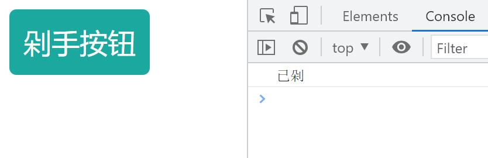
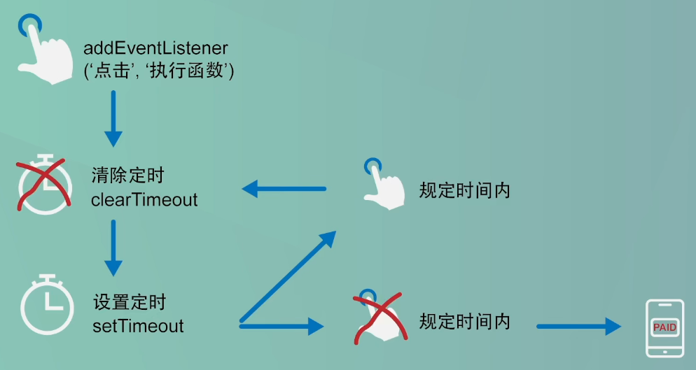

# 防抖函数

## 防抖效果

点击“剁手按钮”，延时1秒后，控制台打印“已剁”。**若点击按钮后，1秒内再次点击，则需重新计时，1秒后打印。**



## 防抖代码

```html
<style>
    input {
        padding: 12px;
        background-color: #1aa89f;
        border-radius: 6px;
        border: 0;
        color: white;
        font-size: 24px;
    }
</style>

<input type="button" value="剁手按钮">

<script>
    const button = document.querySelector('input');
    
    function payMoney() {
        console.log('已剁');
    }
    
    // 防抖函数
    function debounce(func, delay) {
        let timer;
        return function () {
            let context = this;
            let args = arguments;
            clearTimeout(timer);
            timer = setTimeout(function () {
                func.apply(context, args);
            }, delay);
        }
    }
    
    button.addEventListener('click', debounce(payMoney, 1000));
</script>
```

## 防抖分析

> **生活中的防抖：**
>
> ​	电梯感应门
>
> **开发中的防抖：**
>
> ​	改变页面大小的统计、滚动页面位置的统计、输入框连续输入的请求次数控制、防止表单多次提交

本次就结合**“防止页面表单多次提交”**这一案例来讲解防抖函数。初始代码如下，具有正常的监听效果。
```js
const button = document.querySelector('input');

function payMoney() {
    console.log('已剁');
}

button.addEventListener('click', payMoney);
```

假设我们现在要防止用户因为手抖多次触发付款函数，因此我们需要进行防抖操作。防抖函数流程图设计如下：



现在要开始进行防抖设置了。首先需要创建一个防抖函数，并且把事件触发执行的函数设置为这个防抖函数，在防抖函数里面执行原来的`payMoney`函数。

```js
const button = document.querySelector('input');

function payMoney() {
    console.log('已剁');
}

// 防抖函数
function debounce(func) {
    func();
}

button.addEventListener('click', debounce(payMoney));
```

### 防抖函数难点一：

还没有点击按钮，控制台就出现了已经点击按钮的消息，明显是不对的，这就是防抖函数的第一个难点。如果这样写的话，那么定义监听函数时直接执行了函数，因此会出现这种错误。

为了解决这个问题，我们需要用到高阶函数，也就是在函数里面返回函数。效果是，只有在按钮被点击时才打印消息。

用了高阶函数以后，即使我们在字面上执行了这个防抖函数，但是这个防抖函数返回了一个函数，在点击事件触发的时候才执行。

```js
const button = document.querySelector('input');

function payMoney() {
    console.log('已剁');
}

// 防抖函数 + 高阶函数
function debounce(func) {
    return function () {
        func();
    }
}

button.addEventListener('click', debounce(payMoney));
```

接下来我们就可以设置延时了。在返回函数里面增加一个`setTimeout`，并且在`setTimeout`里面执行`payMoney`这个函数。

因为我们需要设置延迟时间，所以我们可以为防抖函数新增第二个参数。

我们要进行延时，就相应相应清除延时，具体要清除哪个延时，我们就必须为延时设置变量名字，接着清除延时使用`clearTimeout`。

### 防抖函数难点二：

前面我们说到，清除延时要在建立延时的前面。现在，这里就是防抖函数的第二个难点了，我们不能清除一个没有定义的变量名，在清除以后再定义这个变量肯定是错误的。

于是，大家就会简单地把定义的步骤放在顶部。

```js
function debounce(func, delay) {
	return function () {
		let timer;
		clearTimeout(timer);
		timer = setTimeout(function () {
        	func();
		}, delay);
	}
}
```
### 防抖函数难点三：

这样看起来好像没有问题，但其实这是防抖函数第三个难点。现在如果连续点击按钮10次，间隔在1秒内，可看到全部消息都陆续执行，并没有实现重新计时的功能。


防抖函数中，每次点击的时候都会执行返回函数里面的内容，也就是创建变量，清除延时，建立延时三个步骤，而且每次点击的执行函数都是独立的，它们互不干涉。正因为它们之间没有联系，因此清除延时在这里完全没有起作用。

要让这些独立的执行函数之间有联系，就需要利用到“作用域链”了，也就是“闭包”，我们要做的只需要把`timer`这个变量的定义放在返回函数的外围，这样我们在定义监事件的时候就同时定义了这个`timer`变量。

```js
function debounce(func, delay) {
	let timer;
	return function () {
		clearTimeout(timer);
		timer = setTimeout(function () {
   			func();
		}, delay);
	}
}
```

因为作用域链的关系，所有独立的执行函数都能访问到这个`timer`变量，并且现在这个`timer`变量只创建了一次，是唯一的，我们只不过不断给`timer`赋值进行延时而已，每一个清除延时，就是清除上一个定义的延时，相当于多个函数共用同一个外部变量。

现在我们连续点击5下，控制台只显示一条消息，证明已经实现了防抖功能。

### 防抖函数难点四：

我们现在稍微返回到起点，让`payMoney`函数里面输出`this`，并且不使用**防抖函数**看看`this`的指向，可以看到，是指向点击按钮的，这也是最合理的。

再看看防抖函数的操作下，`this`的指向，可以看到，`this`指向`Window`了。

```js
const button = document.querySelector('input');

function payMoney() {
console.log('已剁');
console.log(this);
}

// 防抖函数
function debounce(func, delay) {
let timer;
return function () {
  clearTimeout(timer);
  timer = setTimeout(function () {
      func();
  }, delay);
}
}

// 不使用防抖函数，payMoney的this指向：<input type="button" value="剁手按钮">
button.addEventListener('click', payMoney);
// 使用防抖函数，payMoney的this指向：Window {window: Window, self: Window, document: document, name: '', location: Location, …}
button.addEventListener('click', debounce(payMoney, 1000));
```

首先，这肯定不是我们想要的，其次，为什么呢，因为，回调的原因，运行时已经在`Window`下了。

因此，我们可以在`setTimeout`前面就把`this`保存下来，此时的`this`肯定是指向这个按钮的。然后，在`setTimeout`里面用`call`来绑定这个`this`给`payMoney`，此时可以看到，控制台的输出结构是正确的。

```js
// 防抖函数
function debounce(func, delay) {
	let timer;
	return function () {
	    let context = this;
	    clearTimeout(timer);
	    timer = setTimeout(function () {
	        func.call(context);
	    }, delay);
	}
}
```

既然我们已经考虑到`this`的情况，那么我们也得考虑参数的问题，毕竟在`JavaScript`里，函数没有设置参数也是可以传入参数的。也就是每个执行函数是有可能被传入参数的，而传入的参数是需要给`payMoney`函数使用的。因此，我们这里增加参数，并且使用`apply`。

```js
// 防抖函数
function debounce(func, delay) {
 let timer;
 return function () {
     let context = this;
     let args = arguments;
     clearTimeout(timer);
     timer = setTimeout(function () {
         func.apply(context, args);
     }, delay);
 }
}
```

现在，防抖函数就完成了。
