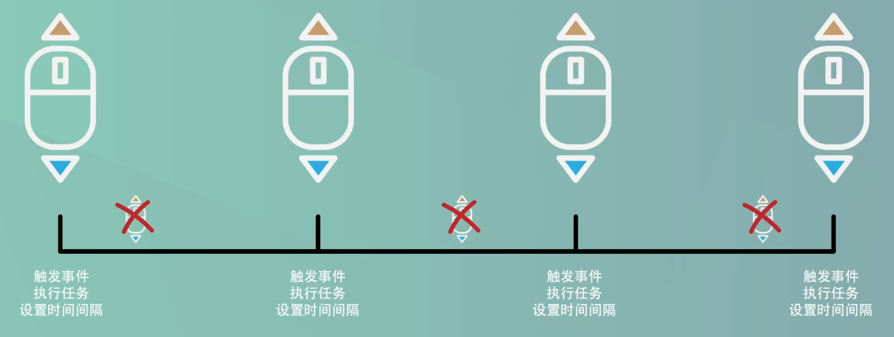

# 节流函数

## 节流效果

当浏览器的视图窗口发生变化时，随机生成界面`body`的背景颜色。**若窗口持续变化，每隔两秒响应一次。**

## 节流代码

```js
function coloring() {
    let r = Math.floor(Math.random() * 255);
    let g = Math.floor(Math.random() * 255);
    let b = Math.floor(Math.random() * 255);
    document.body.style.background = `rgb(${r}, ${g}, ${b})`;
}

// // 节流函数：定时器
// function throttle(func, delay) {
//     let timer;
//     return function () {
//         let context = this;
//         let args = arguments;
//         if (timer) {
//             return;
//         }
//         timer = setTimeout(function () {
//             func.apply(context, args);
//             timer = null;
//         }, delay);
//     }
// }

// 节流函数：Date对象
function throttle(func, delay) {
    let pre = 0;
    return function () {
        let now = new Date();
        let context = this;
        let args = arguments;
        if (now - pre > delay) {
            func.apply(context, args);
            pre = now;
        }
    }
}

window.addEventListener('resize', throttle(coloring, 2000));
```


## 节流分析

> **大自然中的节流：**
>
> ​	鲸鱼换气。鲸鱼每隔一段时间就必须露出水面来换气。首先，鲸露出水面换气，这个时候体内的氧气足够支撑，打个比方30分钟，于是就潜水了，在这30分钟里面，鲸只要还有充足的氧气，就不会冒泡了，只会等到30分钟的时候再露出水面换气，下一次换气以后也同样会等足时间再露出水面。
>
> **Web开发中的节流：**
>
> ​	滚动屏幕



假设我们要监听用户**改变页面尺寸的事件**，并且实现在改变尺寸的时候有相应背景颜色改变的效果。接下来，就用代码来实现节流。

首先，我们设置监听事件`resize`，也就是改变页面尺寸，然后需要触发的任务，创建一个函数`coloring`，这里为红、绿、蓝三种颜色值设置随机值，然后改变背景颜色。

```js
function coloring() {
    let r = Math.floor(Math.random() * 255);
    let g = Math.floor(Math.random() * 255);
    let b = Math.floor(Math.random() * 255);
    document.body.style.background = `rgb(${r}, ${g}, ${b})`;
}

window.addEventListener('resize', coloring);
```

此时的效果，窗口大小每发生变化，背景颜色均发生改变，过于频繁。

接下来就开始实现节流。节流的代码会和防抖代码有点类似。

### 方式一：定时器

首先创建一个节流函数，这个节流函数同样需要两个基本的参数，执行任务的函数和延迟的时间，函数里面同样需要返回一个函数让对象有可执行的内容，然后再修改`addEventListener`里面的参数。现在我们知道，要设置一个时间间隔，对于时间间隔来说，常用的还是`setTimeout`，由于这个时间间隔是要给后面的任务来判断是否执行的标识，因此需要创建变量，那么和防抖一样，这个变量需要在返回函数的外围定义，这样多个任务才可以通过闭包的形式对这个变量进行操作，最后在`setTimeout`里面执行任务函数。

```js
function coloring() {
    let r = Math.floor(Math.random() * 255);
    let g = Math.floor(Math.random() * 255);
    let b = Math.floor(Math.random() * 255);
    document.body.style.background = `rgb(${r}, ${g}, ${b})`;
}

// 节流函数
function throttle(func, delay) {
    let timer;
    return function () {
        timer = setTimeout(function () {
            func();
        }, delay);
    }
}

window.addEventListener('resize', throttle(coloring, 2000));
```

现在，我们就可以进行节流的核心代码了。也就是判断触发的事件是否在时间间隔内，如果在时间间隔内，我们就不触发事件，如果不在时间间隔内，我们就触发事件。换句话说，如果`timer`被赋值了，也就是任务还在等待执行，暂时不改变`timer`的值，如果`timer`没有被赋值，那就给它赋值执行任务就好了。

在代码里面，我们就可以用`if`来进行判断，如果`timer`为`true`，也就是被赋值了，那就直接返回，也就是不执行任务；其余的情况就是`timer`为`false`了，也就是没有被赋值或者任务已经执行完了，那么我们就为`timer`赋值进行延迟执行，延迟执行以后，我们要情况`timer`的值，不需要使用`clearTimeout`，直接清空`timer`的值就可以了，因为这个清空行为是在延迟执行任务以后发生的，所以，符合我们的节流思路。

```js
function coloring() {
    let r = Math.floor(Math.random() * 255);
    let g = Math.floor(Math.random() * 255);
    let b = Math.floor(Math.random() * 255);
    document.body.style.background = `rgb(${r}, ${g}, ${b})`;
}

// 节流函数
function throttle(func, delay) {
    let timer;
    return function () {
        if (timer) {
            return;
        }
        timer = setTimeout(function () {
            func();
            timer = null;
        }, delay);
    }
}

window.addEventListener('resize', throttle(coloring, 2000));
```

现在，我们就可以来完善代码了。也就是之前，防抖函数说过的问题，`this`的指向和参数。

```js
// 节流函数
function throttle(func, delay) {
    let timer;
    return function () {
        let context = this;
        let args = arguments;
        if (timer) {
            return;
        }
        timer = setTimeout(function () {
            func.apply(context, args);
            timer = null;
        }, delay);
    }
}
```

测试代码。可以看到，现在不管怎么改变页面大小，都是按照2秒的间隔来进行的。

### 方式二：Date对象

不过节流还有另一种方式可以实现，因为核心就在于时间间隔，另一种常见的时间间隔就是用`Date`对象。

我们现在把代码稍微复原到初始状态。

```js
function coloring() {
    let r = Math.floor(Math.random() * 255);
    let g = Math.floor(Math.random() * 255);
    let b = Math.floor(Math.random() * 255);
    document.body.style.background = `rgb(${r}, ${g}, ${b})`;
}

// 节流函数
function throttle(func, delay) {
    return function () {
        
    }
}

window.addEventListener('resize', throttle(coloring, 2000));
```

然后，我们在控制台`new`一个`Date`对象，表示当前时间，然后再`new`一个`Date`对象，表示当前的时间。前面创建的就不是当前时间了，现在用后一个减去前一个，可看到是一串数字，这就是毫秒数了。

```js
> let t1 = new Date();
< undefined
> let t2 = new Date();
< undefined
> t2 - t1;
< 5687
```

因为每个`Date`对象都保存了一个从**1970年1月1号**起经过的毫秒数，所以`Date`对象是可以相减的，后一个毫秒数大于前一个毫秒数，再加上我们为节流设置的延时也是毫秒数形式的，因此我们可以利用这一点来开展工作。

现在我们创建一个变量`now`来保存执行函数当时的时间，但是我们要和前一个时间点进行比较才能确定是否已经过了时间间隔。因此我们至少还要创建一个变量，这里用变量`pre`来表示，注意，`pre`也是要在返回函数外围的，避免每次执行都被自动修改了。一开始的值，要设置为0，这样可以进行运算。

现在我们就可以用`if`来进行判断了，如果当前执行函数的时间减去前一个时间点得到的毫秒数，大于我们设置的时间间隔，就意味着已经过了时间间隔了，我们就可以执行函数了，执行完以后，我们需要把当前时间点的毫秒数赋值给表示前一个时间点的变量，即修改`pre`变量的值。因为闭包的关系，后面的执行函数就能识别到`pre`这个变量里面的新值了。

```js
// 节流函数：Date对象
function throttle(func, delay) {
    let pre = 0;
    return function () {
        let now = new Date();
        let context = this;
        let args = arguments;
        if (now - pre > delay) {
            func.apply(context, args);
            pre = now;
        }
    }
}
```

