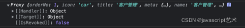
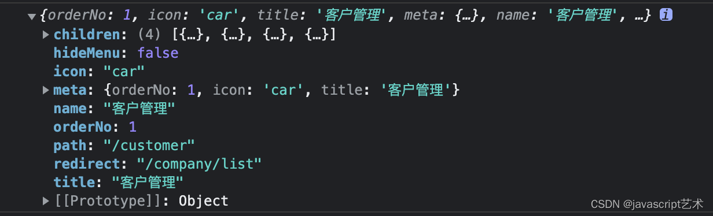

# vue如何获取proxy对象里的属性值

proxy打印出来是一个这样的对象



 直接打印proxy里面的值可能会报undefined

最简单的解决办法就是：

```js
  // 导入toRaw函数
  import { toRaw } from '@vue/reactivity';
 
 
 
  // 该函数返回转换后的对象
  const crystal = toRaw(menu);
  // 输出可以看到已经不是proxy对象了
  console.log(crystal);
```

这样就能打印出proxy里原始的对象


