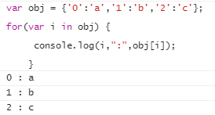
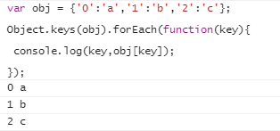
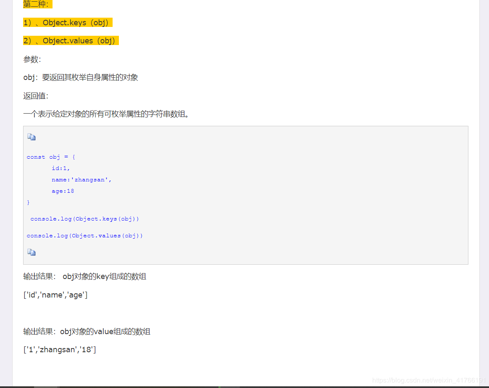
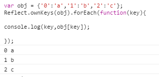
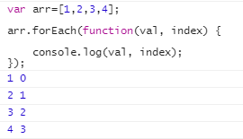
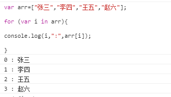
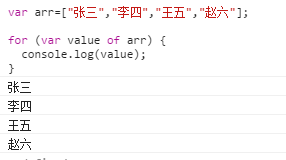

# ES6遍历对象的6种方法（应用中推荐前三种）

1.for … in 循环遍历对象自身的和继承的可枚举属性(循环遍历对象自身的和继承的可枚举属性(不含Symbol属性).).



2、使用Object.keys()遍历 (返回一个数组,包括对象自身的(不含继承的)所有可枚举属性(不含Symbol属性).).



 



3.Object.getOwnPropertyNames(obj),返回一个数组,包含对象自身的所有属性(不含Symbol属性,但是包括不可枚举属性).

```js
var obj = {'0':'a','1':'b','2':'c'};

Object.getOwnPropertyNames(obj).forEach(function(key){
    console.log(key,obj[key]);
});
```


4、使用Reflect.ownKeys(obj)遍历

返回一个数组,包含对象自身的所有属性,不管属性名是Symbol或字符串,也不管是否可枚举. 

```js
var obj = {'0':'a','1':'b','2':'c'};

Reflect.ownKeys(obj).forEach(function(key){
console.log(key,obj[key]);
});
```



**javaScript遍历数组总结**

1、使用forEach遍历


2、使用for..in..遍历



3、使用for-of遍历

不仅支持数组，还支持大多数类数组对象，例如DOM NodeList对象.

也支持字符串遍历，它将字符串视为一系列的Unicode字符来进行遍历.



 

