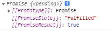

# 关于js promise中如何取到[[PromiseResult]]

1. 当返回值validate 为一个Promise对象时

```js
  let validate=that.selectValidEvent();
  
  console.log( validate);
```




2. 这种情况下如何获取promise对象的值PromiseResult，话不多说上代码：

```js
validate.then((result) => {
	console.log(“result”,result);
}
```


3. 总结：用了async声明方法为异步那个方法that.selectValidEvent(); 返回的就是promise对象，promise对象的值PromiseResult获取只能通过.then()方法获取

# 如何将Promise.then中的值直接return出来

>  Promise 如何返回值，而不是返回 Promise 对象。实际开发中使用封装好的异步请求函数，为什么调用该函数返回的值一直都是 undefined。

## 一、需求

定义一个 `foo` 函数，在里面执行异步操作，然后取得 `Promise.then` 中的值并 `return` 出来，以便在别的地方使用该返回值。

该需求可以用伪代码表示如下：

```javascript
function foo() {
  // 执行异步操作得到 "hello world!" 字符串，并 return 出去
}

result = foo()
console.log(result)  // 预期结果：打印出 "hello world!"
```

复制

## 二、遇到的问题

### 1. 返回 undefined

**问题代码：**

```javascript
function foo() {
  var p = new Promise((resolve, reject) => {
    resolve('hello world!')
  });
  p.then(value => {
     return value
  })
}

result = foo()
console.log(result)  // undefined
```

复制

**问题原因：**

最直接的原因，`foo` 函数没有返回值，所以是 `undefined`。里面的 `return` 语句是写在箭头函数里的，所以箭头函数的 `return` 不是 `foo` 函数的。

### 2. 没有返回正确的值

**问题代码：**

```javascript
function foo() {
  let result = ''
  var p = new Promise((resolve, reject) => {
    resolve('hello world!')
  });
  p.then(value => {
    result = value
  })
  return result
}

result = foo()
console.log(result) // ""
```

复制

**问题原因：**

同步和异步的问题，「无法在当前获得未来的值」。前面声明了 `result`，而后面对它的赋值发生在异步操作中。

## 三、正确的方法

经过一番研究，得出结论：不可能实现直接将 `Promise.then` 中的值 `return` 出来。

正确的使用方式只能是：`return` 出 `Promise` 对象，然后在 `.then` 的执行体中处理异步请求得到的值（或者用 `async/await`）。

### 1. 返回 Promise 对象

```javascript
function foo() {
  return new Promise((resolve, reject) => {
    resolve('Success!')
  });
}

result = foo()
console.log(result)  // [object Promise]
```

复制

### 2. 使用 .then 处理返回的数据

```javascript
function foo() {
  return new Promise((resolve, reject) => {
    resolve('hello world!')
  });
}

p = foo()
p.then(result => console.log(result)) // "hello world!"
```

复制

### 2. 使用 async/await 处理返回的数据

```javascript
function foo() {
  return new Promise((resolve, reject) => {
    resolve('hello world!')
  });
}

// 通过async/await去操作得到的Promise对象
(async function () {
  result = await foo()
  console.log(result)  // "hello world!"
})()
```

复制

## 五、实战代码

将异步请求封装成一个方法，并 `return` 异步请求结果给变量。

```javascript
// 1. 封装数据请求方法（异步）
function getSomething() {
  return new Promise(resolve => {
    service.getList().then(res => {
        resolve(res)
    }) 
  })
}

// 2. 使用 Promise+async 实现
async function asyncFn() {
 let returnData = await getSomething()
 return returnData 
}

// 3. 因为asyncFn()返回的是 Promise对象，而不是直接返回值，所以需要.then来获取值进行操作
asyncFn().then(value => {
    let data = value
})
```