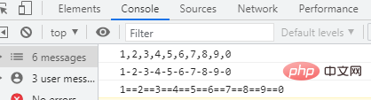

# 拼接全部元素，返回一个字符串

数组中的全部元素拼接成一个字符串，简单来说就是将数组转为一个字符串。例如下面的一个数组：

```js
arr = [1,2,3,4,5,6,7,8,9,0];
```

想要拼接其中的所有元素，返回一个字符串，例如“`1234567890`”或者“`1,2,3,4,5,6,7,8,9,0`”，这要怎么操作？下面我们介绍几种方法。

## 方法一：使用for循环遍历数组，拼接每个数组元素

遍历数组我们使用for循环；拼接可以利用字符串连接运算符“+”、也可使用concat()方法（具体可以阅读文章《[JS字符串学习之巧用函数来连接多个字符串](https://www.php.cn/js-tutorial-481074.html)》）

我们看看实现代码：

```js
var arr = [1,2,3,4,5,6,7,8,9,0];
var i,str="";

for(i=0;i<arr.length;i++){  //循环遍历数组
    //拼接
    str=str.concat(arr[i]);
    //str=str + arr[i];
}

console.log(str);
```

输出结果：


说明：这种方法适用于一维数组转字符串。

## 方法二：使用toString()方法

toString()可以把每个元素转换为字符串，然后以逗号连接输出显示。（注：toString()方法不支持自定义分隔符！）

```js
var arr = [1,2,3,4,5,6,7,8,9,0];
var str;
str=arr.toString();
console.log(str);
```


toString()方法可以处理多维数组，会以迭代的方式把所有数组都转换为字符串。

```js
var arr = [1,[2,3],[4,5],[6,[7,[8,9],0]]];
var str;
str=arr.toString();
console.log(str);
```


## 方法三：使用join()方法

`array.join(separator)`方法用于把数组 array 中的所有元素放入一个字符串，每个元素可以使用 `separator`参数设置的分隔符进行分隔；如果省略该参数，则默认使用逗号“`,`”分隔（这就和toString()方法的输出一样了）。

```js
var arr = [1,2,3,4,5,6,7,8,9,0];
var str1,str2,str3;

str1=arr.join();
str2=arr.join('-');
str3=arr.join('==');
console.log(str1);
console.log(str2);
console.log(str3);
```



如果不想有分隔符，那么可以设置separator参数为空字符串（`''`）;

```js
var arr = [1,2,3,4,5,6,7,8,9,0];
var str;
str=arr.join('');
console.log(str);
```


join()方法也可以处理多维数组，不过需要省略参数，输出和toString()一样：

```js
var arr = [1,[2,3],[4,5],[6,[7,[8,9],0]]];
var str;
str=arr.join();
console.log(str);
```


## 说明：

如果数组中包括了对象（非简单类型），那么调用`join()`和`toString()`方法所出来的结果，无论该元素的内容是什么，都是显示`[object Object]`字符串。

```js
var arr = [{姓名: '李华'}, '张三', '李四'];

console.log(arr.toString()); // "[object Object],张三,李四"
console.log(arr.join()); // "[object Object],张三,李四"
```


一般在实际的场景中，`join()`方法使用得较多。

# 巧用函数来连接多个字符串

在JavaScript字符串中，一说到拼接字符串，就会想到使用字符串连接运算符“`+`”，使用它让两个或多个字符串变量连接起来：

```js
var str1 = "Hello";
var str2 = "World";
var splicing = str1+" "+str2;
console.log("str1字符串为："+str1);
console.log("str2字符串为："+str2);
console.log("拼接之后的字符串为："+splicing); // Hello World
```

## 使用`concat()`方法

`concat()`方法可以连接两个或多个字符串

```js
var str1 = "Hello";
var str2 = str1.concat(" ","World"," ","!");
console.log("str1字符串为："+str1); // Hello
console.log("拼接之后的字符串为："+str2); // Hello World !
```

> 分析：`string.concat(str1,str2,...,strN)`函数可以把多个参数`str1,str2,...,strN`添加到指定字符串`string`的尾部，然后返回连接后的字符串。
>
> 说明：`concat()`方法不会修改原字符串的值，因此 `string` 本身并没有被更改。

## 使用`join()`方法

`join()`方法其实是一个数组方法，可以把数组中的所有元素放入一个字符串。

在特定的操作环境中，我们可以借助该`join()`方法来连接字符串，如 HTML 字符串输出等。

```js
var arr = new Array();
arr = ["www","php","cn"];
var str = arr.join("");
arr = null;
document.write(str); // wwwphpcn
```

> 在传统浏览器中，使用数组的`join()`方法连接超大字符串时，速度会很快，是推荐的最佳方法。

```js
var s = "JavaScript";
var arr = new Array();
for (var i = 0; i < 10; i ++) {
    arr.push(s);
}
var str = arr.join("-");
arr = null;
document.write(str); // JavaScript-JavaScript-JavaScript-JavaScript-JavaScript-JavaScript-JavaScript-JavaScript-JavaScript-JavaScript
```

> 可以看出，`array.join(分隔符)`函数可以使用指定分隔符来将array数组中元素两两连接在一起，形成一个字符串并输出。