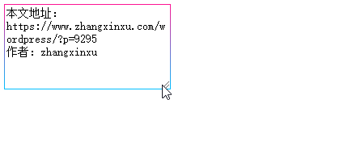

# [监测DOM尺寸变化JS API ResizeObserver简介](https://www.zhangxinxu.com/wordpress/2020/03/dom-resize-api-resizeobserver/) 

### 一、关于MutationObserver提两句

DOM元素的属性或者节点变化的检测，我们可以使用MutationObserver对象，IE11+支持，具体可以参见“[聊聊JS DOM变化的监听检测与应用](https://www.zhangxinxu.com/wordpress/2019/08/js-dom-mutation-observer/)”这篇文章。

但是如果我们想要检测到DOM元素尺寸变化，在过去是没有专门的API的，多借助window对象上绑定resize事件。

但是DOM元素的尺寸变化，有时候窗体的尺寸没有变化也会触发。还有的时候窗体的尺寸变化了，但是DOM元素的尺寸并没有变化，window对象上绑定的resize事件就有些浪费。

由于以上一些原因，一个全新的API就出来了，就是ResizeObserver对象，专门用来观察DOM元素的尺寸是否发生了变化。

这个API游览器支持的非常迅速，我记得去年看的时候才chrome浏览器支持，现在Firefox浏览器也支持了，Safari也确定会支持，估计不用多久就可以使用了。


### 二、ResizeObserver语法

假设页面上有个DOM元素，名叫eleZxx，则我们想要在eleZxx尺寸变化的时候做点什么事情，可以使用下面的JavaScript代码：

```javascript
var ro = new ResizeObserver( entries => {
  for (let entry of entries) {
    const cr = entry.contentRect;
    console.log('Element:', entry.target);
    console.log(`Element size: ${cr.width}px x ${cr.height}px`);
    console.log(`Element padding: ${cr.top}px ; ${cr.left}px`);
  }
});

// 观察一个或多个元素
ro.observe(eleZxx);
```

此时我们在控制台就你呢个看到类似下图的结果：


#### contentRect指的是什么？

`entry.contentRect`返回的是一个DOMRect对象，例如的属性包括：

```yaml
{
    x: 0
    y: 0
    width: 296
    height: 100
    top: 0
    right: 296
    bottom: 100
    left: 0
}
```

如果我们给DOM元素设置个`padding:10px`，则宽高都会变小，同时`left`和`top`属性值变成了`10`。

```yaml
{
    x: 10
    y: 10
    width: 276
    height: 100
    top: 10
    right: 286
    bottom: 110
    left: 10
}
```

这表明contentRect返回是content box，也就是内容区域的尺寸。

我从Google Developers找了张content box示意图，参见下图中间那部分：


同时也从侧面说明了，如果一个元素的content box的尺寸没有发生变化，那么也是不会触发ResizeObserver观察执行的，哪怕你改变了元素的`padding`值，或者改变了元素的`border-width`边框尺寸，都不会认为是DOM元素尺寸变化了。

例如：

```css
div {
    width: 200px; height:100px;
}
```

则上面这个div元素设置`padding:10px`，是没有不会触发ResizeObserver执行的。

#### Firefox中另外两个对象

Firefox浏览器中，entry还包括下面两个属性值，borderBoxSize对象和contentBoxSize对象。

```undefined
entry.borderBoxSize
entry.contentBoxSize
```

都返回ResizeObserverSize对象，该对象展开为：

```yaml
 { 
    inlineSize: 271,
    blockSize: 41
}
```

其中inlineSize表示内联元素排列方向上的尺寸，等同于CSS逻辑属性`inline-size`，在默认文档流下表示宽度；blockSize表示块级元素排列方向上的尺寸，等同于CSS逻辑属性`block-size`，在默认文档流下表示高度。

### 三、ResizeObserver实际应用案例

#### 1. 原生resize行为的检测

例如，有了ResizeObserver，我们就可以检测`<textarea>`的resize拉伸行为了。

比方说`<textarea>`尺寸拉伸的时候，我们可以让边框的颜色不断变化起来。

如下GIF录屏效果所示：



相关代码如下：

```javascript
var objResizeObserver = new ResizeObserver(function (entries) {
    var entry = entries[0];
    var cr = entry.contentRect;
    var target = entry.target;
    
    var angle = (cr.width - 200) + (cr.height - 100);
    target.style.borderImage = 'linear-gradient('+ angle +'deg, deepskyblue, deeppink) 1';
});
// 观察文本域元素
objResizeObserver.observe(eleTextarea);
```

您可以狠狠地点击这里：[ResizeObserver实现textarea边框颜色变啊变demo](https://www.zhangxinxu.com/study/202003/resize-observer-textarea-demo.php)

#### 2. 感知交互行为的发生

当元素里面的内容变多或变少的时候，如果没有把高度和宽度定死，则我们可以通过观察元素的尺寸是否有变化，而知道是否有交互行为发生。

例如，我们在使用Ajax发表评论的时候，需要把评论写入到现有的评论列表，通过观察评论容器的尺寸变化，我们就可以认为这个评论交互已经完成，然后脱离具体的业务逻辑完成其他一些需求，例如数据埋点，我们只需要观察特定容器尺寸是否变化，然后发送埋点数据即可。优点是数据埋点无侵入，无需写入到业务逻辑中，非常灵活，也利于日后维护。

#### 3. 感知元素是否显示或隐藏

当一个元素使用`display:none`进行隐藏的时候，也是会触发尺寸变化的，于是也能够被观测到。

基于尺寸的观测要比基于属性的观测要更精准。因为一个元素的隐藏可能是通过其他元素的属性变化触发的，例如其他元素添加了一个类名，这个类名正好可以影响当前元素的隐藏。

例如：

```xml
<button id="button">点击我</button>

button.active + img {
    display: none;
}
```

按钮元素添加类名`.active`会导致后面的图片隐藏，此时通过MutationObserver观察图片属性或节点的变化是没有任何用的。

此时应该使用ResizeObserver。

```javascript
var objResizeObserver = new ResizeObserver(function () {
    if (getComputedStyle(img).display == 'none') {
        console.log('图片隐藏了');
    } else {
        console.log('图片显示了');
    }
});
// 观察图片元素
objResizeObserver.observe(img);
```

您可以狠狠地点击这里：[ResizeObserver与元素的显示和隐藏检测demo](https://www.zhangxinxu.com/study/202003/resize-observer-display-none-demo.php)

点击demo页面的按钮，就可以看到图片的显隐效果，以及对应的状态变化的描述。


### 四、Polyfill以及结语

Polyfill项目地址：https://github.com/juggle/resize-observer

理论上可以兼容到IE9浏览器，不过还需要引入其他Polyfill，IE11+以及其他现代浏览器直接引入项目JS就可以了。

