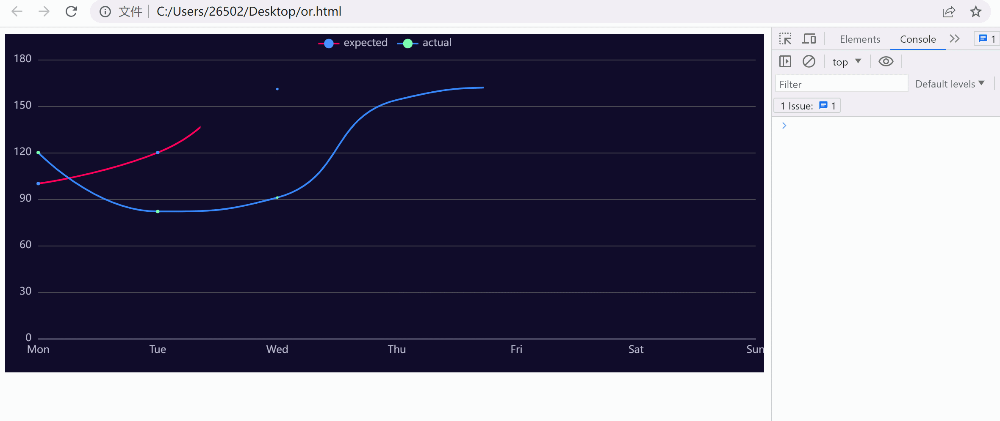

[TOC]


## [监测DOM元素尺寸大小变化|Vue](https://juejin.cn/post/7019297000898166791) 

## [如何优雅监听容器高度变化](https://segmentfault.com/a/1190000019877595)

> 上面两个链接地址，介绍了 `ResizeObserver` 以及它对浏览器的兼容扩展：`resize-observer-polyfill` `element-resize-detector` `vue-resize-observer` 
>
> 但 `ResizeObserver` API已经被普遍兼容，这些扩展将不再被需要


# 使用ResizeObserver监听ECharts图表DOM尺寸变化

`ResizeObserver`的用法示例：

```css
textarea {
    width: 200px; height: 100px;
    border-image: linear-gradient(deepskyblue, deeppink) 1;    
}
```

```html
<textarea id="roElement">本文地址：https://www.zhangxinxu.com/wordpress/?p=9295
作者：zhangxinxu</textarea>
```

```js
var eleRo = document.getElementById("roElement");
var objResizeObserver = new ResizeObserver(function (entries) {
  var entry = entries[0];
  var cr = entry.contentRect;
  var target = entry.target;
  var angle = cr.width - 200 + (cr.height - 100);
  target.style.borderImageSource =
    "linear-gradient(" + angle + "deg, deepskyblue, deeppink)";
});
// 观察文本域元素
objResizeObserver.observe(eleRo);
```

## [ECharts](https://echarts.apache.org/zh/index.html) 

ECharts图表中，给出了 `rendered` 和 `finished` 两个函数：

#### [events.](https://echarts.apache.org/zh/api.html#events) [rendered](https://echarts.apache.org/zh/api.html#events.rendered)

Event

渲染结束事件。注意 `rendered` 事件并不代表渲染动画（参见 [animation](https://echarts.apache.org/zh/option.html#animation) 相关配置）或者渐进渲染（参见 [progressive](https://echarts.apache.org/zh/option.html#series-scatter.progressive) 相关配置）停止，只代表本帧的渲染结束。

例如：

```ts
var snapshotImage = new Image();
document.body.append(snapshotImage);
chart.on('rendered', function () {
    snapshotImage.src = chart.getDataURL();
});
```

#### [events.](https://echarts.apache.org/zh/api.html#events) [finished](https://echarts.apache.org/zh/api.html#events.finished) 

Event

渲染完成事件。当渲染动画（参见 [animation](https://echarts.apache.org/zh/option.html#animation) 相关配置）或者渐进渲染（参见 [progressive](https://echarts.apache.org/zh/option.html#series-scatter.progressive) 相关配置）停止时触发。

```ts
var snapshotImage = new Image();
document.body.append(snapshotImage);
chart.on('finished', function () {
    snapshotImage.src = chart.getDataURL();
});
```

注意：建议在调用 `setOption` 前注册相关事件，否则在动画被禁用时，注册的事件回调可能因时序问题而不被执行。

```ts
var option = {
    // ...
    animation: false
    // ...
};
chart.on('finished', function () {
    // ...  
});
chart.setOption(option);
```


## 代码示例

> 等待echarts图表首次的入场动画加载完毕，使用 `resizeObserver` 对dom的尺寸监听；
>
> 为提高性能，通过节流函数调用echarts的 `resize` 调整echarts尺寸。

### 完整代码

```html
<!-- 为 ECharts 准备一个定义了宽高的 DOM -->
<div id="roElement" style="width: 100%; height: 400px"></div>

<!-- 引入 Apache ECharts -->
<script src="https://cdn.jsdelivr.net/npm/echarts@5.4.2/dist/echarts.min.js"></script>

<script>
    // 指定图表的配置项和数据
    const option = {
        xAxis: {
            data: ["Mon", "Tue", "Wed", "Thu", "Fri", "Sat", "Sun"],
            boundaryGap: false,
            axisTick: {show: false},
        },
        grid: {left: 10, right: 10, bottom: 20, top: 30, containLabel: true},
        tooltip: {
            trigger: "axis",
            axisPointer: {type: "cross"},
            padding: [5, 10],
        },
        yAxis: {axisTick: {show: false}},
        legend: {data: ["expected", "actual"]},
        series: [
            {
                name: "expected",
                lineStyle: {
                    color: "#FF005A",
                    lineStyle: {color: "#FF005A", width: 2},
                },
                smooth: true,
                type: "line",
                data: [100, 120, 161, 134, 105, 160, 165],
                animationDuration: 2800, // 入场动画时长
                animationEasing: "cubicInOut", // 入场动画缓动
            },
            {
                name: "actual",
                smooth: true,
                type: "line",
                lineStyle: {
                    color: "#3888fa",
                    lineStyle: {color: "#3888fa", width: 2},
                    areaStyle: {color: "#f3f8ff"},
                },
                data: [120, 82, 91, 154, 162, 140, 145],
                animationDuration: 2800,
                animationEasing: "quadraticOut",
            },
        ],
    };
    const eleRo = document.getElementById("roElement"); // 获取dom元素
    const chart = echarts.init(eleRo, "dark"); // 基于准备好的dom，初始化echarts实例

    /**
     * ResizeObserver 构造函数创建一个新的 ResizeObserver 对象
     * 它可以用于监听 Element 内容盒或边框盒或者 SVGElement 边界尺寸的大小
     * */
    const objResizeObserver = new ResizeObserver(function (entries) {
        console.log("观察者函数被执行");
        throttledFun();
    });
    /**
     * @desc 函数节流
     * @param fn 函数
     * @param wait 延迟执行毫秒数
     */
    const throttle = function (fn, wait) {
        let timer = null;
        return function () {
            let context = this;
            let args = arguments;
            if (!timer) {
                // 当延迟时间结束后，执行函数
                timer = setTimeout(() => {
                    timer = null;
                    fn.apply(context, args);
                }, wait);
            }
        };
    };
    const throttledFun = throttle(function () {
        console.log("节流函数被触发");
        chart.resize(); // 调整echarts尺寸
    }, 1000); // 频繁调用resize函数会影响性能，所以通过节流函数触发resize

    // 在调用 setOption 前注册相关事件，否则在动画被禁用时，注册的事件回调可能因时序问题而不被执行。
    /**
     * 监听 echarts 的 finished 事件 渲染完成事件
     * 当渲染动画或者渐进渲染停止时触发
     * finished 事件在每次重新渲染图表后都会触发，如果有多次重新渲染，就会出现监听器函数被多次调用的情况
     * （包括首次加载的动画，鼠标悬停移动时触发的图表动画）
     * 为了避免这种情况，给出以下两种处理方案：
     * 方案一：使用一个标记来跟踪触发次数，确保只添加一次 ResizeObserver
     * 方案二：利用异步编程promise，把完成后的动作放到异步队列中（推荐）
     * */

    //#region 方案一：使用一个标记来跟踪触发次数，确保只添加一次 ResizeObserver
    // let resizeObserverAdded = false;
    // chart.on("finished", function () {
    //     console.log("finished函数被触发");
    //     if (!resizeObserverAdded) {
    //         console.log("finished函数内的，绑定监听被触发(仅一次)");
    //         // 观察文本域元素
    //         objResizeObserver.observe(eleRo);
    //         // 对浏览器窗口尺寸变化进行监听（在这里使用并不合适）
    //         // window.addEventListener('resize', throttledFun);
    //     }
    //     resizeObserverAdded = true;
    // });
    //
    // chart.setOption(option); // 使用刚指定的配置项和数据显示图表。
    //#endregion

    //#region 方案二：利用异步编程promise，把完成后的动作放到异步队列中（推荐）
    const chartsPromise = new Promise((resolve) => {
        chart.on("finished", () => {
            console.log("finished函数被触发");
            resolve(); // 把执行结果抛出去
        });

        chart.setOption(option);
    });

    chartsPromise.then(() => {
        objResizeObserver.observe(eleRo); // 确保该函数（绑定监听）只触发一次
    });
    //#endregion
</script>
```

> 解决 `finished` 事件频繁触发的问题，方案二：利用异步编程`promise`，**把完成后的动作放到异步队列中**
>
> 参考：[echarts渲染完成事件finished/rendered](https://juejin.cn/post/6938574522673004581#heading-6) 


### 效果展示


