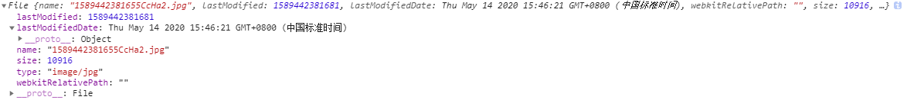
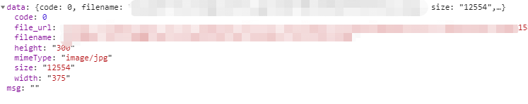

# Base64 上传到 oss 步骤

### Base64 格式的图片是需要转成 Blob ，再转成 file 文件 进而上传到 oss 上

1. 这里先写一个处理函数直接把 base64 转成咱想要的 file 文件

   ```javascript
   /**
    *
    * @param dataUrl  base64 图片
    *  */
   export function base64ToFile(dataUrl: any,  name: any){
     var arr = dataUrl.split(','), mime = arr[0].match(/:(.*?);/)[1],
     bstr = atob(arr[1]), n = bstr.length, u8arr = new Uint8Array(n);
     while (n--) {
       u8arr[n] = bstr.charCodeAt(n);
     }
     return new File([u8arr], name+ '.jpg' ,{ type: "image/jpg" });
   }
   ```

   返回的file文件属性：

   

   

2. 再找后端要接口 获取上传 oss 所需要的参数

   ```js
   // 一般来说 oss 上传所需要的参数
   ossData: object = {
   	OSSAccessKeyId: "",
   	success_action_status: "200",
   	signature: "",
   	key: "",
   	policy: "",
   }
   ossDir: string = ""; // oss 的文件夹名字
   ossHost:string = ""; // oss的域名
   ```

3. 然后就要自己写 FormData 配合 axios 实现上传功能了

   重点：file 必须在最后

   ```js
   let formData = new FormData()
    for (let key in this.ossData){
      formData.append(key, this.ossData[key]);
    }
    formData.append("file", base64ToFile(this.resultImg,name));
    axios.post(this.ossHost,formData,{
        headers: {
          'Content-Type': 'multipart/form-data',
        }}).then((res:any)=>{
          console.log(res)
        })
   ```

返回的结果

file_url 就是 oss上图片的路径url(有时间限制)，filename 是存在后端数据库的，每次请求 filename 这张图片，后端要生成一个有过期时间的 file_url 给到前端。
这整个 base64 上传 oss 操作就完成了。