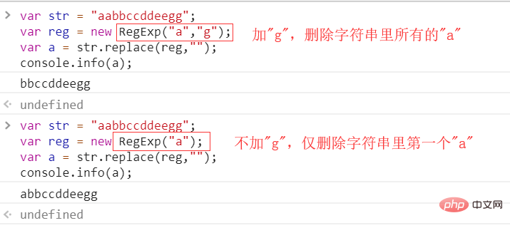

# javascript字符串中指定字符怎么删除

## 删除方法：

1. 使用“str.replace(正则表达式, '')”语句；

2. 使用slice()，语法“str.splice(字符位置,删除数目);”；

3. 使用substring()，语法“str.substring(开始下标,结束下标)”。

**方法1：使用replace()方法**

replace()方法用于将特定字符/字符串替换为其他字符/字符串。它需要两个参数，第一个是要替换的字符串，第二个是要替换的字符串。

在这种情况下，第一个参数是要删除的字符，第二个参数可以作为空字符串给出；这就可以从字符串中删除字符。但此方法删除第一次出现的字符串。

想要删除所有出现的指定字符，可以将replace()方法与正则表达式一起使用。使用正则表达式而不是字符串以及全局属性。它将选择字符串中的每个匹配项并将其删除。

示例：



**方法2：使用slice()方法**

slice()方法用于提取给定参数之间的字符串部分。此方法获取字符串的起始索引和结束索引，并返回这些索引之间的字符串。如果未指定结束索引，则假定它是字符串的长度。

可以通过将开始索引指定为1来删除第一个字符。它将字符串从第二个字符提取到字符串的结尾。通过将结束索引指定为小于字符串长度的一个，可以删除最后一个字符。这将从字符串的开头提取字符串到第二个到最后一个字符。

```html
<!DOCTYPE html>
<html>

<head>
    <meta charset="UTF-8">
</head>

<body>
    <p>原始字符串是：hello hgbhggfj!</p>
    <p>删除字符串的第一个字符：
        <span class="output1"></span>
    </p>
    <p>删除字符串的最后一个字符：
        <span class="output2"></span>
    </p>
    <script type="text/javascript">

        originalString = 'hello hgbhggfj!';
        firstCharRemoved = originalString.slice(1);
        lastCharRemoved = originalString.slice(0, originalString.length - 1);
        document.querySelector('.output1').textContent = firstCharRemoved;
        document.querySelector('.output2').textContent = lastCharRemoved;

    </script>

</body>

</html>
```

输出：

```
原始字符串是：hello hgbhggfj!

删除字符串的第一个字符： ello hgbhggfj!

删除字符串的最后一个字符： hello hgbhggfj
```

**方法3：使用substring()方法**

substring() 方法用于提取字符串中介于两个指定下标之间的字符。

substring() 方法返回的子串包括 开始 处的字符，但不包括 结束 处的字符。

示例：

```js
var str="aabbccdd";

console.info(str.substring(4));  //得到ccdd
```


# 删除字符串后3位

```js
//示例
var test = '0123456789';
 
//str.slice(start,end) 以start为起始下标，end为结尾下标；若为正，则从左向右算，若为负，则从右向左数
console.log(test.slice(1, 3));
//12
 
//str.substring(start,stop) 从start,stop里找出一个较小的值,然后从字符串的开始位置算起,截取较小值位置和较大值位置之间的字符串,截取出来的字符串的长度为较大值与较小值之间的差。
console.log(test.substring(1, 3));
//12
 
//str.substr(start,length) 从指定的位置(start)截取指定长度(length)的字符串;ECMAscript 没有对该方法进行标准化，因此反对使用它
console.log(test.substr(1, 3));
//123
 
//传入负数的情况
console.log(test.slice(-2));
//89
console.log(test.substring(-2));
//0123456789
console.log(test.substr(-2));
//89
 
//删除字符串的后3位
console.log(test.slice(0, test.length - 3));
//0123456
console.log(test.substring(0, test.length - 3));
//0123456
console.log(test.substr(0, test.length - 3));
//0123456
```

