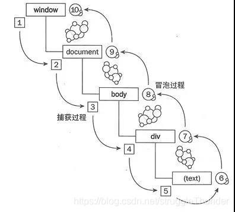
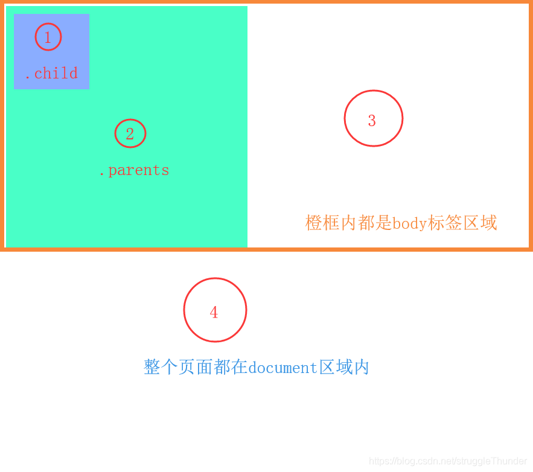

# JS事件流、事件冒泡、阻止冒泡、事件捕获

# 一、事件和事件流

## 1、什么是事件

**事件是可以被 JavaScript 侦测到的行为。** 鼠标点击、鼠标移动、鼠标滚动、按下键盘，浏览器窗口大小的改变，网页加载完成，关闭网页等等都会发生事件。

## 2、什么是事件流

**事件流，描述的是页面中接受事件的顺序。** 



一个完整的JS事件流是从window开始，最后回到window的一个过程。

事件流被分为三个阶段(1~ 5)捕获过程、(5~ 6)事件触发过程、(6~ 10)冒泡过程。

# 二、事件冒泡

看了上面的那张图应该对事件冒泡有了大概的了解了吧。总结来说就是： **当一个元素接收到事件的时候 会把他接收到的事件传给自己的父级，一直到window。**

如果它的父级元素也有某个事件函数，当执行完它的事件函数后，也就会执行它父级的事件函数。

- 用代码感受下一下什么是事件冒泡：

```javascript
<div class="parents" id="parents">
    <div class="child" id="child"></div>
</div>
```

实例图：



```javascript
<script>
    var parents = document.getElementById("parents");
    var child = document.getElementById("child");


    document.onclick = function(e){
        alert("你点击了屏幕任何区域");
    };

    document.body.onclick = function(e){
        alert("你点击了body区域");
    };

    parents.onclick = function (e) {
        alert("你点击了parents区域");
    };

    child.onclick = function (e) {
        alert("你点击了child区域");
    };

</script>
```

-  当**点击区域①**的时候：会依次弹出`你点击了child区域` 、`你点击了parents区域` 、 `你点击了body区域` 、 `你点击了屏幕任何区域` 这四个弹框。 
-  当**点击区域②**的时候：会依次弹出`你点击了parents区域` 、 `你点击了body区域` 、 `你点击了屏幕任何区域` 这三个弹框。 
-  当**点击区域③**的时候：会弹出 `你点击了body区域` 、 `你点击了屏幕任何区域` 这两个弹框。 
-  当**点击区域④**的时候：就只弹出 `你点击了屏幕任何区域` 这一个弹框。 

# 三、阻止冒泡

## 1、JS阻止事件冒泡

我们用 e.stopPropagation() 这个方法添加到某事件函数里的末尾，就可以做到阻止冒泡事件。但是IE8及以下不支持**e.stopPropagation()** 方法，所以就封装一个方法。

```javascript
<script>
    function stopPropagation(e) {
        e = e || window.event;
        if(e.stopPropagation) {
            e.stopPropagation(); //W3C阻止冒泡方法
        } else {
            e.cancelBubble = true; //IE阻止冒泡方法
        }
    }
</script>
```

在**child**（区域①）的点击事件函数最后添加 stopPropagation(e) 方法。

```javascript
<script>
    child.onclick = function (e) {
        alert("你点击了child区域");
        stopPropagation(e);
    };
</script>
```

- 再次点击区域①的时候就只弹出 `你点击了child区域` 这一个弹框。

## 2、JQ阻止事件冒泡

jq阻止事件冒泡就简单了，直接在事件函数里面添加 return false; 就行了。

```javascript
<script>
    $("#parents").click(function () {
       alert("你点击了parents区域")
    });
    $("#child").click(function () {
        alert("你点击了child区域");
        return false;
    });
</script>
```

复制

# 四、事件捕获

讲事件捕获之前先了解下**addEventListener()**方法：

**addEventListener()定义与用法**

- document.addEventListener() 方法用于向文档添加事件句柄。
- 提示： 可以使用 document.removeEventListener() 方法来移除 addEventListener() 方法添加的 事件句柄。
- 提示：使用 element.addEventListener() 方法为指定元素添加事件句柄。

**语法:**

```javascript
document.addEventListener(event, function, useCapture);
```

**参数值:**

| 参数       | 描述                                                         |
| :--------- | :----------------------------------------------------------- |
| event      | 必需。描述事件名称的字符串。 注意： 不要使用 “on” 前缀。例如，使用 “click” 来取代 “onclick”。  提示： 所有 HTML DOM 事件，可以查看我们完整的 HTML DOM Event 对象参考手册。 |
| function   | 必需。描述了事件触发后执行的函数。  	当事件触发时，事件对象会作为第一个参数传入函数。事件对象的类型取决于特定的事件。例如， “click” 事件属于 MouseEvent(鼠标事件) 对象。 |
| useCapture | 可选。布尔值，指定事件是否在捕获或冒泡阶段执行。  可能值：    true - 事件句柄在捕获阶段执行    false - 默认。事件句柄在冒泡阶段执行 |

从上面的表格中，可以看到参数值`useCapture`，为`true`的时候，事件在捕获过程中就会执行。 用代码感受下：

```javascript
<div class="div1" id="div1">
    <div class="div2" id="div2"></div>
</div>

<script>
    var div1 = document.getElementById("div1");
    var div2 = document.getElementById("div2");
    
    div1.addEventListener("click",function () {
        alert("你点击了div1")
    },false);  //false 在冒泡阶段执行

    div2.addEventListener("click",function () {
        alert("你点击了div2")
    },false);
</script>
```

>  当点击子元素 **div2** 的时候，会先弹出 `你点击了div2` 的弹框后，再弹出 `你点击了div1` 的弹框。

如果将**div1**的**addEventListener**方法中的最后的布尔参数值改成true，来看看什么效果：

```javascript
<div class="div1" id="div1">
    <div class="div2" id="div2"></div>
</div>

<script>
    var div1 = document.getElementById("div1");
    var div2 = document.getElementById("div2");
    
    div1.addEventListener("click",function () {
        alert("你点击了div1")
    },true);  //false 在捕获阶段执行

    div2.addEventListener("click",function () {
        alert("你点击了div2")
    },false);
</script>
```

>  当点击子元素 **div2** 的时候，会先弹出 `你点击了div1` 的弹框后，再弹出 `你点击了div2` 的弹框。,和之前的顺序就不一样了。

## MDN

# [event.stopPropagation](https://developer.mozilla.org/zh-CN/docs/Web/API/Event/stopPropagation)

[`Event`](https://developer.mozilla.org/zh-CN/docs/Web/API/Event) 接口的 **`stopPropagation()`** 方法阻止捕获和冒泡阶段中当前事件的进一步传播。但是，它不能防止任何默认行为的发生；例如，对链接的点击仍会被处理。如果要停止这些行为，请参见 [`preventDefault()`](https://developer.mozilla.org/zh-CN/docs/Web/API/Event/preventDefault) 方法，它可以阻止事件触发后默认动作的发生。它也不能阻止附加到相同元素的相同事件类型的其他事件处理器，如果要阻止这些处理器的运行，请参见 [`stopImmediatePropagation()`](https://developer.mozilla.org/zh-CN/docs/Web/API/Event/stopImmediatePropagation) 方法。

# [event.stopImmediatePropagation](https://developer.mozilla.org/zh-CN/docs/Web/API/Event/stopImmediatePropagation)

[`Event`](https://developer.mozilla.org/zh-CN/docs/Web/API/Event) 接口的 **`stopImmediatePropagation()`** 方法阻止监听同一事件的其他事件监听器被调用。

如果多个事件监听器被附加到相同元素的相同事件类型上，当此事件触发时，它们会按其被添加的顺序被调用。如果在其中一个事件监听器中执行 `stopImmediatePropagation()` ，那么剩下的事件监听器都不会被调用。