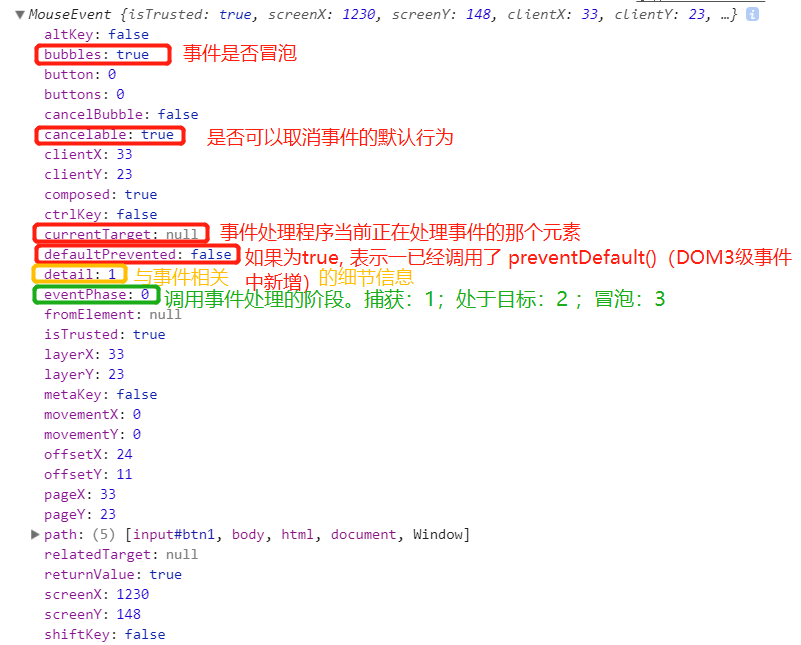
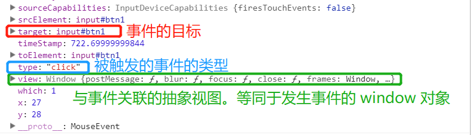
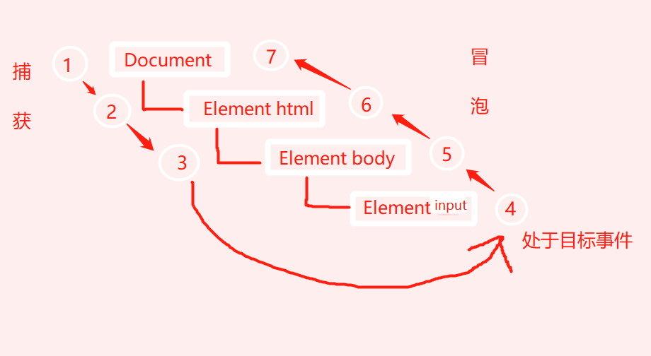

# 【事件】事件对象

- 触发DOM上某个事件时产生一个事件对象event，这个对象中包含什么？

	- 包含导致事件的元素、事件的类型以及其他事件相关的信息。包含与创建它的特定事件有关的属性和方法。

- 所有浏览器都支持 event 对象吗？

	- 都支持。但是支持方式不同。

- event 对象什么时候存在？

	- 只有在事件处理程序执行期间，event 对象才会存在。

- event 事件什么时候会被销毁？

	- 一旦事件处理程序执行完成， event 对象就会被销毁。

## DOM中的事件对象

兼容 `DOM` 的浏览器会将一个 `event` 对象传入到事件处理程序中，无论指定事件处理程序时使用什么方法（`DOM0`级或者`DOM2`级），都会传入 `event` 对象

```html
<!DOCTYPE html>
<html lang="en">

<body>
    <input type="button" id="btn1" value="btn1">
    <script>
        var btn1 = document.getElementById("btn1");
        btn1.onclick = function (event) {
            console.log(event.type);
        };
        btn1.addEventListener("click", function (event) {
            console.log(event.type);
        }, false);
    </script>
</body>

</html>
```

### event 的属性与方法

触发 `click` 事件时产生事件 `event` ，在控制台输出 `event` 查看属性和方法：





### 属性 `currentTarget`、`target`

`event` 对象的 `currentTarget` 属性表示事件处理程序正在处理事件的那个元素，`target` 属性表示事件的目标。

在对象处理程序内部，对象 `this` 始终等于 `currentTarget` 的值，但是对象 `this` 并不始终等于 `target` 的值。

```html
<!DOCTYPE html>
<html lang="en">

<body>
    <input type="button" id="btn" value="btn">
    <script>
        var btn = document.getElementById("btn");
        var fn = function (event) {
            console.log(event.currentTarget);           // <input type="button" id="btn" value="btn">
            console.log(event.target);                  // <input type="button" id="btn" value="btn">
            console.log(this);                          // <input type="button" id="btn" value="btn">
            console.log(event.currentTarget === this);  // true
            console.log(event.target === this);         // true
        };
        btn.addEventListener("click", fn, false);
    </script>
</body>

</html>
```

对象 `this` 并不始终等于 `target` 的值，举个例子：

```html
<!DOCTYPE html>
<html lang="en">

<body>
    <input type="button" id="btn" value="btn">
    <script>
        document.body.onclick = function (event) {      // 事件注册到document.body上
            console.log(event.currentTarget);           // <body>...</body>
            console.log(event.target);                  // <input type="button" id="btn" value="btn">
            console.log(this);                          // <body>...</body>
            console.log(event.currentTarget === this);  // true
            console.log(event.target === this);         // false
        };
    </script>
</body>

</html>
```

## 属性 type

- 什么时候可以使用 `type` 属性？

	- 需要通过一个函数处理多个事件时

下面举个例子。`onclick、onmouseover、onmouseout` 事件处理程序注册在按钮上，`handler` 函数处理多个事件。触发事件时产生一个事件对象 `event`，通过检测 `event` 对象的 `type` 属性让 `handler` 函数确定发生了什么并且执行相应的操作。

```html
<!DOCTYPE html>
<html>

<head>
    <meta charset="utf-8" />
</head>

<body>
    <input type="button" id="btn1" value="btn" />
    <script>
        var btn = document.getElementById("btn1");
        var handler = function (event) {
            switch (event.type) {
                case "click":
                    console.log("按钮被点击");
                    break;
                case "mouseover":
                    event.target.style.backgroundColor = "red";
                    console.log("鼠标移入");
                    break;
                case "mouseout":
                    event.target.style.backgroundColor = "";
                    console.log("鼠标移出");
                    break;
            }
        };
        btn.onclick = handler;
        btn.onmouseover = handler;
        btn.onmouseout = handler;
    </script>
</body>

</html>
```

### `preventDefault()`方法

`preventDefault()` 方法能够阻止特定事件的默认行为。前提：`cancelable` 属性为 `true`。

举个栗子：链接的默认行为就是被单击时会导航到其 `href` 特性指定的 `URL`。可以通过链接的 `onclick` 事件处理程序取消它。

```html
    <a id="myLink" href="http://www.baidu.com">点击跳转到百度</a>
    <script>
        var link = document.getElementById("myLink");
        link.onclick = function (event) {
            event.preventDefault();
        }
    </script>
```

### `stopPropagation()`方法

`stopPropagation()` 用于立即停止事件在 `DOM` 层次中的传播。

```html
    <input type="button" id="btn1" value="按钮" />
    <script>
        var btn = document.getElementById("btn1");
        btn.onclick = function (event) {
            console.log("btn");
            event.stopPropagation();
        };
        document.body.onclick = function (event) {
            console.log("document.body");
        };
    </script>
```

> 点击按钮之后，控制台输出：btn
> 
> 说明：
> 点击了按钮，触发了在按钮上注册的事件处理程序，事件处理程序处于目标对象上。如果没有使用 `stopPropagation`，接下来执行的事件处理程序是冒泡阶段触发的添加到 `document.body` 中的点击事件。但是使用了 `stopPropagation()` 函数中止了事件在 DOM 层次上传播，所以没有触发添加到 `document.body` 上的事件处理程序。
>
> 如果没有语句`event.stopPropagation();`，点击按钮之后，控制台会输出：`btn document.body`

### 属性 `eventPhase`

- `eventPhase` 有啥用？

	- 可以用来确定事件当前正位于事件流的哪个阶段。

- 怎么确定事件当前正位于事件流的哪个阶段？

	- `eventPhase` 为 1 ，在捕获阶段调用事件处理程序

	- `eventPhase` 为 2 ，事件处理程序处于目标对象上

	- `eventPhase` 为 3 ，在冒泡阶段调用事件处理程序

下面举个例子：

```html
    <input type="button" id="btn1" value="按钮" />
    <script>
        var btn = document.getElementById("btn1");
        btn.onclick = function (event) {
            console.log("结果1：", event.eventPhase);      //输出：2
        };
        // addEventListener()是DOM2级事件处理程序的方法，方法的第三个参数为true，表示在捕获阶段调用事件处理程序
        document.body.addEventListener("click", function (event) {
            console.log("结果2：", event.eventPhase);      //输出：1
        }, true);
        document.body.onclick = function (event) {
            console.log("结果3：", event.eventPhase);      //输出：3
        }
    </script>
```

> 说明：
> 点击按钮时，首先执行的事件处理程序是捕获阶段触发的添加到 `document.body` 中的那一个。然后，触发在按钮上注册的事件处理程序。最后，执行的事件处理程序是冒泡阶段触发的添加到 `document.body` 中的那一个。

DOM事件流图：

