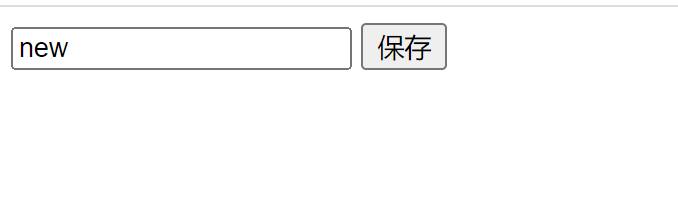
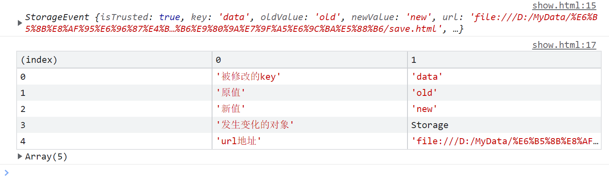

## 补充：Web Storage 的事件通知机制

### `Storage`事件

如果**多个页面都需要访问本地存储的数据**，就需要**在存储区域的内容发生改变时，能够通知相关的页面**。

`Web Storage API`内建了一套事件通知机制，当存储区域的内容发生改变（包括增加、修改、删除数据）时，就会自动触发 `storage` 事件，并把它发送给所有感兴趣的监听者。因此，如果需要跟踪存储区域的改变，就需要在关心存储区域内容的页面监听 `storage` 事件。

监听 `storage` 事件：

```js
window.addEventListener("storage", callback, false);
function callback(e) {
    console.log(e);
}
```

变量 `e` 就是一个 `StorageEvent` 对象，这个对象有很多有用的属性：

| 属性        | 含义                                                         |
| ----------- | ------------------------------------------------------------ |
| key         | 设置或删除或修改的键。调用clear()时，则为null。              |
| oldValue    | 改变之前的旧值。如果是新增元素，则为null。                   |
| newValue    | 改变之后的新值。如果是删除元素，则为null。                   |
| storageArea | 该属性是一个引用，指向发生变化的sessionStorage或localStorage对象。 |
| url         | 触发这个改变事件的页面的URL。                                |

### 实例

假设有 `save.html` 和 `show.html` 两个页面（同一文件夹下），在 `save` 页面触发数据改变，在 `show` 页面通过控制台将相关信息打印出来。

save.js：

```html
<input type="text" id="data" placeholder="input date to save">
<button onClick="saveItem()">保存</button>
<script>
    function saveItem() {
        var data = document.getElementById("data").value;
        localStorage.setItem("data", data);
    }
</script>
```



show.js：

```html
<script>
    window.addEventListener("storage", callback, false);
    function callback(e) {
        console.log(e);
        let arr = [["被修改的key", e.key], ["原值", e.oldValue], ["新值", e.newValue], ["发生变化的对象", e.storageArea], ["url地址", e.url]];
        console.table(arr);
    }
</script>
```



此时，如果 `save` 页面改变了存储区域的内容，就会自动触发 `storage` 事件，并把它发送给所有监听 `storage` 事件的页面。

需要注意的是，只有在数据的内容确实发生改变的时候，才会触发 `storage` 事件。如果把一个值设置成一模一样的值，或删除一个根本就不存在的存储项，则不会触发 `storage` 事件。并且，`storage` 事件只会发送给同源、而且处于打开状态的其它页面，而不会发送给触发改变的页面本身（即 `ave.html`）及处于关闭状态的页面。因此，应当从Web服务器上获取本实例的页面。

**说明：**

文档源是通过协议、主机名、端口三者来确定的，只有三者都完全相同，才认为网页是同源的。如，以下每个URL都是不同的文档源：

```js
'http://www.waibo.wang'     // 协议：http，主机名：www.waibo.wang

'https://www.waibo.wang'    // 协议：https，不同协议

'http://bbs.waibo.wang'     // 不同主机名

'http://www.waibo.wang:8080'// 不同端口
```

# JavaScript本地储存：`localStorage`、`sessionStorage`、`cookie`

> 记录：`sessionStorage`不能存储对象，如果是对象，需要用转化为`json字符串`

**javaScript有三种数据存储方式，分别是：**

- `sessionStorage`
- `localStorage`
- `cookier`

## 1. `sessionStorage`

- `sessionStorage`仅在当前会话下有效，关闭页面或浏览器后被清除；
- `setItem(key, value)` 设置数据
- `getItem(key)` 获取数据
- `removeItem(key)` 移除数据
- `clear()` 清除所有值

```js
// 添加数据
window.sessionStorage.setItem("name", "李四")
window.sessionStorage.setItem("age", 18)
// 获取数据
console.log(window.sessionStorage.getItem("name")) // 李四
// 清除某个数据
window.sessionStorage.removeItem("gender")
// 清空所有数据
window.sessionStorage.clear()
```

## 2. `localStorage`

- `localStorage` 是 HTML5 标准中新加入的技术，用于长久保存整个网站的数据，保存的数据没有过期时间，直到手动去删除；
- `localStorage` 和 `sessionStorage` 最大一般为5MB，仅在客户端（即浏览器）中保存，不参与和服务器的通信；
- `setItem(key, value)` 设置数据
- `getItem(key)` 获取数据
- `removeItem(key)` 移除数据
- `clear()` 清除所有值

```js
// 添加数据
window.localStorage.setItem("name", "张三")
window.localStorage.setItem("age", 20)
window.localStorage.setItem("gender", "男")
// 获取数据
console.log(window.localStorage.getItem("name")) // 张三
// 清除某个数据
window.localStorage.removeItem("gender")
// 清空所有数据
window.localStorage.clear()
```

## 3. cookier

- 简介
`Cookie` 是一些数据, 存储于你电脑上的文本文件中，用于存储 web 页面的用户信息
`Cookie` 数据是以键值对的形式存在的，每个键值对都有过期时间。如果不设置时间，浏览器关闭，`cookie`就会消失，当然用户也可以手动清除`cookie`
`Cookie`每次都会携带在HTTP头中，如果使用`cookie`保存过多数据会带来性能问题
`Cookie`内存大小受限，一般每个域名下是4K左右，每个域名大概能存储50个键值对

- 基本操作
通过访问`document.cookie`可以对`cookie`进行创建，修改与获取。
默认情况下，`cookie` 在浏览器关闭时删除，你还可以为 `cookie` 的某个键值对 添加一个过期时间
如果设置新的`cookie`时，某个`key`已经存在，则会更新这个`key`对应的值，否则他们会同时存在`cookie`中

```js
// 设置cookie
document.cookie = "username=orochiz"
document.cookie = "age=20"

// 读取cookie
var msg = document.cookie
console.log(msg) // username=orochiz; age=20

// 添加过期时间（单位：天）
var d = new Date() // 当前时间 2019-9-25
var days = 3       // 3天
d.setDate(d.getDate() + days)
document.cookie = "username=orochiz;" + "expires=" + d

// 删除cookie （给某个键值对设置过期的时间）
d.setDate(d.getDate() - 1)
console.log(document.cookie)
```

## 总结

### 相同点：

都保存在浏览器端，可以下图位置查看储存的信息

### 不同点：

①传递方式不同

`cookie`数据始终在同源的http请求中携带（即使不需要），即`cookie`在浏览器和服务器间来回传递。

`sessionStorage`和`localStorage`不会自动把数据发给服务器，仅在本地保存。

②数据大小不同

`cookie`数据还有路径（path）的概念，可以限制`cookie`只属于某个路径下。
存储大小限制也不同，`cookie`数据不能超过4k，同时因为每次http请求都会携带`cookie`，所以`cookie`只适合保存很小的数据，如会话标识。

`sessionStorage`和`localStorage` 虽然也有存储大小的限制，但比`cookie`大得多，可以达到5M或更大。

③数据有效期不同

`sessionStorage`：仅在当前浏览器窗口关闭前有效，自然也就不可能持久保持；

`localStorage`：始终有效，窗口或浏览器关闭也一直保存，因此用作持久数据；

`cookie`只在设置的`cookie`过期时间之前一直有效，即使窗口或浏览器关闭。

④作用域不同

`sessionStorage`不在不同的浏览器窗口中共享，即使是同一个页面；

`localStorage` 在所有同源窗口中都是共享的；

`cookie`也是在所有同源窗口中都是共享的。

`Web Storage` 支持事件通知机制，可以将数据更新的通知发送给监听者。

`Web Storage` 的 api 接口使用更方便。
