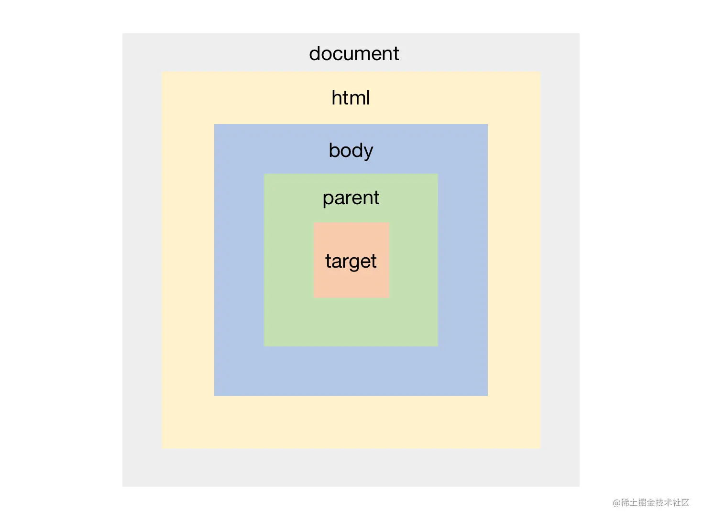
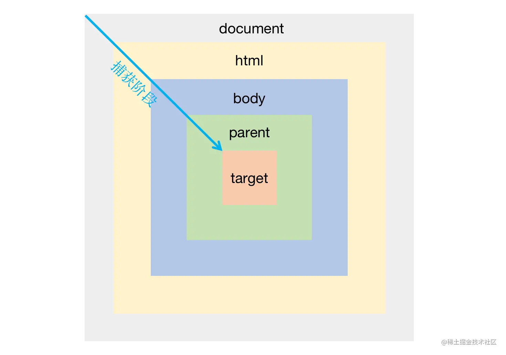
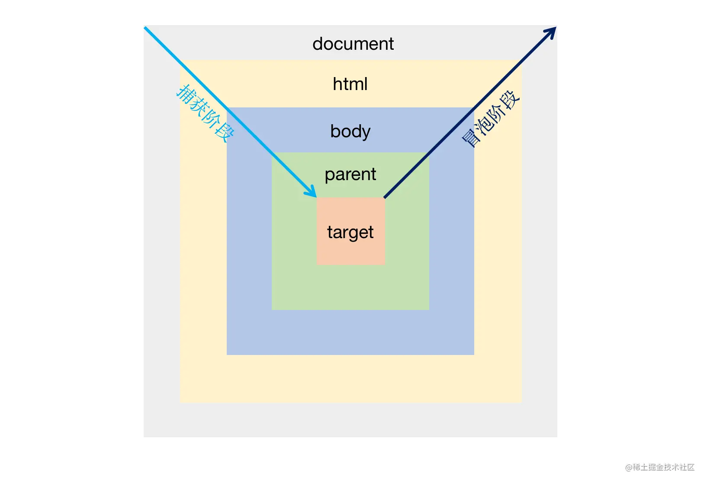

# JS的事件和事件流模型

JavaScrip 中事件流模型分为 事件捕获、事件目标、事件冒泡 三个阶段。

- 第一阶段：捕获阶段，从window对象传导到目标节点
- 第二阶段：目标阶段，事件在目标节点上触发
- 第三阶段：冒泡阶段，从目标节点传回window对象

```html
<html>
    <body>
        <div class="parent">
              <div class="target">
              </div>
        </div>
    </body>
</html>
```




- `事件捕获(event capturing)` 由外向内，即从 DOM 树的父到子，`document -> html -> body -> parent -> target`
- `事件冒泡(event bubbling)` 由内向外，即从 DOM 树的子到父，`target -> parent -> body -> html -> document`
- `目标阶段(event target)` 指的是事件冒泡的第一个阶段，也就是冒泡阶段的 `target` 触发事件，所以目标阶段也会被当做事件冒泡的一部分

## 事件冒泡 VS 事件捕获

`事件冒泡` 和 `事件捕获` 分别由 `微软` 和 `网景` 公司提出，后来 `W3C` 将两者结合，平息了战火，制定了统一的标准 —— **先捕获再冒泡**。

### 事件的绑定

DOM0级事件绑定 `el.onclick=function(){};`

> DOM0级事件会相互覆盖（就是给el绑定onclick属性，只会有一个有效），所以现在不是很推荐使用

DOM2级事件绑定 标准浏览器：`el.addEventListener('click',function(){},false)`

> IE6-8: `el.attachEvent('onclick',function(){})`

### addEventListener

在 JavaScript 中，DOM 的 `addEventListener` 方法用于向指定元素添加事件句柄。
 语法：`element.addEventListener(event, function, useCapture)`

| element    | 目标元素                                                     |
| ---------- | ------------------------------------------------------------ |
| event      | 事件名，如 "click"                                           |
| function   | 事件触发时执行的函数                                         |
| useCapture | Boolean 值，true - 事件句柄在 `捕获` 阶段执行；false - 默认事件句柄在 `冒泡` 阶段执行 |

> 并不是所有的事件都会冒泡或者捕获，例如 blur、focus、load、resize 等事件都不支持冒泡或者捕获，详见 MDN。

## 事件捕获

我们先来猜猜下面的代码，当我们点击 class 为 target 的 div 时，输出顺序是什么

```js
const parent = document.querySelector('.parent')
const target = document.querySelector('.target')
const html = document.querySelector('html')

document.addEventListener('click', ()=>{console.log('document 捕获')}, true)
html.addEventListener('click', ()=>{console.log('html 捕获')}, true)
document.body.addEventListener('click', ()=>{console.log('body 捕获')}, true)
parent.addEventListener('click', ()=>{console.log('parent 捕获')}, true)
target.addEventListener('click', ()=>{console.log('target 捕获')}, true)
```

根据捕获事件流模型由外向内的规则，会依次输出 `document 捕获 -> html 捕获 -> body 捕获 -> parent 捕获 -> target 捕获`



## 事件冒泡

我们把上面代码中的 true 全部改成 false 再来看看结果。

```js
const parent = document.querySelector('.parent')
const target = document.querySelector('.target')
const html = document.querySelector('html')

document.addEventListener('click', ()=>{console.log('document 冒泡')}, false)
html.addEventListener('click', ()=>{console.log('html 冒泡')}, false)
document.body.addEventListener('click', ()=>{console.log('body 冒泡')}, false)
parent.addEventListener('click', ()=>{console.log('parent 冒泡')}, false)
target.addEventListener('click', ()=>{console.log('target 冒泡')}, false)
```

根据冒泡事件流模型由外向内的规则，会依次输出 `target 冒泡 -> parent 冒泡 -> body 冒泡 -> html 冒泡 -> document 冒泡`

## 事件冒泡&事件捕获同时存在

如果两种事件流模型同时存在会怎样展示呢？

```js
const parent = document.querySelector('.parent')
const target = document.querySelector('.target')
const html = document.querySelector('html')

document.addEventListener('click', ()=>{console.log('document 捕获')}, true)
document.addEventListener('click', ()=>{console.log('document 冒泡')}, false)
html.addEventListener('click', ()=>{console.log('html 捕获')}, true)
html.addEventListener('click', ()=>{console.log('html 冒泡')}, false)
document.body.addEventListener('click', ()=>{console.log('body 捕获')}, true)
document.body.addEventListener('click', ()=>{console.log('body 冒泡')}, false)
parent.addEventListener('click', ()=>{console.log('parent 捕获')}, true)
parent.addEventListener('click', ()=>{console.log('parent 冒泡')}, false)
target.addEventListener('click', ()=>{console.log('target 捕获')}, true)
target.addEventListener('click', ()=>{console.log('target 冒泡')}, false)
target.addEventListener('click', ()=>{console.log('target 捕获1')}, true)
target.addEventListener('click', ()=>{console.log('target 冒泡1')}, false)
```

**原则：**

- 从外向内，捕获前进，遇到捕获事件立即执行
- 非 target 节点，先捕获再冒泡
- target 节点，按代码书写顺序执行（无论冒泡还是捕获）

因此会依次输出：`document 捕获 -> html 捕获 -> body 捕获 -> parent 捕获 -> target 捕获 -> target 捕获1 -> target 冒泡 -> target 冒泡1 -> parent 冒泡 -> body 冒泡 -> html 冒泡 -> document 冒泡`



## event对象

事件处理函数的第一个参数为当前的事件对象，一般我们使用 `event` 或者 `e` 接收。

**event.target**

我们可以通过 `event.target` 获取当前事件的目标对象，例如上面的例子中，如果点击的是 target 那么 event.target 就是 target，如果点击的是 parent 那么 event.target 就是 parent。

在一个事件的任何阶段，event.target 都是当前事件的目标对象，这是固定的。

```js
const target = document.querySelector('.target')

// e.target 取决于你点击了谁
document.addEventListener('click', function (e){
    console.log(e.target);// target
}, true)
document.addEventListener('click', function (e){
    console.log(e.target);// target
}, false)
target.addEventListener('click', function (e){
    console.log(e.target);// target
})
```

**this和event.currentTarget**

如果你没有将箭头函数或者已经绑定了this的函数作为事件的处理函数的话，那么处理函数的 this 将指向事件当前阶段的对象，event.currentTarget 会始终指向事件当前阶段的对象。

> 事件冒泡和捕获阶段，处理函数中的 this 指向谁这是面试经常问的问题。

```js
const parent = document.querySelector('.parent')
const target = document.querySelector('.target')
const html = document.querySelector('html')

document.addEventListener('click', function (e){
    console.log(e.target);// target
    console.log(e.currentTarget);// document
    console.log(this);// document
}, true)
parent.addEventListener('click', (e) => {
    console.log(e.target);// target
    console.log(e.currentTarget);// parent
    console.log(this);// window
}, false)
target.addEventListener('click', function (e){
    console.log(e.target);// target
    console.log(e.currentTarget);// target
    console.log(this);// target
})
```

## 如何阻止事件捕获/冒泡

如果我们希望 target 的事件触发时，不触发上级元素的相应事件（也就是关闭冒泡的过程），我们通过调用 event 的 stopPropagation 方法或者 stopImmediatePropagation 方法来阻止这个行为。

1、**stopImmediatePropagation**方法：
 stopImmediatePropagation方法作用在当前节点以及事件链上的所有后续节点上，目的是在执行完当前事件处理程序之后，停止当前节点以及所有后续节点的事件处理程序的运行

2、**stopPropagation**方法：
 stopPropagation方法作用在后续节点上，目的在执行完绑定到当前元素上的所有事件处理程序之后，停止执行所有后续节点的事件处理程序

`stopPropagation` 与 `stopImmediatePropagation` 的区别是：`stopPropagation` 不会阻止当前节点的其他处理函数执行，但是会阻止事件流模型中其他后续节点的事件。而 `stopImmediatePropagation` 则会在阻止事件流模型中其他后续节点的事件的基础上在阻止当前节点的其他处理函数执行。

```js
const parent = document.querySelector('.parent')
const target = document.querySelector('.target')

parent.addEventListener('click', (e) => {
    e.stopPropagation()
    console.log('parent 捕获1');
}, true)
parent.addEventListener('click', (e) => {console.log('parent 捕获2');}, true)
parent.addEventListener('click', (e) => {console.log('parent 冒泡1')})
parent.addEventListener('click', (e) => {console.log('parent 冒泡2')})
target.addEventListener('click', (e) => {console.log('target 冒泡');})
```

输出 `parent 捕获1 -> parent 捕获2`

如果使用 stopImmediatePropagation:

```js
const parent = document.querySelector('.parent')
const target = document.querySelector('.target')

parent.addEventListener('click', (e) => {
    e.stopImmediatePropagation()
    console.log('parent 捕获1');
}, true)
parent.addEventListener('click', (e) => {console.log('parent 捕获2');}, true)
parent.addEventListener('click', (e) => {console.log('parent 冒泡1')})
parent.addEventListener('click', (e) => {console.log('parent 冒泡2')})
target.addEventListener('click', (e) => {console.log('target 冒泡');})
```

则只输出 `parent 捕获1`

## 阻止默认行为

**event.preventDefalut()**

js中某些节点的某些事件会触发一些默认行为，例如 `a` 标签的 `click` 事件会触发跳转、`form` 的 `submit` 事件触发会触发提交行为、`type=submit` 的 `button` 的 `click` 事件触发会触发外层 `form` 表单的 `submit` 事件等等。

当我们不想触发这些行为时，可以调用 `event.preventDefalut()` 方法来阻止他们

```html
<a href="https://baidu.com" id="baiduLink">https://baidu.com</a>

<script>
const baiduLink = document.querySelector('#baiduLink')

baiduLink.addEventListener('click', (e) => {
    e.preventDefault()
})
</script>
```

现在点击 a 标签后不会发生跳转了
