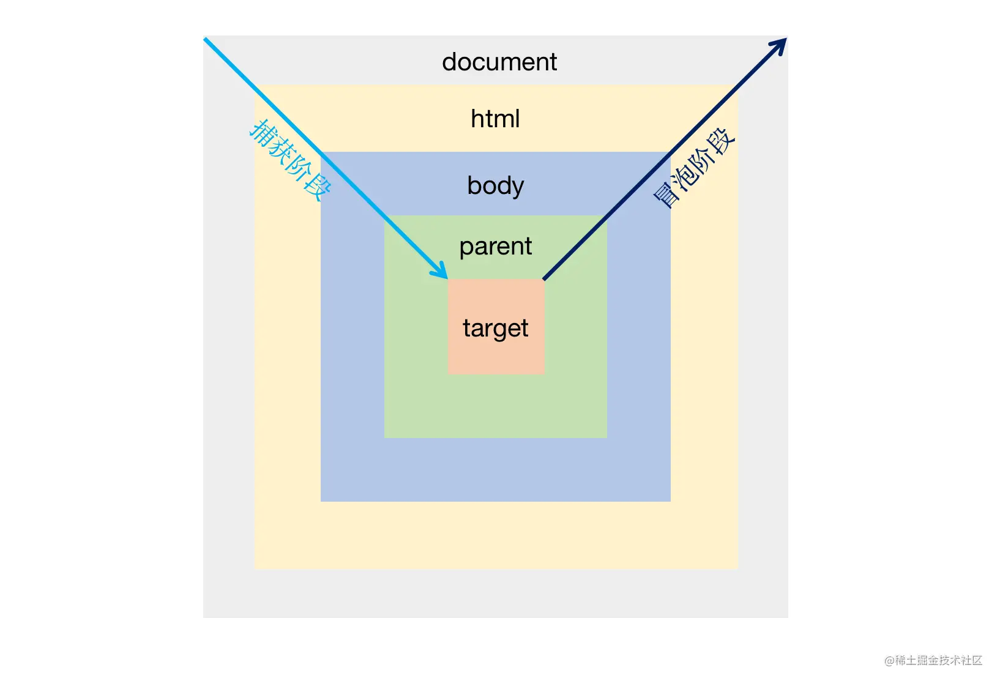
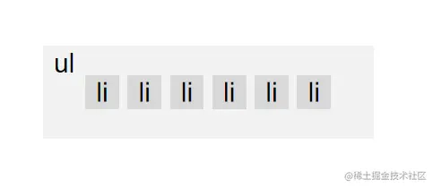

# JS中的事件代理和事件委托

## 事件委托

**事件委托**是指借用 `事件冒泡` 或者 `事件捕获` 机制，如果我们有许多以类似方式处理的元素，那么就不必为每个元素都分配一个事件处理程序 —— 而是将单个处理程序放在它们的共同祖先上。

> 举个通俗的例子：比如一个宿舍的同学同时快递到了，一种方法就是他们一个个去领取，还有一种方法就是把这件事情委托给宿舍长，让一个人出去拿好所有快递，然后再根据收件人一 一分发给每个宿舍同学；
> 在这里，取快递就是一个事件，每个同学指的是需要响应事件的 DOM 元素，而出去统一领取快递的宿舍长就是代理的元素，所以真正绑定事件的是这个元素，按照收件人分发快递的过程就是在事件执行中，需要判断当前响应的事件应该匹配到被代理元素中的哪一个或者哪几个。

一个事件触发后，会在子元素和父元素之间传播（propagation）。这种传播分成三个阶段。
 （1）捕获阶段：从window对象传导到目标节点（上层传到底层）称为“捕获阶段”（capture phase），捕获阶段不会响应任何事件；
 （2）目标阶段：在目标节点上触发，称为“目标阶段”
 （3）冒泡阶段：从目标节点传导回window对象（从底层传回上层），称为“冒泡阶段”（bubbling phase）。事件代理即是利用事件冒泡的机制把里层所需要响应的事件绑定到外层。



使用事件代理之前为每个 li 添加 click 事件的方式：

```html
<ul>
    <li>1</li>
    <li>2</li>
    <li>3</li>
    <li>4</li>
</ul>
```



```js
const ul = document.querySelector('ul');
// 获取所有的li
const lis = document.querySelectorAll('li');
// 挨个绑定事件
lis.forEach(li => {
    li.addEventListener('click',function (event){
        alert(`${this.innerText}被点击了`);
    });
});
```

我们需要获取所有的 li ，然后为其所有元素添加事件。这有两个缺点：

- 新添加的 li 标签需要再次为其绑定事件

  ```js
  let newLi = document.createElement("li");
  newLi.innerText = '5';
  ul.appendChild(newLi);
  // 点击5不会触发事件
  ```

- 每一个 li 标签都需单独绑定事件

当我们使用事件代理的思路来为其添加事件处理函数时：

```js
const ul = document.querySelector('ul');
// 事件绑定到其公共的祖先元素ul上
ul.addEventListener('click', function (event){
    // 这里this是ul，event.target 才是li
    alert(`${event.target.innerText}被点击了`);
})

let newLi = document.createElement("li");
newLi.innerText = '5';
ul.appendChild(newLi);
```

现在还有一个问题：当点击 ul 中其他元素时也会触发事件，但我们只想在点击 ul 下的第一层 li 标签才触发事件，其他标签被点击不触发。

可以通过判断 event.target 的标签类型来判断被点击的是不是 li 标签，然后判断其父元素是否是 ul 来判断其是不是 ul 下的第一层 li 标签。

```html
<ul>
    <li>1</li>
    <li>2</li>
    <li>3</li>
    <li><div>4</div></li>
    <span>5</span>
    <div>6</div>
</ul>

<script>
    const ul = document.querySelector('ul');
    ul.addEventListener('click', function (event){
        const target = event.target
        // 标签为li标签 而且 父元素为ul
        if(target.tagName === 'LI' && target.parentNode === this){
            alert(`${target.innerText}被点击了`);
        }
    });
</script>
```

现在我们解决了刚刚的问题，但是又遇到一个新的问题就是当我们点击 4 时不会触发事件，原因是 4 包裹在一个 div 标签中，所以本次事件的 target 的 div 而不是 li。但是按理我们同样需要处理点击 li 的事件处理函数（因为冒泡机制）

我们可以通过获取 target 的祖先节点，如果我们需要被代理事件的 li 为其祖先节点，则表示我们需要执行处理函数

```js
const ul = document.querySelector('ul');
ul.addEventListener('click', function (event){
    let target = event.target
    // 获取到被点击节点的祖先节点，直到其父节点为ul
    while (target && target.parentNode !== this){
        target = target.parentNode;
    }
    if(target.tagName === 'LI' && target.parentNode === this){
        alert(`${target.innerText}被点击了`);
    }
});
```

这样一个简单版的事件代理就实现了，他有什么好处：

- 只需要绑定一个事件到ul上，占用的内存更小
- 可以为动态添加的元素监听事件，不需要每添加一个元素就重新绑定一次。

## 事件委托

事件委托是一个叫法，例如上面的例子，ul 为 li 代理 click 事件，这就叫做事件代理。也可以说是 li 将 click 事件委托给 ul，这就叫做事件委托。

所以当面试官问你事件委托和事件代理的区别，千万不要蒙了，这俩其实是一个东西。

## 补充

### 事件委托的优点

1. 可以大量节省内存占用，减少事件注册，比如在ul上代理所有li的click事件就非常棒
2. 可以实现当新增子对象时无需再次对其绑定（动态绑定事件）

### 【1】JavaScript原生实现事件委托

```html
<ul id="myLinks">
    <li id="goSomewhere">Go somewhere</li>
    <li id="doSomething">Do something</li>
    <li id="sayHi">Say hi</li>
</ul>
<script>
    document.addEventListener("click", function (event) {
        var target = event.target;
        switch (target.id) {
            case "doSomething":
                document.title = "事件委托";
                break;
            case "goSomewhere":
                location.href = "http://www.baidu.com";
                break;
            case "sayHi": alert("hi");
                break;
        }
    })
</script>
```

### 【2】jQuery事件 `delegate()` 实现事件委托

`delegate()` 方法为指定的元素（属于被选元素的子元素）添加一个或多个事件处理程序，并规定当这些事件发生时运行的函数。

格式：`$(selector).delegate(childSelector, event, data, function)`

| 参数          | 描述                                                         |
| :------------ | :----------------------------------------------------------- |
| childSelector | 必需，规定要附加事件处理程序的一个或多个子元素。             |
| event         | 必需，规定附加到元素的一个或多个事件。由空格分隔多个事件值。必须是有效的事件。 |
| data          | 可选，规定传递到函数的额外数据。                             |
| function      | 必需，规定当事件发生时运行的函数。                           |

```html
<!DOCTYPE html>
<html>
<head>
  <meta charset="utf-8">
  <script src="http://lib.sinaapp.com/js/jquery/2.0.2/jquery-2.0.2.min.js"></script>
</head>
<body>
  <ul id="myLinks">
    <li id="goSomewhere">Go somewhere</li>
    <li id="doSomething">Do something</li>
    <li id="sayHi">Say hi</li>
  </ul>
  <script>
    $(document).ready(function () {
      $("#myLinks").delegate("#goSomewhere", "click", function () {
        location.href = "http://www.baidu.com";
      });
    });
  </script>
</body>
</html>
```

### 使用事件委托注意事项

使用“事件委托”时，并不是说把事件委托给的元素越靠近顶层就越好。事件冒泡的过程也需要耗时，越靠近顶层，事件的”事件传播链”越长，也就越耗时。如果DOM嵌套结构很深，事件冒泡通过大量祖先元素会导致性能损失。
