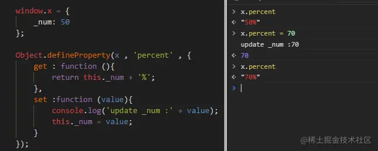

# 属性的赋值器(`setter`)和取值器(`getter`)

对象的属性是由属性名`name`，值`key`，和其他特性（可读写性 `writable`，可枚举性`enumerable`，可配置性`configurable`）组成的。从ES5开发，提供了`getter`和`setter` 可以将属性值的获取和设置分别绑定到方法上，称之为“存取器”。有了getter和setter我们就能够在属性值的变更和获取时实现一些操作。

## 简单的getter , setter

直接在对象中创建属性的getter和setter，并进行测试。

注意语法规则，是通过get和set关键字创建的percent属性的getter和setter函数。**get函数是没有参数的，set函数会将等号右边的值作为参数**。当访问percent属性时，会返回`_num`加%，当设置percent时，会打印日志并将值赋给`_num`。

## 使用defineProperty

如何在已有的对象上添加getter和setter呢？  `Object.defineProperty(obj, prop, descriptor)` ，obj 为将要操作的对象，prop是将要定义或者修改的属性名，`descriptor` 是将要被修改或者定义的描述符。看实例

`defineProperty()`添加或者修改属性的时候需要注意：

1. 数据描述符`configurable`标志着该属性能够被改变，能够被删除，默认为false
2. 数据描述符`enumerable`标志着该属性是否可枚举，默认为false。只有可枚举属性才会在for in中遍历，Object.keys()中返回。另外，所有的内置方法都是不可枚举的，eg：toString
3. 数据描述符value默认为undefined，`writable` 默认为false。所以defineProperty默认新增的属性，是不可以被赋值运算符修改的。
4. 存取描述符`set`和`get`都默认为 `undefined`
5. `set/get`是不能够和value或者writable一起用的，因为当是存取器属性的时候，当设置了set标志着可写，设置了get就标志着可读，而value也是通过get函数返回的，所以不能同时使用。

## Class中的 getter setter

ES6新增class的概念，改变了构造对象的书写方式，class中同样可以设置存取器。

