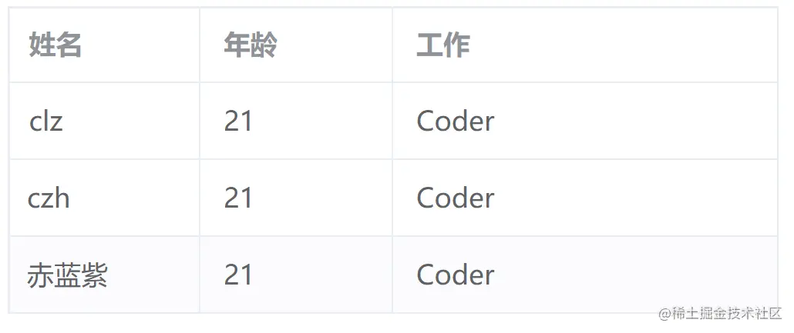
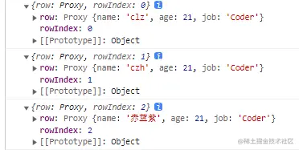
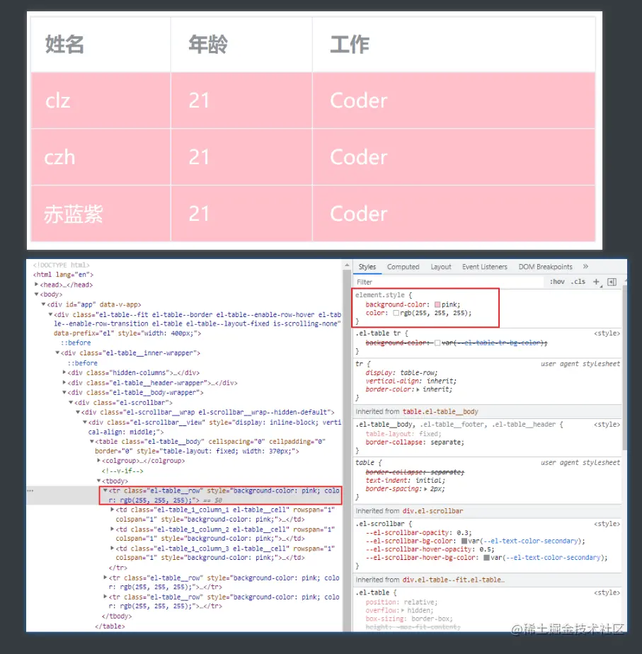
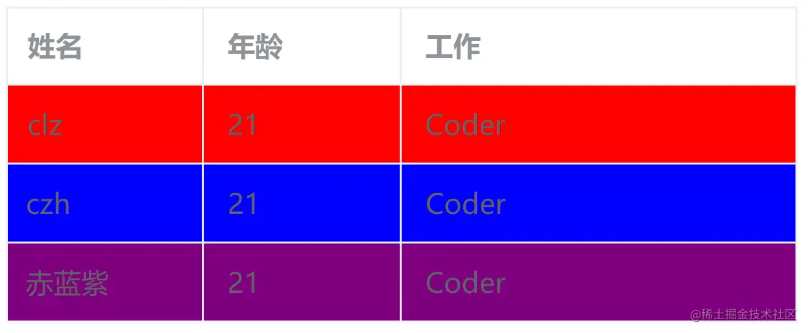
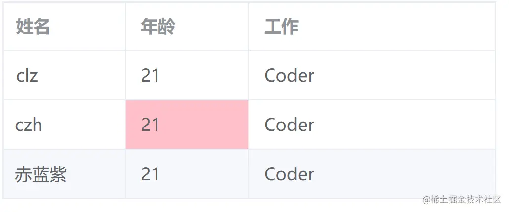
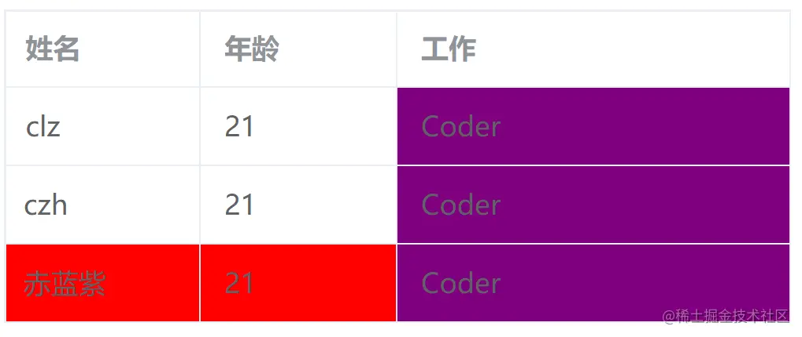
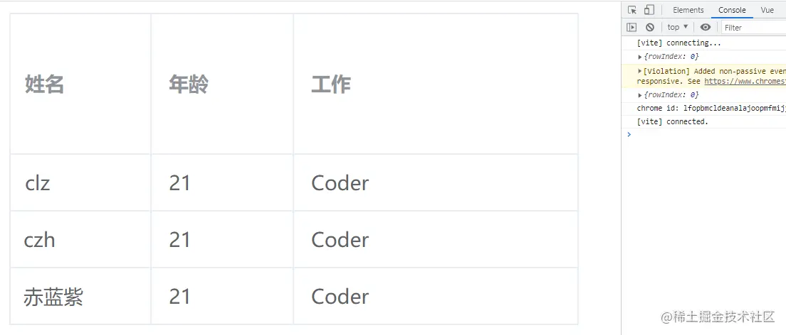
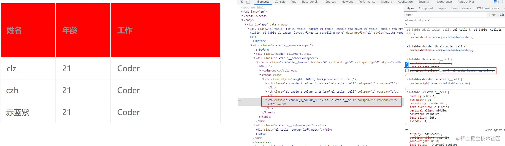
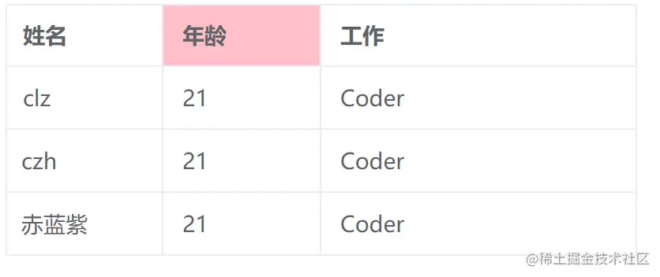
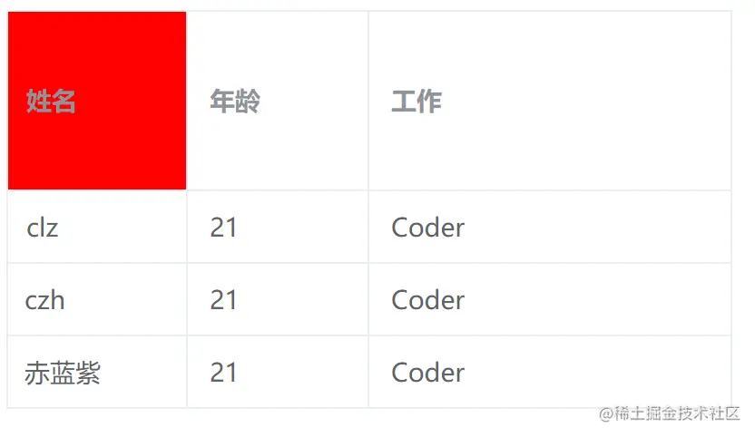

# Element Plus修改表格行、单元格样式

## 前言

实习工作需要根据表格的状态字段来设置行的样式，记录一波。

先来一下基础配置。(Vue3)

```html
<template>
  <el-table :data="tableData" border style="width: 400px">
    <el-table-column prop="name" label="姓名" width="100" />
    <el-table-column prop="age" label="年龄" width="100" />
    <el-table-column prop="job" label="工作" />
  </el-table>
</template>

<script setup>
const tableData = [
  {
    name: "clz",
    age: 21,
    job: "Coder",
  },
  {
    name: "czh",
    age: 21,
    job: "Coder",
  },
  {
    name: "赤蓝紫",
    age: 21,
    job: "Coder",
  },
];
</script>

<style lang="less" scoped>
</style>
```



## 设置某一行的样式

主要是通过` row-style`属性来实现。它是行的` style`的回调方法，可以通过它来实现设置某一行的样式。

先让我们来体验一下它的参数都是些什么。

```html
<el-table 
  style="width: 400px" 
  border 
  :data="tableData" 
  :row-style="rowState"
>
</el-table>
```

```js
const rowState = (arg) => {
  console.log(arg)
}
```



可以发现，它是一个对象，一个属性是行的数据，一个是行号(从0开始)，至于不只是打印3次，而是打印9次的原因还没发现，后面单元格的会打印18次，9个单元格打印18次。但是这个并不是本次的研究重点。

那么，我们怎样能设置样式呢？

只需要返回含有属性样式的对象即可。(**驼峰命名法**)

```js
const rowState = (arg) => {
  return {
    backgroundColor: 'pink',
    color: '#fff'
  }
}
```



然后在搭配参数使用，就能实现根据表格内容设置行的样式。

```js
const rowState = ({ row }) => {
  let style = {}

  switch (row.name) {
    case 'clz':
      style = {
        backgroundColor: 'red'
      }
      break;
    case 'czh':
      style = {
        backgroundColor: 'blue'
      }
      break;
    case '赤蓝紫':
      style = {
        backgroundColor: 'purple'
      }
      break;
  }

  return style;
}
```



## 设置某一个单元格的样式

通过` cell-style`属性来实现。做法和上面一样，就不多说了，主要的四个参数` row, column, rowIndex, columnIndex`。

- `row`：行的信息
- `column`：列的信息
- `rowIndex`： 行数(0开始算)
- `columnIndex`：列数(0开始算)

```html
<el-table 
  style="width: 400px" 
  border 
  :data="tableData" 
  :cell-style="cellStyle"
>
</el-table>
```

```js
const cellStyle = ({ row, column, rowIndex, columnIndex }) => {
  if (rowIndex === 1 && columnIndex === 1) {
    return {
      backgroundColor: 'pink'
    }
  }
}
```



其实，`cell-state`不只是能设置单元格的样式，因为它的参数中含有` row`和` column`，所以还可以用来设置某一行或某一列的样式。

```js
const cellStyle = ({ row, column, rowIndex, columnIndex }) => {

  if (column.label === '工作') {
    return {
      backgroundColor: 'purple'
    }
  }

  if (row.name === '赤蓝紫') {
    return {
      backgroundColor: 'red'
    }
  }

}
```



**注意，这里重叠的地方并不会出现后来的样式覆盖掉前面的样式，而是先到先得**

## 表头样式修改(赠品)

特殊的表头，特殊的处理

`header-row-style`：只有一个`rowIndex`属性

```js
const headerRowStyle = (args) => {
  console.log(args)

  return {
    height: '100px',
    backgroundColor: 'red'
  }
}
```



发现只有标头的行高有所变化，这是为啥呢？



检查样式发现，这是因为单元格本身具有背景颜色，所以并不会生效。

`header-row-style`：和正常的单元格一样，有四个属性

```javascript
const headerCellStyle = ({ row, column, rowIndex, columnIndex }) => {
  if (columnIndex === 1) {
    return {
      backgroundColor: 'pink'
    }
  }
}
```



也可以通过`column`属性来设置符合条件的表头单元格的样式。

```javascript
const headerCellStyle = ({ row, column, rowIndex, columnIndex }) => {

  if (column.label === '姓名') {
    return {
      backgroundColor: 'red'
    }
  }
}
```

