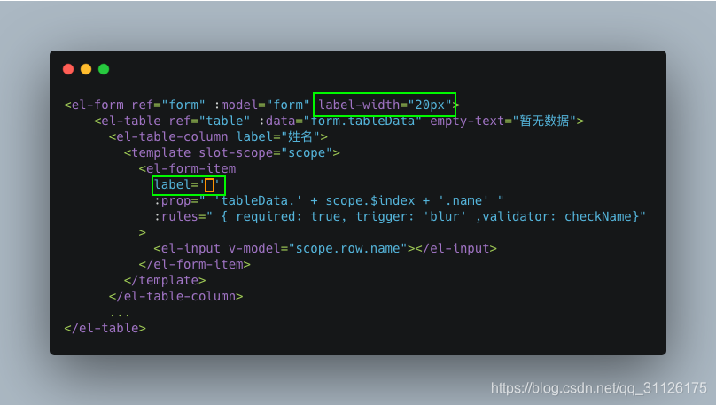
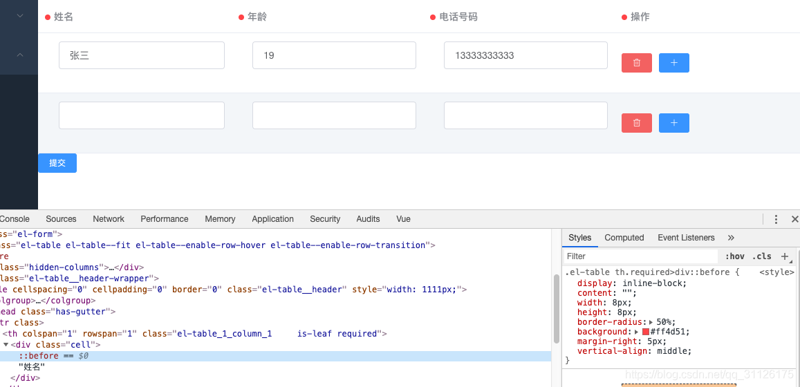
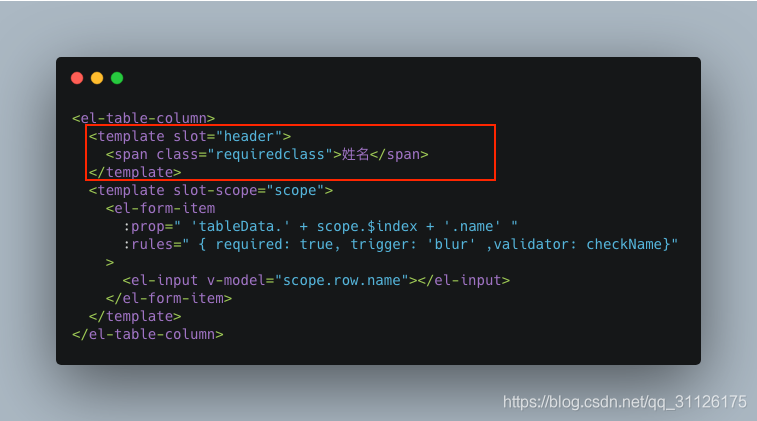
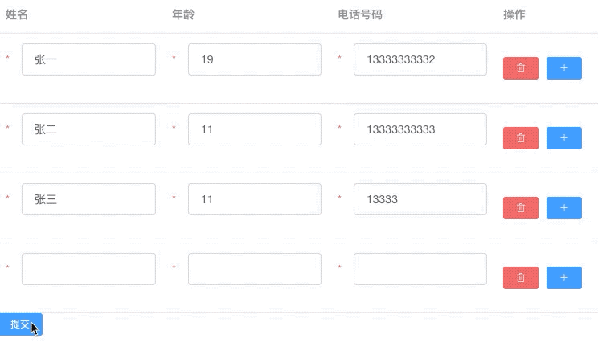

# [el-table与el-form同用,并校验](https://blog.csdn.net/qq_31126175/article/details/97265338) 

## 基本结构


```vue
<template>
  <div>
    <el-form ref="form" :model="form">
      <el-table  ref="table" :data="form.tableData" empty-text='暂无数据'>
        <el-table-column label="姓名">
          <template slot-scope="scope">
            <el-form-item >
              <el-input v-model="scope.row.name"></el-input>
            </el-form-item>
          </template>
        </el-table-column>
        <el-table-column label="年龄">
          <template slot-scope="scope">
            <el-form-item >
              <el-input v-model.number="scope.row.age" type="number"></el-input>
            </el-form-item>
          </template>
        </el-table-column>
        <el-table-column  label="操作">
          <template slot-scope="scope">
            <el-button type="danger" size="mini" @click="del(scope.$index)" icon='el-icon-delete'></el-button>
            <el-button type="primary" size="mini" @click="add" icon='el-icon-plus'></el-button>
          </template>
        </el-table-column>
      </el-table>
    </el-form>
  </div>
</template>

<script>
export default {
  data() {
    return {
      form: {
        tableData: [
          {
            name: "aaa",
            age: 11
          },
          {
            name: "",
            age: ''
          }
        ]
      }
    };
  },
  methods:{
      add(){
          this.form.tableData.push({
              name: "",
              age: ''
          })
      },
      del(index){
          this.form.tableData.splice(index,1);
      }
  }
};
</script>
```

> el-table 数据是数组 , el-form 数据是 对象

## 添加校验

> Form 组件提供了表单验证的功能，只需要通过 `rules` 属性传入约定的验证规则，并将 Form-Item 的 `prop` 属性设置为需校验的字段名即可。

### 方法1：

```html
<el-form :rules='rules'  ...>

<el-form-item :prop=" 'tableData.' + scope.$index + '.name' " :rules='rules.name'>
```

```js
data(){
	return {
    	rules: {
	        name: [
	          { required: true, message: '名字不能为空', trigger: 'blur' }
	        ]
	      }
    }
}
```

### 方法2：

`<el-form-item :prop=" 'tableData.' + scope.$index + '.name' " :rules="{ required: true, message: '名字不能为空', trigger: 'blur' }">`

```html
 <el-table-column label="姓名">
   <template slot-scope="scope">
     <el-form-item :prop=" 'tableData.' + scope.$index + '.name' " 
        :rules="{ required: true, message: '名字不能为空', trigger: 'blur' }">
       <el-input v-model="scope.row.name"></el-input>
     </el-form-item>
   </template>
 </el-table-column>
```

## 自己写校验方法

### 方法1：校验方法写在`data`中.

```js
data() {
      var checkAge = (rule, value, callback) => {
        if (!value) {
          return callback(new Error('年龄不能为空'));
        }else if(!Number.isInteger(value) ){
            callback(new Error('请输入数字值'));
        }else if(value < 18){
            callback(new Error('必须年满18岁'));
        }else if(value >50){
            callback(new Error('小于50岁'));
        }else{
            callback();
        }
      };
      var checkName = (rule, value, callback) => {
          let regName =/^[\u4e00-\u9fa5]{2,4}$/;
        if (!value) {
          return callback(new Error('姓名不能为空'));
        }else if(!regName.test(value)){
            callback(new Error('请输入正确的姓名'));
        }else{
            callback();
        }
      };
    return {
      form: {
        tableData: [
          {
            name: "",
            age: ''
          }
        ]
      },
      rules: {
        name: [
          { required: true, trigger: 'blur' ,validator: checkName}
        ],
        age: [
          { required: true, trigger: 'blur', validator: checkAge}
        ],
      }
    };
  },
```

### 方法2：校验犯法写在`methods`中.

```html
<el-form-item :prop=" 'tableData.' + scope.$index + '.name' " :rules=" { required: true, trigger: 'blur' ,validator: checkName}">

<el-form-item :prop=" 'tableData.' + scope.$index + '.age' " :rules=" { required: true, trigger: 'blur' ,validator: checkAge}">
```

```js
methods:{
      checkAge  (rule, value, callback)  {
        if (!value) {
          return callback(new Error('年龄不能为空'));
        }else if(!Number.isInteger(value) ){
            callback(new Error('请输入数字值'));
        }else if(value < 18){
            callback(new Error('必须年满18岁'));
        }else if(value >50){
            callback(new Error('小于50岁'));
        }else{
            callback();
        }
      },
      checkName (rule, value, callback) {
        let regName =/^[\u4e00-\u9fa5]{2,4}$/;
        if (!value) {
          return callback(new Error('姓名不能为空'));
        }else if(!regName.test(value)){
            callback(new Error('请输入正确的姓名'));
        }else{
            callback();
        }
      }
  }
```

## 同table中，某字段不能重复

> 同table中,不能写相同的电话号码

```html
<el-table-column label="电话号码">
   <template slot-scope="scope">
     <el-form-item
       :prop=" 'tableData.' + scope.$index + '.tel' "
       :rules=" { required: true, trigger: 'blur' ,validator: checkTel}"
     >
       <el-input
         v-model.number="scope.row.tel"
         type="number"
         @blur="telequalCheckblur(scope.$index,scope.row.tel)"
       ></el-input>
     </el-form-item>
   </template>
 </el-table-column>
```

```js
methods:{
	checkTel(rule, value, callback) {
      let regTel = /^(((1[3456789][0-9]{1})|(15[0-9]{1}))+\d{8})$/;
      let index = rule.field.split(".")[1];
      if (!value) {
        return callback(new Error("电话号码不能为空"));
      } else if (!regTel.test(value)) {
        callback(new Error("请输入正确的电话号码"));
      } else if (this.telequalCheck(index, value)) {
        callback(new Error("电话号码重复,请重新填写"));
      } else {
        callback();
      }
    },
    //相等判断
    telequalCheck(index, value) {
      return this.form.tableData.some(({ tel }, i) => {
        console.log(i, index, i == index);
        return i == index ? false : tel === value;
      });
    },
}
```

## 必填`*`显示

### 1. 输入框前加`*`

> 注意：这里面`label=' '`必须有空格,否则还是没有`*` 

正常来说，在el-form中，使用rules的`required: true`，就能显示`*`了.
因为是在表格中，所以表单就不使用`label`了，所以这时必填选项的`*`没有了.




### 2. 表头加`*`

#### 1.`el-table>`添加 `header-cell-class-name='required'`

| 参数                   | 说明                                                         | 类型                                                  | 可选值 | 默认值 |
| ---------------------- | ------------------------------------------------------------ | ----------------------------------------------------- | ------ | ------ |
| header-cell-class-name | 表头单元格的 className 的回调方法，也可以使用字符串为所有表头单元格设置一个固定的 className。 | Function({row, column, rowIndex, columnIndex})/String | —      | —      |



#### 2. elment 有默认的样式，如果不想要，就换个class名字
`header-cell-class-name='requiredclass'`

```html
<style>
.requiredclass>div.cell::before{
  content: "*";
  color: #f56c6c;
  margin-right: 4px;
}
</style>
```


#### 3. 只加某几个

> `:header-cell-class-name='addHeaderCellClassName'`

```js
addHeaderCellClassName({row, column, rowIndex, columnIndex}){
  if(columnIndex===0 || columnIndex===1){
    return 'requiredclass'
  }
}
```


#### 4.自定义表头

> 在需要添加`*`的位置添加自定义表头



```css
.requiredclass::before{
  content: "*";
  color: #f56c6c;
  margin-right: 4px;
}
```

## 删除某行，同时删除这行的校验结果

### 问题: 删除某行时,这行的校验结果不随着删除

观察图片,删除第三行,第三行的校验结果,还在.



### 解决方法

1. 删除时,对表单进行校验

   ```js
   del(index) {
     this.form.tableData.splice(index, 1);
     this.$refs.form.validate()
   },
   ```

2. row-key

   > 绑定row-key，绑定的值要保证`存在且唯一`

   ```html
    <el-form ref="form" :model="form" label-width="20px">
         <el-table
           ref="table"
           :data="form.tableData"
           empty-text="暂无数据"
           header-cell-class-name="requiredclass"
           row-key='id'
         >
         ...
   
   
    form: {
       tableData: [
         {
           name: "张一",
           age: 19,
           id:'1',
           tel: 13333333332
         },
       ]
     }
   ```

   
