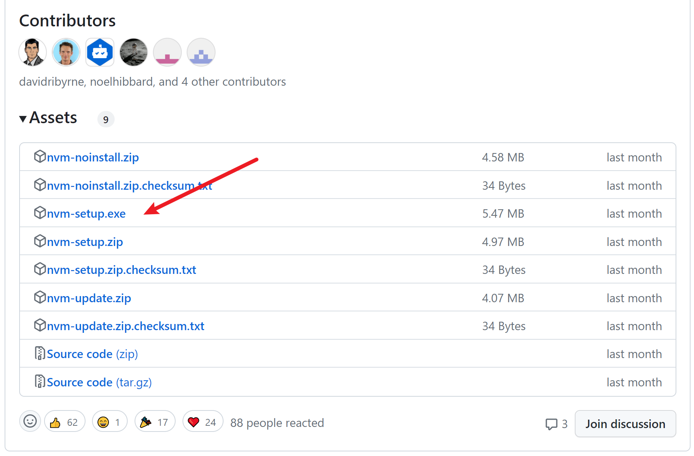
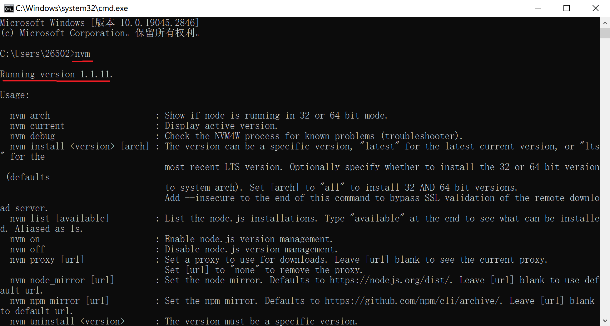
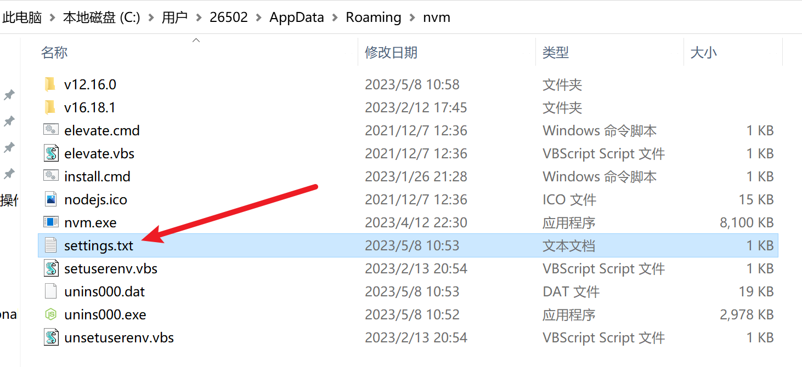
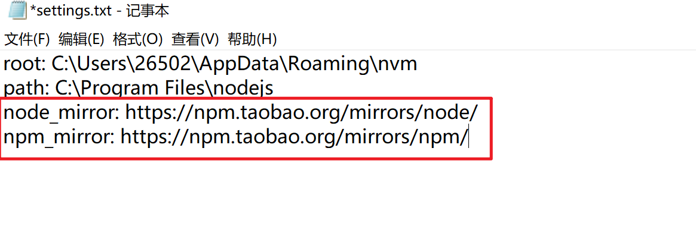
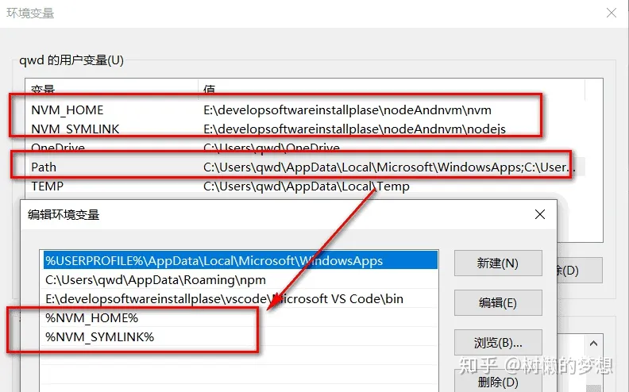
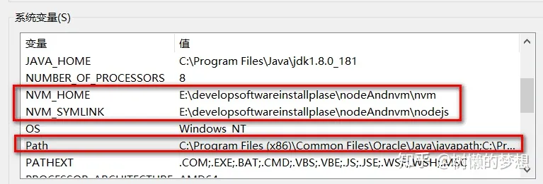
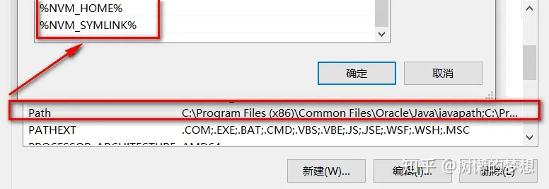

# 使用 nvm管理 node.js（windows版本）

## 使用场景

### `npm i` 报错信息如下：

```bash
npm ERR! code 1
npm ERR! path D:\workspace\exchange\exchange-web\exchange-web-ui\node_modules\node-sass
npm ERR! command failed
npm ERR! command C:\Windows\system32\cmd.exe /d /s /c node-gyp rebuild
npm ERR! gyp info it worked if it ends with ok
npm ERR! gyp info using node-gyp@3.8.0
npm ERR! gyp info using node@13.6.0 | win32 | x64
npm ERR! gyp ERR! configure error
npm ERR! gyp ERR! stack Error: Can't find Python executable "python", you can set the PYTHON env variable.
npm ERR! gyp ERR! stack     at PythonFinder.failNoPython (D:\workspace\exchange\exchange-web\exchange-web-ui\node_modules\node-gyp\lib\configure.js:484:19)
npm ERR! gyp ERR! stack     at PythonFinder.<anonymous> (D:\workspace\exchange\exchange-web\exchange-web-ui\node_modules\node-gyp\lib\configure.js:509:16)
npm ERR! gyp ERR! stack     at callback (D:\workspace\exchange\exchange-web\exchange-web-ui\node_modules\graceful-fs\polyfills.js:299:20)
npm ERR! gyp ERR! stack     at FSReqCallback.oncomplete (fs.js:166:21)
npm ERR! gyp ERR! System Windows_NT 10.0.19043
npm ERR! gyp ERR! command "D:\\software\\node\\node.exe" "D:\\workspace\\exchange\\exchange-web\\exchange-web-ui\\node_modules\\node-gyp\\bin\\node-gyp.js" "rebuild"
npm ERR! gyp ERR! cwd D:\workspace\exchange\exchange-web\exchange-web-ui\node_modules\node-sass
npm ERR! gyp ERR! node -v v13.6.0
npm ERR! gyp ERR! node-gyp -v v3.8.0
npm ERR! gyp ERR! not ok
```

## 报错原因

前端的package.json 文件中 这两个版本是如下：

```json
“node-sass”: “^4.14.0”,
“script-loader”: “^0.7.2”,
```


因为我下载的是 `node16` 根本下载不下来 `node-sass`


> **备注：**
>
> 浏览到 Node.js 的所有版本：[官网：以往的版本](https://nodejs.org/zh-cn/download/releases)。
>
> **如何查看项目中采用的node版本**
> package-lock.json：
> ```json
> "@types/node": {
> "version": "12.12.7",
> "resolved": "https://registry.npm.taobao.org/@types/node/download/@types/node-12.12.7.tgz?cache=0&other_urls=https%3A%2F%2Fregistry.npm.taobao.org%2F%40types%2Fnode%2Fdownload%2F%40types%2Fnode-12.12.7.tgz",
> "integrity": "sha1-AeTqck2eO9UNkMEf1ZgLoxfY+hE=",
> "dev": true
> },
> ```
> 如果项目使用的 yarn 和 typescript，可以查看yarn.lock 里的@types/node@ 的 version
>
> 1. `packageJson.engines`，第三方模块都会有，自己的项目中有可能有（在vue项目中可在`package.json`文件中找到）
>
>    ```json
>    "engines": {
>      "node": ">=8.9",
>      "npm": ">= 3.0.0"
>    },
>    ```
>
> 2. `pm2.app[].interpreter`，如果采用 `pm2` 部署，可以查看 interpreter 选项，但不保证该项存在
>
> 3. `FROM`，如果采用 `docker` 部署，查看基础镜像 `Dockerfile` 中 node 的版本号
>
> 4. 如果以上方式都不可以，那只有问人了


## 解决方法：

使用工具`nvm`切换Node.js版本.

删除`node_modules`和包`-lock.json`：

```bash
npm cache clean --force
```

重新安装：

```bash
npm i
```


## 1、nvm 是什么

（1）nvm(Node.js version manager) 是一个命令行应用，可以协助您快速地 更新、安装、使用、卸载 本机的全局 node.js 版本。
（2）有时候，我们可能同时在进行多个项目开发，而多个项目所使用的node版本又是不一样的，或者是要用最新的node版本进行试验和学习。这种情况下，对于维护多个版本的node将会是一件非常麻烦的事情，而nvm就是为解决这个问题而产生的，他可以在同一台电脑上进行多个node版本之间的切换，而这正是nvm的价值所在。

## 2、安装 nvm-windows

nvm下载地址：[github](https://github.com/coreybutler/nvm-windows/releases) 点击最新版本的 `nvm-setup.exe` 下载到本地并安装



**安装：以windows10系统为例**，都给默认即可
**注意：nvm的安装目录不能有汉字和空格，否则会报错**
**注意：电脑之前安装过nodejs的，不需要卸载，nvm在安装的过程中会提示，是否把电脑之前安装过的nodejs交给nvm来管理，点击【是】就可以了**


**安装完确认** 打开CMD，输入命令 nvm ，安装成功则如下显示，可以看到里面列出了各种命令。



### 淘宝的镜像 

为了提高下载速度，我们通常将npm镜像改为淘宝的镜像：

#### 方法一：直接在命令行输入

```bash
nvm node_mirror https://npm.taobao.org/mirrors/node/
nvm npm_mirror https://npm.taobao.org/mirrors/npm/
```

#### 方法二

>
安装的nvm目录下找到settings.txt文件，打开settings.txt文件后，加上下面两行代码：
>
```bash
node_mirror: https://npm.taobao.org/mirrors/node/
npm_mirror: https://npm.taobao.org/mirrors/npm/
```
>


### 配置环境变量

> windows10的系统，nvm安装成功后，会自动的把对应的环境变量添加到系统上
> 安装完成后，**重启CMD**，在CMD中运行 nvm， 提示 【nvm不是内部或外部命令，也不是可运行的程序或批处理文件】就是没有配置对应的环境变量

**环境变量的配置方法可以看下面的图片：(用户环境变量、系统环境变量都要配置)**

> 环境变量位置：打开桌面此电脑图标-->鼠标右键-->属性-->页面左侧点击 高级系统设置-->弹出框内右下角点击 环境变量

**用户环境变量**




**系统环境变量**





## *3、使用 nvm 管理版本（nvm常用命令）

**`nvm list`** 查看已安装管理的 node 版本；

**`nvm list available `** 查看哪些 node 版本是可以安装的；

**`nvm install latest`** 安装最新版本node.js，也就是 Current 版本；

**`nvm ls-remote`** Mac版本中,列出全部可以安装的node版本；

**`nvm ls available`** windows版本,列出全部可以安装的node版本；

**`nvm install lts`** 安装最新的 LTS 版本；

**`nvm install 16.14.2`** 指定具体版本号安装；

**`nvm ls`** 列出当前已安装的所有版本，查看所有安装的 node 版本，前面有个 * 号的代表的是当前使用的 node 版本；

**`nvm use 版本号`** 切换到某一具体版本，例如：`nvm use 14.3.0`；

**`nvm uninstall 版本号`** 卸载某一具体版本，例如：`nvm use 14.3.0`；

**`nvm current`** 显示当前的版本；

**`nvm alias`** 给不同的版本号添加别名；

**`nvm unalias`** 删除已定义的别名；

**`nvm reinstall-packages`** 在当前版本node环境下，重新全局安装指定版本号的npm包；

```bash
nvm arch [32|64]： 显示node是运行在32位还是64位模式。指定32或64来覆盖默认体系结构。
-nvm install [arch]：该可以是node.js版本或最新稳定版本latest。（可选[arch]）指定安装32位或64位版本（默认为系统arch）。设置[arch]为all以安装32和64位版本。在命令后面添加–insecure，可以绕过远端下载服务器的SSL验证。
nvm list [available]：列出已经安装的node.js版本。可选的available，显示可下载版本的部分列表。这个命令可以简写为nvm ls [available]。
nvm on： 启用node.js版本管理。
nvm off： 禁用node.js版本管理(不卸载任何东西)
nvm proxy [url]： 设置用于下载的代理。留[url]空白，以查看当前的代理。设置[url]为none删除代理。
nvm node_mirror [url]：设置node镜像，默认为https://nodejs.org/dist/.。可以设置为淘宝的镜像https://npm.taobao.org/mirrors/node/
nvm npm_mirror [url]：设置npm镜像，默认为https://github.com/npm/npm/archive/。可以设置为淘宝的镜像https://npm.taobao.org/mirrors/npm/
nvm uninstall ： 卸载指定版本的nodejs。
nvm use [version] [arch]： 切换到使用指定的nodejs版本。可以指定32/64位[arch]。
-nvm use ：将继续使用所选版本，但根据提供的值切换到32/64位模式
nvm root [path]： 设置 nvm 存储node.js不同版本的目录 ,如果未设置，将使用当前目录。
-nvm version： 显示当前运行的nvm版本，可以简写为nvm v
```

