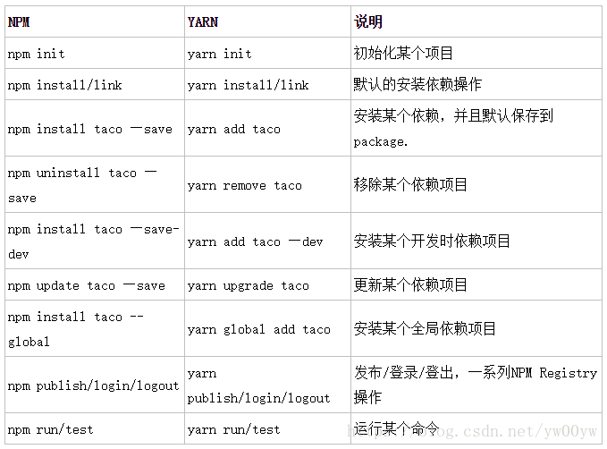
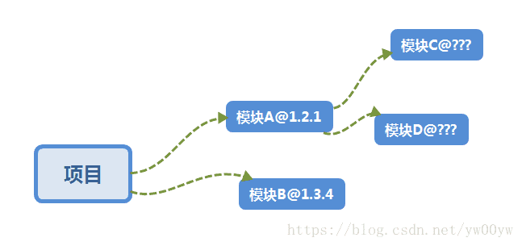

# [yarn的安装和使用](https://blog.csdn.net/yw00yw/article/details/81354533) 

#### yarn的简介：

Yarn是facebook发布的一款取代npm的包管理工具。

------

#### yarn的特点：

- 速度超快。
  - Yarn 缓存了每个下载过的包，所以再次使用时无需重复下载。 同时利用并行下载以最大化资源利用率，因此安装速度更快。
- 超级安全。
  - 在执行代码之前，Yarn 会通过算法校验每个安装包的完整性。
- 超级可靠。
  - 使用详细、简洁的锁文件格式和明确的安装算法，Yarn 能够保证在不同系统上无差异的工作。

------

#### yarn的安装:

1. 下载node.js，使用npm安装
   `npm install -g yarn`
   查看版本：`yarn --version`

2. 安装node.js，下载yarn的安装程序:
   [提供一个.msi文件，在运行时将引导您在Windows上安装Yarn](https://yarnpkg.com/en/docs/install#windows-stable) 

3. Yarn 淘宝源安装，分别复制粘贴以下代码行到黑窗口运行即可

   ```bash
   yarn config set registry http://registry.npmmirror.com -g
   ```

> 淘宝镜像的地址不定期会进行更新。如果你是在一段时间前通过设置 `yarn config set registry https://registry.npm.taobao.org -g` 来使用淘宝镜像，可能会发现地址已经无法使用了。为了避免这种情况，建议在使用淘宝镜像之前，先去淘宝镜像的官网 (https://npm.taobao.org/) 上查看最新的镜像地址，并根据最新地址对设置进行更新。这样可以确保你使用的是最新的淘宝镜像地址。

------

#### yarn的常用命令：

- 安装yarn

  - `npm install -g yarn`

- 安装成功后，查看版本号：

  - `yarn --version`

- 创建文件夹 yarn

  - `md yarn`

- 进入yarn文件夹

  - `cd yarn`

- 初始化项目

  - `yarn init // 同npm init，执行输入信息后，会生成package.json文件`

- yarn的配置项：

  - `yarn config list // 显示所有配置项`
  - `yarn config get <key> //显示某配置项`
  - `yarn config delete <key> //删除某配置项`
  - `yarn config set <key> <value> [-g|--global] //设置配置项`

- 安装包：

  - `yarn install //安装package.json里所有包，并将包及它的所有依赖项保存进yarn.lock`
  - `yarn install --flat //安装一个包的单一版本`
  - `yarn install --force //强制重新下载所有包`
  - `yarn install --production //只安装dependencies里的包`
  - `yarn install --no-lockfile //不读取或生成yarn.lock`
  - `yarn install --pure-lockfile //不生成yarn.lock`

- 添加包（会更新package.json和yarn.lock）：

  - `yarn add [package] // 在当前的项目中添加一个依赖包，会自动更新到package.json和yarn.lock文件中`
  - `yarn add [package]@[version] // 安装指定版本，这里指的是主要版本，如果需要精确到小版本，使用-E参数`
  - `yarn add [package]@[tag] // 安装某个tag（比如beta,next或者latest）`

  //不指定依赖类型默认安装到dependencies里，你也可以指定依赖类型：

  - `yarn add --dev/-D // 加到 devDependencies`
  - `yarn add --peer/-P // 加到 peerDependencies`
  - `yarn add --optional/-O // 加到 optionalDependencies`

  //默认安装包的主要版本里的最新版本，下面两个命令可以指定版本：

  - `yarn add --exact/-E // 安装包的精确版本。例如yarn add foo@1.2.3会接受1.9.1版，但是yarn add foo@1.2.3 --exact只会接受1.2.3版`
  - `yarn add --tilde/-T // 安装包的次要版本里的最新版。例如yarn add foo@1.2.3 --tilde会接受1.2.9，但不接受1.3.0`

- 发布包

  - `yarn publish`

- 移除一个包

  - `yarn remove <packageName>：移除一个包，会自动更新package.json和yarn.lock`

- 更新一个依赖

  - `yarn upgrade 用于更新包到基于规范范围的最新版本`

- 运行脚本

  - `yarn run 用来执行在 package.json 中 scripts 属性下定义的脚本`

- 显示某个包的信息

  - `yarn info <packageName> 可以用来查看某个模块的最新版本信息`

- 缓存

  - ```
    yarn cache
    ```

    - `yarn cache list # 列出已缓存的每个包 yarn cache dir # 返回 全局缓存位置 yarn cache clean # 清除缓存`

------

#### npm 与 yarn命令比较:



------

#### npm 与 yarn相关问题比较:

###### npm模块的依赖:

- npm存在一些历史遗留问题，请看下图：
  

> 比如说你的项目模块依赖是图中描述的，@1.2.1代表这个模块的版本。在你安装A的时候需要安装依赖C和D，很多依赖不会指定版本号，默认会安装最新的版本，这样就会出现问题：比如今天安装模块的时候C和D是某一个版本，而当以后C、D更新的时候，再次安装模块就会安装C和D的最新版本，如果新的版本无法兼容你的项目，你的程序可能就会出BUG，甚至无法运行。这就是npm的弊端，而yarn为了解决这个问题推出了yarn.lock的机制，这是作者项目中的yarn.lock文件。

###### yarn.lock文件格式:


> 大家会看到，这个文件已经把依赖模块的版本号全部锁定，当你执行yarn install的时候，yarn会读取这个文件获得依赖的版本号，然后依照这个版本号去安装对应的依赖模块，这样依赖就会被锁定，以后再也不用担心版本号的问题了。其他人或者其他环境下使用的时候，把这个yarn.lock拷贝到相应的环境项目下再安装即可。
> 注意：这个文件不要手动修改它，当你使用一些操作如yarn add时，yarn会自动更新yarn.lock。

## 使用yrm工具管理一些npm源

#### 安装

- `yarn global add yrm`

#### 查看可用源

- `yrm ls`

#### 选择源

- `yrm use yarn`

## 快速删除node_modules

手动删除真的很慢：

- 安装： `npm install rimraf -g`
- 使用：`rimraf node_modules`

rimraf是node的一个包，可以快速删除node_modules，再也不用等半天了


## 常用命令

安装`package.json`中的依赖：`yarn --registry=https://registry.npmmirror.com` 