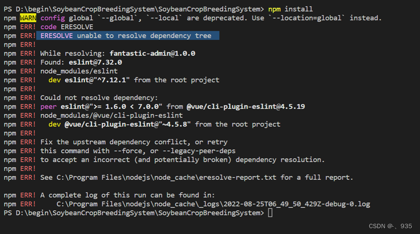

# npm命令安装依赖

# 解决：ERESOLVE unable to resolve dependency tree

NPM版本问题报错的解决方案

在安装项目依赖时，很大可能会遇到安装不成功的问题，其中有一个很大的原因，可能就是因为你的npm版本导致的。 

```bash
npm ERR! code ERESOLVE npm ERR! ERESOLVE unable to resolve dependency tree

ERESOLVE unable to resolve dependency tree
```

如图：


4.报错原因

在新版本的npm中，默认情况下，npm install遇到冲突的peerDependencies时将失败。

5.解决办法

使用--force或--legacy-peer-deps可解决这种情况。

`--force `会无视冲突，并强制获取远端npm库资源，当有资源冲突时覆盖掉原先的版本。

`--legacy-peer-deps` 标志是在v7中引入的，目的是绕过peerDependency自动安装；它告诉 NPM 忽略项目中引入的各个modules之间的相同modules但不同版本的问题并继续安装，保证各个引入的依赖之间对自身所使用的不同版本modules共存。


建议用 `--legacy-peer-deps` 比较保险一点

在终端输入

```bash
npm install --legacy-peer-deps
```


回车Enter即可解决

# npm ERR! code ENOENT问题解决方法

这个错误就是进错目录了，设置一下工作区的文件夹，然后重新输入命令就行了