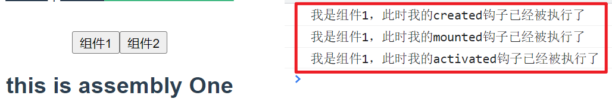
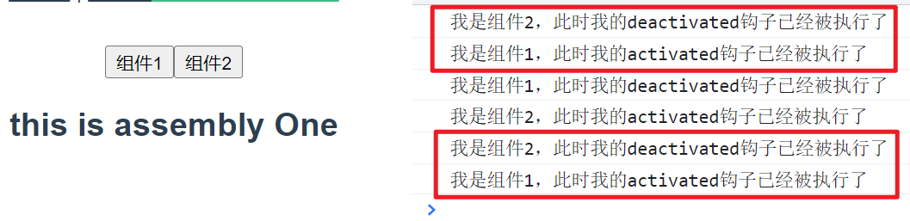

# `activated`和`deactivated`

## 什么是activated

> 首先要确定一个点就是他也是属于**vue生命周期**中的一个。
> 为什么我们平常说的生命周期没有它呢？我们平常说的生命周期就是`created, update, mounted, destory`和他们的之前之后的状态，当我们去查的`activated`的时候发现没有，但是会在官方的`keep-alive`([vue3](https://cn.vuejs.org/guide/built-ins/keep-alive.html) | [vue2](https://v2.cn.vuejs.org/v2/api/#keep-alive))中发现他的身影和介绍，说白了就是我们直接切换组件的时候，组件的钩子函数会对应的触发，比如进来的时候出现`created`，离开的时候出现`destory`这样的，那么当我们使用缓存的时候，也就是`keep-alive`的时候，我们正常的钩子函数就没办法执行了，这个时候`activated`和`deactivated`就会执行。

## activated解决了一个什么问题

> 我们做一个项目的时候，一个功能是引用了组件中的数据，这个时候我们需要每次进去的时候都最新的值给传递过去，更新掉，我们有几种办法。
> 目前是三种，
> 第一种是我们直接将数据作为参数，进行父子数据的传递；
> 第二种办法是使用vuex状态管理这个值，进行全局一个状态管理，也是可以实现的；
> 第三种就是我们将组件缓存，使用`keep-alive`，但是数据传递过去不会更新，因为`created`和`mounted`不执行，这个时候就可以使用我们的`activated`进行更新数据

## Demo

#### main.vue

```vue
<template>
  <div>
    <button @click="currAssembly('one')">
      组件1
    </button>
    <button @click="currAssembly('two')">
      组件2
    </button>
    <transition>
      <keep-alive>
        <component :is="isCurr"></component>
      </keep-alive>
    </transition>
  </div>
</template>

<script>
  import AssemblyOne from '../components/assembly1.vue'
  import AssemblyTwo from '../components/assembly2.vue'

  export default {
    components: {
      AssemblyOne,
      AssemblyTwo
    },
    data() {
      return {
        isCurr: 'AssemblyOne'
      }
    },
    methods: {
      currAssembly(flg) {
        if (flg === 'one') {
          this.isCurr = 'AssemblyOne'
        } else {
          this.isCurr = 'AssemblyTwo'
        }
      }
    }
  }
</script>
```

#### assembly1(组件1)

```vue
<template>
  <div>
    <h2>
      {{msg}}
    </h2>
  </div>
</template>

<script>
  export default {
    data() {
      return {
        msg: 'this is assembly One'
      }
    },
    created() {
      console.info('我是组件1，此时我的created钩子已经被执行了')
    },
    mounted() {
      console.info('我是组件1，此时我的mounted钩子已经被执行了')
    },
    activated() {
      console.info('我是组件1，此时我的activated钩子已经被执行了')
    },
    deactivated() {
      console.info('我是组件1，此时我的deactivated钩子已经被执行了')
    }
  }
</script>
```

#### assembly2(组件2)

```vue
<template>
  <div>
    <h2>
      {{msg}}
    </h2>
  </div>
</template>

<script>
  export default {
    data() {
      return {
        msg: 'this is assembly Two'
      }
    },
    created() {
      console.info('我是组件2，此时我的created钩子已经被执行了')
    },
    mounted() {
      console.info('我是组件2，此时我的mounted钩子已经被执行了')
    },
    activated() {
      console.info('我是组件2，此时我的activated钩子已经被执行了')
    },
    deactivated() {
      console.info('我是组件2，此时我的deactivated钩子已经被执行了')
    }
  }
</script>
```

### 执行结果

- 第一次运行
   
- 第二次运行
-  

### 要点速记

- `activated`和`deactivated`是配合`keep-alive`一起使用的
- `activated`和`deactivated`没有`keep-alive`的时候是不会被触发的
- 在存在`keep-alive`的时候可以将`activated`当作`created`进行使用
- `deactivated`是组件销毁的时候触发，此时的`destory`是不执行的
