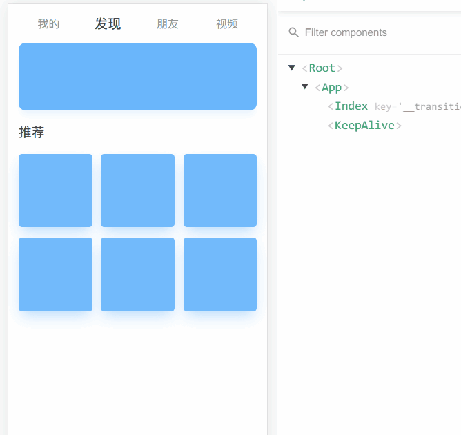

## 示例-根据条件缓存页面



**场景：**

从首页的点击导航进入列表页,

列表页点击列表进入 该 数据详情页

从详情页返回，希望列表页缓存，不重新渲染数据，这样会提高用户体验。

> 从首页进入列表页刷新，从详情页返回列表页不刷新。

**分析一下**

这样需求，如果是小程序的话，默认列表页就会缓存，因为小程序的运行环境是微信客户端，当我们打开一个页面会新建一个webview，

所有列表页和详情页是两个webview，当我们进入详情页，列表页webview，只是会在详情页webview下面，不会销毁。

以下是小程序运行环境：我们可以看到每个页面都有一个webview


但是但是，我们的项目是用vue开发的webapp，多个组件共用一个窗口，当我们切换路由时，切出路由组件会销毁，所有列表页进入详情页列表页会销毁，重新回到列表页，列表页组件会重新加载。

**解决方案**

`keep-alive`

`keep-alive`是Vue提供的一个抽象组件，主要用于保留组件状态或避免重新渲染。

`<keep-alive>` 包裹动态组件时，会缓存不活动的组件实例，而不是销毁他们。

和`<transition>` 相似，` <keep-alive>` 是一个抽象组件，它自身不会渲染一个DOM元素，也不会出现在父组件链中。

但是 `keep-alive` 会把其包裹的所有组件都缓存起来。

**分析一下**

我们可以把需求拆分为2步

(1) 把需要缓存和不需要缓存的组件区分开，在组件的路由配置的元信息，meta中定义哪些需要缓存哪些不需要缓存


具体代码如下

1，定义两个出口 `router-view`

```html
<keep-alive>
    <!-- 需要缓存的视图组件 -->
  <router-view v-if="$route.meta.keepAlive">
  </router-view>
</keep-alive>

<!-- 不需要缓存的视图组件 -->
<router-view v-if="!$route.meta.keepAlive">
</router-view>
```

2，在router配置中定义哪些需要缓存哪些不需要缓存

```js
new Router({
    routes: [
        {
            path: '/',
            name: 'index',
            component: () => import('./views/keep-alive/index.vue')
        },
        {
            path: '/list',
            name: 'list',
            component: () => import('./views/keep-alive/list.vue'),
            meta: {
                keepAlive: true //需要被缓存
            }
        },
        {
            path: '/detail',
            name: 'detail',
            component: () => import('./views/keep-alive/detail.vue')
        }
    ]
})
```

(2)，开始按需缓存组件

我们从官方文档提供的 api 入手,

keep-alive组件如果设置了 include ，就只有和 include 匹配的组件会被缓存，

所以思路就是，动态修改 include 数组来实现按需缓存。

```vue
<template>
    <keep-alive :include="include">
        <!-- 需要缓存的视图组件 -->
      <router-view v-if="$route.meta.keepAlive">
      </router-view>
    </keep-alive>

    <!-- 不需要缓存的视图组件 -->
    <router-view v-if="!$route.meta.keepAlive">
    </router-view>
</template>
<script>
    export default {
      name: "app",
      data: () => ({
        include: []
      }),
      watch: {
        $route(to, from) {
          //如果 要 to(进入) 的页面是需要 keepAlive 缓存的，把 name push 进 include数组
          if (to.meta.keepAlive) {
            !this.include.includes(to.name) && this.include.push(to.name);
          }
        }
      }
    };
</script>
```

此时我们发现，从详情页返回列表页，列表页真的不再刷新了

em...新的问题又出现了,由于 列表页被缓存了,这个时候我从首页,再点击进入某个列表，也不刷新了，完了，点击首页导航应该进入不同的列表页的. 也就是说，从首页进入列表组件不应该被缓存的。

解决一下，我们在定义路由是，在元信息中再加一个字段，这里是deepth字段，代表进入路由的层级,比如首页路由deepth是0.5,列表页是1,详情页是2

```js
new Router({
    routes: [
        {
            path: '/',
            name: 'index',
            component: () => import('./views/keep-alive/index.vue'),
            meta: {
                deepth: 0.5 // 定义路由的层级
            }
        },
        {
            path: '/list',
            name: 'list',
            component: () => import('./views/keep-alive/list.vue'),
            meta: {
                deepth: 1
                keepAlive: true //需要被缓存
            }
        },
        {
            path: '/detail',
            name: 'detail',
            component: () => import('./views/keep-alive/detail.vue'),
            meta: {
                deepth: 2
           }
        }
    ]
})
```

然后在 app.vue中增加监听器，监听 我们进入路由的 方向

具体代码如下

```vue
<template>
    <keep-alive :include="include">
    <!-- 需要缓存的视图组件 -->
      <router-view v-if="$route.meta.keepAlive">
      </router-view>
    </keep-alive>

    <!-- 不需要缓存的视图组件 -->
    <router-view v-if="!$route.meta.keepAlive">
    </router-view>
</template>
<script>
    export default {
      name: "app",
      data: () => ({
        include: []
      }),
      watch: {
        $route(to, from) {
          //如果 要 to(进入) 的页面是需要 keepAlive 缓存的，把 name push 进 include数组
          if (to.meta.keepAlive) {
            !this.include.includes(to.name) && this.include.push(to.name);
          }
          //如果 要 form(离开) 的页面是 keepAlive缓存的，
          //再根据 deepth 来判断是前进还是后退
          //如果是后退
          if (from.meta.keepAlive && to.meta.deepth < from.meta.deepth) {
            var index = this.include.indexOf(from.name);
            index !== -1 && this.include.splice(index, 1);
          }
        }
      }
    };
</script>
```

em...终于解决啦，完美!!!

[千锋HTML5学院：如何讲清楚JS原型链?](https://zhuanlan.zhihu.com/p/139382945)

[千锋HTML5学院：如何讲清楚闭包？](https://zhuanlan.zhihu.com/p/114543319)

[千锋HTML5学院：如何讲清楚函数防抖？](https://zhuanlan.zhihu.com/p/110733457)

[千锋HTML5学院：如何讲清楚函数节流？](https://zhuanlan.zhihu.com/p/110810391)
