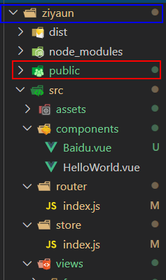

# vue 获取本地图片路径（动态引入 / 静态引入）

开篇首先，我们直接 `img src = "xxx"` 就可以获取图片，但是我们需要的不是直接写在上面的 地址而是从 data 数据当中获取到的地址此方法有别于从数据库中获取的数据一、首先我们在 img 当中引用&lt;template&gt;&lt;div&gt;&lt;img :src="arr.url"&gt;&lt;/div&gt;&lt;/template&gt;记住这里是:src里面的是

## `require()` 动态引入

首先，我们直接 `img src = "xxx"` 就可以获取图片，但是我们需要的不是直接写在上面的地址，而是从 data 数据当中获取到的地址，此方法有别于从数据库中获取的数据。

### 一、首先我们在 img 当中引用

```html
<template>
	<div>
		
	</div>
</template>
```

> 这里是 `:src` 

### 二、设置数据 data()

```js
<script>
export default {
    data(){
      return{
        arr:[
       		 { url:require("../img/001.jpg") },
       		 { url:require("../img/002.jpg") },
       		 //至于这里为什么会写两个 ，是因为我们通常获取的数据并不是一个，
       		 //使用的时候通常使用 v-for 来进行遍历
       		 //如果只按上文的 img案例，只看一个就行
        ],
      }
    },
}
</script>
```

> **直接给 它 传递一个路径行吗？**
> 不行，图片资源是静止的，编译后文件名为发生变化。
> 编译前：
> `< img src="./assets/4g.jpg" alt="">`
> 编译后：
> `< img src="/img/01.f0cfc21d.jpg" alt="">`
> 常见的引入方式，路径是固定的字符串，图片会被webpack处理，名称发生变化，找不到文件

> **为什么需要使用 `require()` 把路径括起来？**
> 使用`require`定义之后，可以动态使用，不用`require`，就只能写死路径（绝对路径）。
> 不用`require`， `:src="…/img/image.jpg"` 会被解析为字符串。
> 用了`require`，就是将图片当成模块先引进来，再绑定。


## `public` 静态引入

如果做的是纯静态的网站展示，有许多的本地静态资源需要加载，里面包括本地数据和本地图片混合的好几组，建议使用 `public` 方式。其他情况下建议使用 `require` 方式

如果你的图片在 public 下面，就直接写 图片名 `例：a.png`，如果有二级目录就直接地址 `例：images/a.png`

- **不需要写 public ，它会自动引用 public 里面的内容**

```js
	data(){
		return{
			arr:[
			 {
			 	url:"abc.jpg"
			 }
			]
		}
	}
```