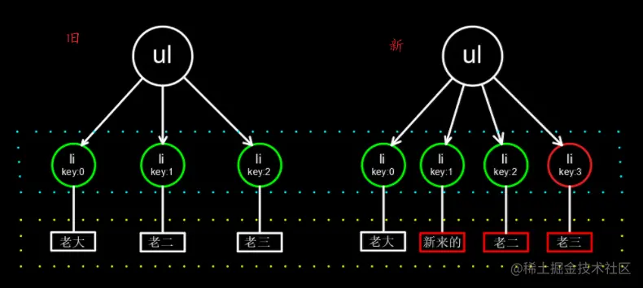

# 列表渲染（v-for）及 key 的使用

官方文档：
[内置指令：v-for](https://cn.vuejs.org/api/built-in-directives.html#v-for) 
[列表渲染](https://cn.vuejs.org/guide/essentials/list.html) 
[内置的特殊 Attributes：key](https://cn.vuejs.org/api/built-in-special-attributes.html#key) 

## [VUE--列表渲染（v-for）及key的使用](https://blog.csdn.net/dmr123456/article/details/118566587) 

### v-for 用法

```html
<div v-for="item in items">
  {{ item.text }}
</div>
```

```html
<div v-for="(item, index) in items"></div>
<div v-for="(value, key) in object"></div>
<div v-for="(value, name, index) in object"></div>
```

`v-for` 的默认行为会尝试原地修改元素而不是移动它们，即”`就地更新`”策略。如果数据项的顺序发生改变，vue将不会移动DOM元素来匹配数据项的顺序，而是就地更新每个元素，并且确保它们在每个索引位置正确渲染。也就是说默认的情况下vue会尽量使用已经存在的DOM元素，直接在已有的DOM上进行复用修改，这样可以带来一定性能上的提升。

```html
<!-- <script src="https://unpkg.com/vue"></script> -->
<script src="https://cdn.jsdelivr.net/npm/vue@2/dist/vue.js"></script>
<div id="app">
  <div v-for="(item,i) in list" :key="i">
    {{item}}{{i}}
    <input />
    <button @click="handleDelete(i)">delete</button>
  </div>
</div>
<script>
  var app = new Vue({
    el: "#app",
    data: {
      list: [
        { id: 1, value: "A" },
        { id: 2, value: "B" },
        { id: 3, value: "C" },
      ],
    },
    methods: {
      handleDelete(i) {
        this.list.splice(i, 1);
      },
    },
  });
</script>
```


> 问题：
>
> 删除第二项的实际上变化：vue经过比对发现第二项数据被删除了，即`list[1]`被删除了，list变为`[{"id":1,value:"A"},{"id":2,value:"C"}]`，所以列表只需要渲染这两个数据。渲染时会复用第二个div的DOM结构，也就是直接把第二个div改成了第三个div。
> 第二个div被删除了，但是input里面的值还在？这就是vue就地更新的一个缺陷，因为这里input是临时DOM状态，在元素复用时，input里的值也会被保留。

### [通过 key 管理状态](https://cn.vuejs.org/guide/essentials/list.html#maintaining-state-with-key) 

Vue 默认按照“就地更新”的策略来更新通过 `v-for` 渲染的元素列表。当数据项的顺序改变时，Vue 不会随之移动 DOM 元素的顺序，而是就地更新每个元素，确保它们在原本指定的索引位置上渲染。

默认模式是高效的，但**只适用于列表渲染输出的结果不依赖子组件状态或者临时 DOM 状态 (例如表单输入值) 的情况**。

为了给 Vue 一个提示，以便它可以跟踪每个节点的标识，从而重用和重新排序现有的元素，你需要为每个元素对应的块提供一个唯一的 `key` attribute：	

```html
<div v-for="item in items" :key="item.id">
  <!-- 内容 -->
</div>
```

> key绑定 `item.id` 效果符合预期。
>
> `v-for` 的默认行为尝试原地修改元素而不是移动它们。要强制其重新排序元素，需要用特殊attribute key来提供一个排序提示；
>
> 建议尽可能在使用v-for时提供key attribute，除非遍历输出的DOM内容非常简单，或者是刻意依赖默认行为以获取性能上的提升。
>
> 因为它是vue识别节点的一个通用机制，key并不仅与v-for特别关联。
>
> key的特殊attribute主要用在vue的虚拟DOM算法，在新旧nodes对比时辨识VNodes。如果不使用key，vue会使用一种最大限度减少动态元素并且尽可能的尝试就地修改/复用相同类型元素的算法。而使用key时，它会基于key的变化重新排列元素顺序，并且移除key不存在的元素。
>
> 有相同父元素的子元素必须有独特的key，重复的key会造成渲染错误。
>
> 它也可以用于强制替换元素/组件而不是重复使用它。
>
> key的作用主要是为了高效的更新虚拟DOM；当以index为key值时，如果数组长度发生变化，会导致key的变化，比如删除其中某一项，那么 index会相应变化。所以**当用index作为key和不加key没什么区别，都不能提升性能**。一般使用每项数据的唯一值作为key，就算数组长度发生变化，也不会影响到这个key。
>
> vue和react的虚拟DOM的diff算法大致相同，其核心是基于两个简单的假设：
>
> 1、两个相同的组件产生类似的DOM结构，不同的组件产生不同的DOM结构；
>
> 2、同一层级的一组节点，他们可以通过唯一的id进行区分。
>
> 基于以上两点假设，使得虚拟DOM的Diff算法的复杂度从O(n^3)降到了O(n)。

## [diff算法 - v-for中的key值作用](https://juejin.cn/post/7099817250554642462#heading-7) 

### diff算法

> diff算法就是用JavaScript来表示一个dom树的结构然后用这个dom去构建一个真实的dom 插入到文档中 当状态变更的时候 重新构造一个dom树 比较新旧dom树 记录两个dom树的差异 并且通知视图开始更新

### 虚拟dom

> `.vue` 文件中的template里写的标签, 都是模板, 都要被vue处理成虚拟DOM对象, 才会渲染显示到真实DOM页面上


**真实的DOM属性好几百个, 没办法快速的知道哪个属性改变了**

> - 真实dom的部分属性图：
>
>   
>
> - `template` 里标签结构
>
>   ```vue
>   <template>
>       <div id="box">
>           <p class="my_p">123</p>
>       </div>
>   </template>
>   ```
>
>   


vue在内存中生成一样的虚拟DOM结构(本质是个JS对象)

对应的虚拟DOM结构

```js
const dom = {
    type: 'div',
    attributes: [{id: 'box'}],
    children: {
        type: 'p',
        attributes: [{class: 'my_p'}],
        text: '123'
    }
}
```

这个虚拟dom只有主要的几个属性，速度更快

以后vue数据更新

1. 生成新的虚拟DOM结构
2. 和旧的虚拟DOM结构对比
3. 利用diff算法, 找不不同, 只更新变化的部分(重绘/回流)到页面 - 也叫打补丁

> 好处1: 提高了更新DOM的性能(不用把页面全删除重新渲染)
>
> 好处2: 虚拟DOM只包含必要的属性(没有真实DOM上百个属性)
>
> 
>
> 总结：虚拟DOM保存在内存中，只记录dom关键信息，配合diff算法提高DOM更新的性能

### diff算法的新旧对比

#### 情况1: 根元素变了, 删除重建

- 旧虚拟DOM

  ```vue
  <div id="box">
      <p class="my_p">123</p>
  </div>
  ```

- 新虚拟DOM

  ```vue
  <ul id="box">
      <li class="my_p">123</li>
  </ul>
  ```

#### 情况2: 根元素没变, 属性改变, 元素复用, 更新属性

- 旧虚拟DOM

  ```vue
  <div id="box">
      <p class="my_p">123</p>
  </div>
  ```

- 新虚拟DOM

  ```vue
  <div id="myBox" title="标题">
      <p class="my_p">123</p>
  </div>
  ```

### diff算法-key

> 根元素没变, 子元素没变, 元素内容改变

#### 无key - 就地更新

v-for不会移动DOM, 而是尝试复用, 就地更新，如果需要v-for移动DOM, 你需要用特殊 attribute `key` 来提供一个排序提示

```html
<ul id="myUL">
    <li v-for="str in arr">
        {{ str }} 
        <input type="text">
    </li>
</ul>
<button @click="addFn">下标为1的位置新增一个</button>
```

```js
export default {
    data(){
        return {
            arr: ["老大", "老二", "老三"]
        }
    },
    methods: {
        addFn(){
            this.arr.splice(1, 0, '新来的')
        }
    }
};
```

以上代码效果为点击按钮，新增一条数据，对应就会多一个li，那么diff算法是怎么计算的呢

`旧 - 虚拟DOM结构` 和 `新 - 虚拟DOM结构` 对比过程：一级一级对比

##### 无key - 就地更新-图解：


1. 先对比根标签,发现一样，直接复用

2. 再对比li标签，发现旧虚拟dom有三个li标签,新虚拟dom有四个标签，会直接复用前三个li标签而不是重新销毁重建，少一个li，就会补上一个li

3. 最后比对内容，发现第一条内容没变，会复用，从第二个开始对应的内容发生变化，更新对应内容

> 性能不高，从第二个li往后都更新了

#### 有key-key为索引

还是就地更新

因为新旧虚拟DOM对比，key存在就复用此标签更新内容，如果不存在就直接建立一个新的。

```html
<ul id="myUL">
    <li v-for="(str, index) in arr" :key="index">
        {{ str }} 
        <input type="text">
    </li>
</ul>
<button @click="addFn">下标为1的位置新增一个</button>
```

```js
export default {
    data(){
        return {
            arr: ["老大", "老二", "老三"]
        }
    },
    methods: {
        addFn(){
            this.arr.splice(1, 0, '新来的')
        }
    }
};
```

##### key为索引-图解过程:




1. v-for先循环产生新的DOM结构，key是连续的，和旧dom前三个一致，直接复用

2. 然后比较新旧DOM结构，找到区别，打补丁到页面上

   最后补一个li，然后从第二个往后，都要更新内容

> key为索引：当用 `index` 作为 `key` 和不加 `key` 没什么区别，并不能提升性能。

#### 有key-key为id

key的值只能是唯一不重复的，字符串或数值

v-for不会移动DOM，而是尝试复用, 就地更新，如果需要v-for移动DOM，你需要用特殊 attribute `key` 来提供一个排序提示

```vue
<template>
  <div>
    <ul>
      <li v-for="obj in arr" :key="obj.id">
        {{ obj.name }}
        <input type="text">
      </li>
    </ul>
    <button @click="btn">下标1位置插入新来的</button>
  </div>
</template>

<script>
export default {
  data() {
    return {
      arr: [
        {
          name: '老大',
          id: 100
        },
        {
          name: '老二',
          id: 101
        },
        {
          name: '老三',
          id: 102
        }
      ],
    };
  },
  methods: {
    btn(){
      this.arr.splice(1, 0, {
        id: 103, 
        name: '新来的'
      })
    }
  }
};
</script>
```

##### key为id-图解效果(根据key值对比)：


1. 根据key值比较新旧dom，key值为100,101,102的结构没变，直接复用

2. 少一个key为103的li，打补丁一个新li

3. 下面的`'老大','老二'.'老三'`对应的key值都没变，复用，打补丁添加一个`'新来的'`。

> 总结：添加key为id的性能更高，总结一句话---有id用id(不重复的字符串效果一样)，无id用索引，但没意义


### 总结:

#### vue是如何提高更新性能的?

- 采用虚拟DOM+diff算法提高更新性能

#### 虚拟DOM是什么?

- 本质是保存dom关键信息的JS对象

#### diff算法如何比较新旧虚拟DOM?

- 根元素改变 – 删除当前DOM树重新建
- 根元素未变, 属性改变 – 更新属性
- 根元素未变, 子元素/内容改变 - 更新内容
- 无key – 就地更新 / 有key – 按key比较

