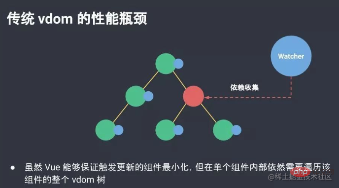

# 讨论Vue2中key和Vue3中key的区别

在`Vue`中使用`v-for`指令渲染列表时，必须要在每个子组件中加上一个`key`属性。这个`key`属性是一个特殊的属性，用于标识每个节点的唯一性。在`Vue2.x`版本中的`key`和`Vue3.x`版本中的`key`有很大的不同。

## **Vue2中的key**

在`Vue2.x`版本中，`key`主要用于**Vue的虚拟DOM算法中的优化策略**。在Vue2中，当使用`v-for`指令渲染列表时，`Vue`会根据`key`的值去对比新旧节点，然后对`DOM`进行更新。`Vue2`中的`key`具有以下特点：

- key必须是字符串或数字类型，**不能**是对象和数组。
- key的值必须是唯一的，不能重复。
- key的值必须具有可预测性，**不能**随机生成。

在`Vue2`中，由于使用了`key`的优化策略，可以有效地避免`DOM`重排和重新渲染，提高了渲染性能，同时也可以避免出现错误的数据更新。

## **Vue3中的key**

在`Vue3.x`版本中，`key`的作用与`Vue2.x`版本中的**不同**，它主要用于**跟踪节点的身份**。在`Vue3`中，当使用`v-for`指令渲染列表时，`Vue`会根据`key`的值来判断哪些节点是新增的、哪些节点是删除的，然后对DOM进行更新。`Vue3`中的`key`具有以下特点：

- key可以是任何类型，**包括**对象和数组。
- key的值必须是唯一的，不能重复。
- key的值**可以**是非可预测的，例如随机生成的值。

`Vue3`中的`key`与`Vue2`中的不同之处在于，Vue3中的key是用于跟踪节点的身份，而不是仅仅用于优化渲染。这意味着，在`Vue3`中，`key`的**唯一性是必须保证的，否则会导致节点身份混乱，从而导致错误的渲染结果**。

这样设计，主要是为了**提高渲染效率和性能**。在`Vue2`中，在处理动态列表时可能会存在一些问题。

这种问题出现的**原因**是因为`Vue2`只是根据`key`值进行**简单地判断**，然后比较新老节点的差异，而无法精确地知道哪些节点是新增的、哪些节点是删除的。

`Vue3`解决了这些问题。使用`key`就可以**精确地判断**哪些节点是新增的、哪些节点是删除的。这使得`Vue3`在处理动态列表时更加高效和准确，避免了`Vue2`中存在的一些问题。因此，将`key`设计成用于跟踪节点的身份，是`Vue3`在提高渲染效率和性能方面的一个重要的优化。

## **结论**

`Vue2`中的`key`和`Vue3`中的`key`在使用上有很大的不同。`Vue2`中的`key`主要用于优化渲染性能，而`Vue3`中的`key`主要用于跟踪节点的身份。`Vue3`中的`key`可以是任何类型，包括对象和数组，但必须保证唯一性。

无论是使用`Vue2`还是`Vue3`，我们都需要注意在使用`v-for`指令渲染列表时必须添加`key`属性，这是为了保证渲染的正确性。