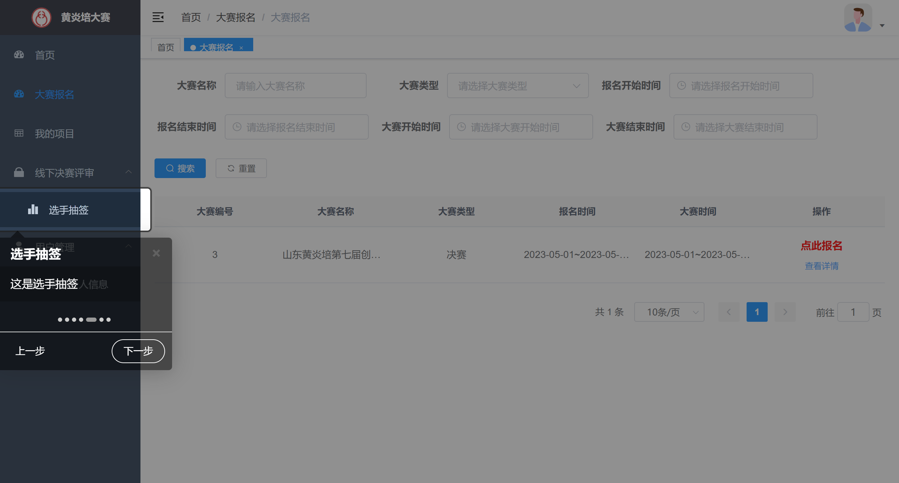

# RuoYi 中实现新手步骤引导效果

## 背景

RuoYi 中后台系统管理模板中，要实现新手步骤引导效果，指引用户操作。



## 实施

### 官网常见问题：[侧边栏如何默认展开](http://doc.ruoyi.vip/ruoyi-vue/other/faq.html#%E4%BE%A7%E8%BE%B9%E6%A0%8F%E5%A6%82%E4%BD%95%E9%BB%98%E8%AE%A4%E5%B1%95%E5%BC%80) 

某些场景下，用户需要默认展开侧边栏的某些`sub-menu`，可以通过`default-openeds`来进行设置。

`layout\components\Sidebar\index.vue`

```vue
<el-menu
	:default-openeds="['/system', '/tool']"
	:default-active="activeMenu"
	:collapse="isCollapse"
	:background-color="settings.sideTheme === 'theme-dark' ? variables.menuBg : variables.menuLightBg"
	:text-color="settings.sideTheme === 'theme-dark' ? variables.menuText : 'rgba(0,0,0,.65)'"
	:unique-opened="false"
	:active-text-color="settings.theme"
	:collapse-transition="false"
	mode="vertical"
    >
	<sidebar-item v-for="route in sidebarRouters" :key="route.path  + index" :item="route" :base-path="route.path" />
  </el-menu>
```


### 过滤出有二级目录的路由

参考： `layout\components\Sidebar\SidebarItem.vue` 

**`layout\components\Sidebar\index.vue`代码**：

```vue
<template>
    <div :class="{ 'has-logo': showLogo }">
        <logo v-if="showLogo" :collapse="isCollapse" />
        <el-scrollbar wrap-class="scrollbar-wrapper">
            <el-menu :default-openeds="defaultOpeneds" :default-active="activeMenu" :collapse="isCollapse"
                :background-color="variables.menuBg" :text-color="variables.menuText" :unique-opened="true"
                :active-text-color="settings.theme" :collapse-transition="false" mode="vertical">
                <sidebar-item v-for="(route, index) in permission_routes"
                    :data-intro="`这是${route.meta ? route.meta.title : '首页'}`"
                    :data-title="route.meta ? route.meta.title : '首页'" :key="route.path + index" :item="route"
                    :base-path="route.path" />
            </el-menu>
        </el-scrollbar>
    </div>
</template>

<script>
import { mapGetters, mapState } from "vuex";
import Logo from "./Logo";
import SidebarItem from "./SidebarItem";
import variables from "@/assets/styles/variables.scss";
import { checkUserNull } from '@/api/basisdata/user_common';

export default {
    data() {
        return {
            defaultOpeneds: [], // 非管理员时默认打开的菜单项
        }
    },
    components: { SidebarItem, Logo },
    computed: {
        ...mapState(["settings"]),
        ...mapGetters(["permission_routes", "sidebar"]),
        activeMenu() {
            const route = this.$route;
            const { meta, path } = route;
            // if set path, the sidebar will highlight the path you set
            if (meta.activeMenu) {
                return meta.activeMenu;
            }
            return path;
        },
        showLogo() {
            return this.$store.state.settings.sidebarLogo;
        },
        variables() {
            return variables;
        },
        isCollapse() {
            return !this.sidebar.opened;
        }
    },
    mounted() {
        checkUserNull().then(res => {
            if (res.rows[0].admin || localStorage.getItem('unIntro')) return; // 是管理员不显示引导效果
            for (const item of this.permission_routes) {
                !item.hidden && !(this.hasOneShowingChild(item.children, item) && (!this.onlyOneChild.children || this.onlyOneChild.noShowingChildren) && !item.alwaysShow) && this.defaultOpeneds.push(item.path);
            }
            localStorage.setItem('unIntro', true);
            // localStorage.removeItem('unIntro'); // 移除对不展示引导效果的控制 // 执行`退出登录`运行该代码
            this.$intro()
                .setOption("nextLabel", " 下一步 ")
                .setOption("prevLabel", " 上一步 ")
                .setOption("doneLabel", " 完成 ")
                .start();
        })
    },
    methods: {
        hasOneShowingChild(children = [], parent) {
            const showingChildren = children.filter(item => {
                if (item.hidden) {
                    return false
                } else {
                    // Temp set(will be used if only has one showing child)
                    this.onlyOneChild = item
                    return true
                }
            })
            // When there is only one child router, the child router is displayed by default
            if (showingChildren.length === 1) {
                return true
            }
            // Show parent if there are no child router to display
            if (showingChildren.length === 0) {
                this.onlyOneChild = { ...parent, path: '', noShowingChildren: true }
                return true
            }
            return false
        },

        resolvePath(routePath) {
            if (isExternal(routePath)) {
                return routePath
            }
            if (isExternal(this.basePath)) {
                return this.basePath
            }
            return path.resolve(this.basePath, routePath)
        }
    },
};
</script>
```

### 具体参考

 [01.introjs实现页面引导效果(main.js全局引入).md](..\..\Vue组件\02.页面引导效果\01.introjs实现页面引导效果(main.js全局引入).md) 

 [02.intro.js实现分步骤帮助引导(utils常用工具封装).md](..\..\Vue组件\02.页面引导效果\02.intro.js实现分步骤帮助引导(utils常用工具封装).md) (推荐)

> 后续新增了`常见问题页`，没有采取该方案