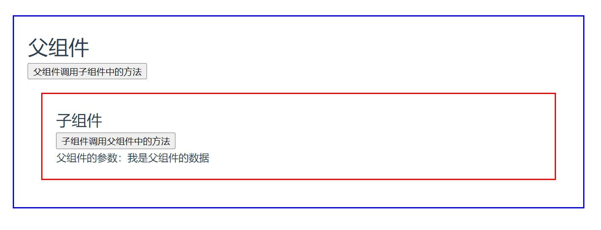

# 父子组件交互

## setup语法糖 父组件调用子组件的函数

> 使用 `<script setup>` 的组件是**默认关闭**的——即通过模板引用或者 `$parent` 链获取到的组件的公开实例，**不会**暴露任何在 `<script setup>` 中声明的绑定。
>
> 可以通过 `defineExpose` 编译器宏来显式指定在 `<script setup>` 组件中要暴露出去的属性
>
> [`defineExpose()`](https://cn.vuejs.org/api/sfc-script-setup.html#defineexpose).
>
> [组件上的 ref](https://cn.vuejs.org/guide/essentials/template-refs.html#ref-on-component).



## ChildModule.vue

```vue
<script setup>
// 子组件方法
const funAtChildModule = () => { console.log('我是子组件的打印，被父组件调用了~') }

// #region 与父组件进行数据交互
defineExpose({ funAtChildModule });         // 组件中要暴露出去的属性
const props = defineProps(['fatherData']);  // 接收的参数
const emit = defineEmits(['callFatherFun']);// 抛出的事件
// #endregion
// #region
const callFun = () => {
    emit('callFatherFun', '数据1', '数据2')
}
// #endregion
</script>

<template>
    <div style="border: 2px solid red;margin: 20px;padding: 20px;">
        <h2>子组件</h2>
        <button @click="callFun">子组件调用父组件中的方法</button>
        <p>父组件的参数：{{ fatherData }}</p>
    </div>
</template>
```


## FatherModel.vue

```vue
<script setup>
import { ref, onMounted } from 'vue';
import ChildModule from './ChildModule.vue';

const childModule = ref();
console.log(childModule.value); // undefined
// #region 组件完成初始渲染并创建 DOM 节点后运行
onMounted(() => {
    console.log(childModule.value.funAtChildModule); // () => { console.log('我是子组件的打印，被父组件调用了~') }
})
// #endregion

// #region 调用子组件的函数
const callFun = () => {
    childModule.value.funAtChildModule();
}
// #endregion

// #region 
const funAtFatherModule = function (parameter1, parameter2) {
    console.dir(arguments[1]); // 数据2 （没有形参时获取传递的参数。arguments 是依存于Function 中的，es6 箭头函数 没有this 和 arguments）
    console.log(`我是父组件的打印，被子组件调用了~这是子组件传递的参数：${parameter1 + parameter2}`)
}
// #endregion

const fatherData = ref('我是父组件的数据');
</script>

<template>
    <div style="border: 2px solid blue;margin: 20px;padding: 20px;">
        <h1>父组件</h1>
        <button @click="callFun">父组件调用子组件中的方法</button>
        <ChildModule ref="childModule" @call-father-fun="funAtFatherModule" :fatherData="fatherData" />
    </div>
</template>
```

## 子组件修改父组件的响应式数据

参考官网：[组件 v-model](https://cn.vuejs.org/guide/components/v-model.html) 

父组件（两种写法均可）：

```html
<CustomInput v-model="searchText" />
<CustomInput :model-value="searchText" />
```

子组件：

在组件内实现 `v-model` 的方式是使用一个可写的，同时具有 getter 和 setter 的 `computed` 属性。`get` 方法需返回 `modelValue` prop，而 `set` 方法需触发相应的事件：

```html
<!-- CustomInput.vue -->
<script setup>
import { computed } from 'vue'

const props = defineProps(['modelValue'])
const emit = defineEmits(['update:modelValue'])

const value = computed({
  get() {
    return props.modelValue
  },
  set(value) {
    emit('update:modelValue', value)
  }
})
</script>

<template>
  <input v-model="value" />
</template>
```

> 以上写法就是子组件通过触发自定义事件修改父组件数据的。
>
> 直接在子组件中修改父组件传递的对象的内部值可能违反了Vue的设计原则，因为这样的操作会导致数据的变动变得难以追踪和调试。在大多数情况下，应该通过props和自定义事件来进行父子组件之间的通信。
>
> 直接在子组件中修改父组件的数据会使得数据的流动变得不明确，不易追踪和调试。建议按照单向数据流的原则，通过props将数据传递给子组件，再通过自定义事件将修改后的值传递给父组件。这样可以保持数据的可追溯性和一致性，使组件之间的通信更加清晰和可维护。

