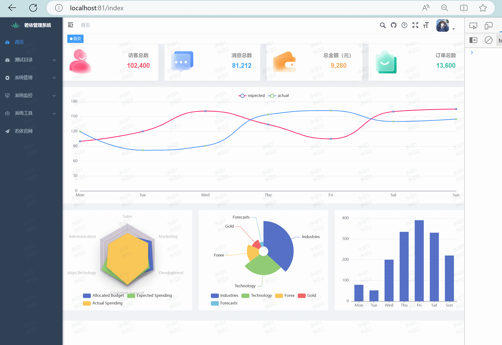

# vue3中使用Echarts，多组件适应元素尺寸变化

[toc]

## 导读

>多组件适应元素尺寸变化的核心代码是，实例中 `resize.js` 中的代码，调用方式参照 `lineChart.vue` 中的代码。

## 1.下载 echarts

```bash
npm i -s echarts
```

## 2.在main.js中引入

```js
import { createApp } from 'vue'
import App from './App.vue'
 
// 引入 echarts
import * as echarts from 'echarts'

const app = createApp(App)

// 全局挂载 echarts
app.config.globalProperties.$echarts = echarts
 
app.mount('#app')
```

## 3.组件中使用

### 方式一：vue3.0的写法，在组件中使用

```vue
<template>
  <div
    ref="myChart"
    id="myChart"
    :style="{ width: '800px', height: '400px' }"
  ></div>
</template>
 
<script>
import { getCurrentInstance, onMounted } from 'vue';
 
export default {
  setup() {
    // 通过 internalInstance.appContext.config.globalProperties 获取全局属性或方法
    let internalInstance = getCurrentInstance();
    let echarts = internalInstance.appContext.config.globalProperties.$echarts;
 
    onMounted(() => {
      const dom = document.getElementById('myChart');
      const myChart = echarts.init(dom); // 初始化echarts实例
      const option = {
        xAxis: {
          type: 'category',
          data: ['Mon', 'Tue', 'Wed', 'Thu', 'Fri', 'Sat', 'Sun']
        },
        yAxis: {
          type: 'value'
        },
        series: [
          {
            data: [820, 932, 901, 934, 1290, 1330, 1320],
            type: 'line',
            smooth: true
          }
        ]
      };
      // 设置实例参数
      myChart.setOption(option);
    });
    return {};
  }
};
</script>
```

### 方式二：全局挂载后，在组件中以 vue2 的写法

```vue
<template>
  <div
    ref="myChart"
    id="myChart"
    :style="{ width: '800px', height: '400px' }"
  ></div>
</template>
<script>
export default {
  mounted() {
    this.drawLine();
  },
  methods: {
    drawLine() {
      const dom = this.$refs['myChart'];
      const myChart = this.$echarts.init(dom); // 初始化echarts实例
      const option = {
        xAxis: {
          type: 'category',
          data: ['Mon', 'Tue', 'Wed', 'Thu', 'Fri', 'Sat', 'Sun']
        },
        yAxis: {
          type: 'value'
        },
        series: [
          {
            data: [820, 932, 901, 934, 1290, 1330, 1320],
            type: 'line',
            smooth: true
          }
        ]
      };
      // 设置实例参数
      myChart.setOption(option);
    }
  }
};
</script>
```

### 方式三：直接在组件中引入echarts

```vue
<template>
  <div
    ref="myChart"
    id="myChart"
    :style="{ width: '800px', height: '400px' }"
  ></div>
</template>
 
<script>
// 方式二：直接在组件中引入echarts
import * as echarts from 'echarts';
export default {
  mounted() {
    const dom = this.$refs['myChart']; // 获取dom节点
    const myChart = echarts.init(dom); // 初始化echarts实例
 
    const option = {
      xAxis: {
        type: 'category',
        data: ['Mon', 'Tue', 'Wed', 'Thu', 'Fri', 'Sat', 'Sun']
      },
      yAxis: {
        type: 'value'
      },
      series: [
        {
          data: [820, 932, 901, 934, 1290, 1330, 1320],
          type: 'line',
          smooth: true
        }
      ]
    };
    // 设置实例参数
    myChart.setOption(option);
  }
};
</script>
```

## 4.实例：结合 `ResizeObserver` 适应元素尺寸变化

> 以若依为例

### 效果图



### 文件结构

```bash
├── src
	├── views
		├── dashboard
			├── mixins
				├── resize.js
			├── BarChart.vue
			├── LineChart.vue
			├── PanelGroup.vue
			├── PieChart.vue
			└── RaddarChart.vue
		├── index.vue
```

### 详细代码

#### `resize.js`

```js
/**
 * @desc 函数节流
 * @param fn 函数
 * @param wait 延迟执行毫秒数
 */
let timer = null;
const throttle = function (fn, wait) {
  return function () {
    let context = this;
    let args = arguments;
    if (!timer) {
      // 当延迟时间结束后，执行函数
      timer = setTimeout(() => {
        timer = null;
        fn.apply(context, args);
      }, wait);
    }
  };
};

let ro = null;
let charts = [];
// 创建并返回一个新的 ResizeObserver 对象
const newRO = function (callback) {
  // ResizeObserver 接口监视 Element 内容盒或边框盒或者 SVGElement 边界尺寸的变化。
  !ro && (ro = new ResizeObserver(throttle(callback, 1000)));
};

/**
 *
 * @param {Object} chartVal 初始化的echarts实例
 * @param {Object} domElement 被监听尺寸变化的dom元素
 */
function resize(chartVal, domElement) {
  charts.push(chartVal);
  newRO(() => {
    charts.forEach((item) => {
      item.resize(); // 调整echarts尺寸
    });
  });

  // 添加监听事件
  function initListener() {
    ro.observe(domElement); // 观察一个或多个元素
  }

  // 调用函数添加监听事件：
  initListener();
}

// 移除观察者对某一个元素的监听
function destroyListener(chartVal, domElement) {
  charts = charts.filter((item) => item != chartVal);
  ro.unobserve(domElement); // 取消特定观察者目标上所有对 Element 的监听。
}

export { resize, destroyListener };
```

#### `lineChart.vue` (其他同级chart组件类似)

```vue
<template>
  <div ref="container" :class="props.className" :style="{ width: props.width, height: props.height }" />
</template>

<script setup>
import { ref, onMounted, onBeforeUnmount, onActivated, onDeactivated, watch } from 'vue';
import { resize, destroyListener } from "./mixins/resize"

const { proxy } = getCurrentInstance();
let echarts = proxy.$echarts;

const props = defineProps({
  className: { type: String, default: 'chart', required: false },
  width: { type: String, default: '100%', required: false },
  height: { type: String, default: '350px', required: false },
  autoResize: { type: Boolean, default: true, required: false },
  chartData: { type: Object, required: true },
})

let chart = null;

const container = ref(null); // echarts图表的容器元素

watch(
  () => props.chartData, (newValue, oldValue) => {
    setOptions(newValue);
  },
  { deep: true }
)

onMounted(() => {
  initChart();
})

onActivated(() => resize(chart, container.value))

onDeactivated(() => destroyListener(chart, container.value))

onBeforeUnmount(() => {
  if (!chart) {
    return;
  }
  chart.dispose(); // 销毁图表
  chart = null;
})

const initChart = function () {
  chart = echarts.init(container.value, 'macarons')
  // 监听 echarts 的 finished 事件
  let resizeObserverAdded = false;
  chart.on('finished', function () {
    if (!resizeObserverAdded) {
      resize(chart, container.value);
    }
    resizeObserverAdded = true;
  });
  setOptions(props.chartData);
}
const setOptions = function ({ expectedData, actualData } = {}) {
  chart.setOption({
    xAxis: {
      data: ['Mon', 'Tue', 'Wed', 'Thu', 'Fri', 'Sat', 'Sun'],
      boundaryGap: false,
      axisTick: {
        show: false
      }
    },
    grid: {
      left: 10,
      right: 10,
      bottom: 20,
      top: 30,
      containLabel: true,
    },
    tooltip: {
      trigger: 'axis',
      axisPointer: {
        type: 'cross',
      },
      padding: [5, 10],
    },
    yAxis: {
      axisTick: {
        show: false,
      }
    },
    legend: {
      data: ['expected', 'actual']
    },
    series: [{
      name: 'expected', lineStyle: {
        color: '#FF005A',
        lineStyle: {
          color: '#FF005A',
          width: 2,
        }

      },
      smooth: true,
      type: 'line',
      data: expectedData,
      animationDuration: 2800,
      animationEasing: 'cubicInOut',
    },
    {
      name: 'actual',
      smooth: true,
      type: 'line',
      lineStyle: {
        color: '#3888fa',
        lineStyle: {
          color: '#3888fa',
          width: 2,
        },
        areaStyle: {
          color: '#f3f8ff',
        }

      },
      data: actualData,
      animationDuration: 2800,
      animationEasing: 'quadraticOut',
    }]
  })
}
</script>
```

#### `index.vue`

```vue
<template>
  <div class="dashboard-editor-container">
    <panel-group @handleSetLineChartData="handleSetLineChartData" />

    <el-row style="background: #fff; padding: 16px 16px 0; margin-bottom: 20px">
      <line-chart :chart-data="lineChartData" />
    </el-row>

    <el-row :gutter="20">
      <el-col :xs="24" :sm="24" :lg="8">
        <div class="chart-wrapper">
          <raddar-chart />
        </div>
      </el-col>
      <el-col :xs="24" :sm="24" :lg="8">
        <div class="chart-wrapper">
          <pie-chart />
        </div>
      </el-col>
      <el-col :xs="24" :sm="24" :lg="8">
        <div class="chart-wrapper">
          <bar-chart />
        </div>
      </el-col>
    </el-row>
  </div>
</template>

<script setup name="Index">
import PanelGroup from './dashboard/PanelGroup'
import LineChart from './dashboard/LineChart'
import RaddarChart from './dashboard/RaddarChart'
import PieChart from './dashboard/PieChart'
import BarChart from './dashboard/BarChart'

const staticLineChartData = {
  newVisitis: {
    expectedData: [100, 120, 161, 134, 105, 160, 165],
    actualData: [120, 82, 91, 154, 162, 140, 145]
  },
  messages: {
    expectedData: [200, 192, 120, 144, 160, 130, 140],
    actualData: [180, 160, 151, 106, 145, 150, 130]
  },
  purchases: {
    expectedData: [80, 100, 121, 104, 105, 90, 100],
    actualData: [120, 90, 100, 138, 142, 130, 130]
  },
  shoppings: {
    expectedData: [130, 140, 141, 142, 145, 150, 160],
    actualData: [120, 82, 91, 154, 162, 140, 130]
  }
}
const lineChartData = ref(staticLineChartData.newVisitis)

const handleSetLineChartData = (type) => {
  lineChartData.value = staticLineChartData[type]
}
</script>

<style lang="scss" scoped>
.dashboard-editor-container {
  background-color: rgb(240, 242, 245);
  position: relative;

  .chart-wrapper {
    background: #fff;
    padding: 16px 16px 0;
    margin-bottom: 32px;
  }
}

@media (max-width: 1024px) {
  .chart-wrapper {
    padding: 8px;
  }
}
</style>
```


