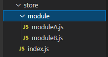

# vite&vue3中使用批量导入 import.meta.glob

> [**Vite官方文档：从v2迁移——`import.meta.glob`**](https://cn.vitejs.dev/guide/migration-from-v2.html#importmetaglob) 
>
> - `import.meta.globEager` 已经弃用，请使用 `import.meta.glob('*', { eager: true })` 来代替。
>
> [**Vite官方文档：Glob 导入形式**](https://cn.vitejs.dev/guide/features.html#glob-import) 

## 例1：引入库

以 Vuex4+ 批量导入store模块为例

假设有如下目录结构



代码：

```js
import { createStore } from 'vuex'
```

导入模块

```js
const files = import.meta.glob('./module/*.js')
```

或者

```js
const files = import.meta.glob('./module/*.js',{eager: true})
```

> 注意，路径需为以 ./ 开头）或绝对路径（以 / 开头，相对于项目根目录解析

`import.meta.glob('*')` 为懒加载导入，构建时，会分离为独立的 chunk

`import.meta.glob('*', { eager: true })` 为直接引入

两者在使用上也有不同的区别

1. `import.meta.glob('*')`懒加载导入

   ```js
   const files = import.meta.glob('./module/*.js')
   const modules = {}
   for (const key in files) {
       files[key]().then(res=>{
           modules[key.replace(/(\.\/module\/|\.js)/g, '')] = res.default
       })
   }
   
   Object.keys(modules).forEach(item => {
       modules[item]['namespaced'] = true
   })
   
   export default createStore({
       modules,
   })
   ```

   如果使用异步导入的方式，会导致一些需要被首先应用的数据无法被获取到，可以根据实际需求，选择不同的导入方式

   > **`key.replace(/(\.\/module\/|\.js)/g, '')`** 
   >
   > 使用正则表达式的`replace`函数将字符串`key`中符合条件的部分替换为空字符串。具体的匹配模式为`/(\.\/module\/|\.js)/g`，其中：
   >
   > - `\.\/module\/`表示匹配字符串中的`./module/`；
   > - `\.js`表示匹配字符串中的`.js`；
   > - `|`表示逻辑或，即匹配`./module/`或`.js`；
   > - `/g`表示替换所有匹配项，而不仅仅是第一个。
   >
   > 在代码执行后，所有匹配到的`./module/`和`.js`都会被替换为空字符串。

2. `import.meta.glob('*', { eager: true })` 直接引入

   ```js
   const files = import.meta.glob('./module/*.js',{eager: true})
   const modules = {}
   for (const key in files) {
       modules[key.replace(/(\.\/module\/|\.js)/g, '')] = files[key].default
   }
   
   Object.keys(modules).forEach(item => {
       modules[item]['namespaced'] = true
   })
   
   export default createStore({
       modules,
   })
   ```


### 总结

1. 引用`createStore`
2. `import.meta.glob('*')` 或 `import.meta.glob('*', { eager: true })` 导入需要导入的文件，注意路径匹配
3. 遍历files，根据导入方式做不同的处理
4. 方法不限于vuex的模块导入，这里只是简单的例子

## 例2：引入语言包

`vue-i18n`插件，创建实例时引入本地语言包文件。

目录结构如下：

```bash
├── src
	├── lang
		├── en
			├── common
				└── index.json
			└──  demo
				└── index.json
		├── zh
			├── common
				└── index.json
			├── demo
				└── index.json
		└── index.js
```

下面是`index.js`文件中，对语言包文件的引入

```js
// 批量引入
const modules = import.meta.glob(["./en/*/index.json", "./zh/*/index.json"], {
  eager: true,
});

console.log(modules);
const en = {};
const zh = {};
for (const key in modules) {
  if (key.indexOf("/en/") !== -1) {
    en[key.replace(/(\.\/en\/|\/index.json)/g, "")] = { ...modules[key] };
  } else if (key.indexOf("/zh/") !== -1) {
    zh[key.replace(/(\.\/zh\/|\/index.json)/g, "")] = { ...modules[key] };
  }
}
console.log({ en, zh });
```

打印结果：

```json
{
    en: {
        common: {
            // ...
        },
        demo: {
            // ...
        }
    },
    zh: {
        common: {
            // ...
        },
        demo: {
            // ...
        }
    }
}
```

