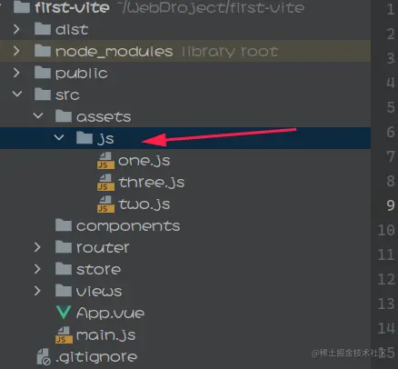
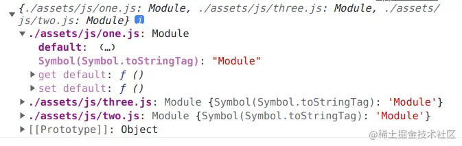
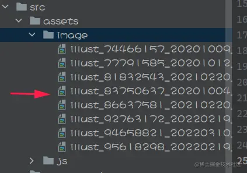
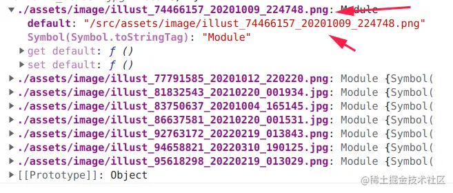

# [Vue3 + Vite批量导入模块 / 资源](https://juejin.cn/post/7074066400670646303) 

在Vue项目开发中，我们常常会导入一些外部的模块，或者是自己写模块导入。

但是模块多了，一个个地导入很显然不是一个好办法，因此我们可以批量导入。

## 1，前置基础知识 - JavaScript模块化编程

在以往开发普通网页程序时，我们直接使用`script`标签引入了js文件即可调用其函数，但是在vue中你发现就不行了，**因为vue也是使用了模块化编程标准。**

通常我们可以把一个封装了很多要复用的函数和变量的js文件称作**模块**，模块必须暴露（导出）其中的变量、函数才能被外部导入并调用其中的函数。

现在常见的模块标准有两个：`CommonJS`和`ES6`。

在这里我们着重讲解`ES6`模块。

### (1) `export`语句 - 暴露函数和变量使外部调用

现在我们自己创建一个js文件表示我们自己的模块，里面封装一些常常复用的函数、变量等等，就需要使用`export`暴露出来。

```javascript
// 导出常量a
export const a = 'test';

// 导出函数myPrint
export function myPrint(msg) {
	console.log('[]' + msg);
}
```

可见在定义变量/函数时在前面加上`export`即可。

除此之外，还可以批量导出：

```javascript
const a = 'test';

function myPrint(msg) {
	console.log('[]' + msg);
}

// 导出常量a和函数myPrint
export {
	a,
	myPrint
};
```

### (2) `import`语句 - 导入变量/函数并使用

上面封装好了函数、变量等等并导出了，但是还是不能直接使用的。需要在要使用的地方进行导入操作：

```javascript
// 导入函数myPrint和常量a
import {
	a,
	myPrint
} from './mymodule.js';

// 使用导入的变量和函数
console.log(a);
myPrint('msg');
```

这样就可以使用了。

可见`import`语法如下：

```javascript
import { 变量1/函数1, 变量2/函数2, 变量3/函数3, ... } from 'js文件路径';
```

需要注意，导入的变量和函数一次可以有多个，用大括号括起来，**并且导入的变量/函数名必须和模块中导出的变量/函数名一致！**

### (3) `import * as xxx`语句 - 全部导入

对于需要导入很多的模块，我们`import`后面需要写一长串的导入的变量和函数，因此我们还可以一次性全部导入。

对于上面的`mymodule`里面导出了一个变量和一个函数，在此我们可以一次性全部导入：

```javascript
// 一次性全部导入该模块的内容并命名为my
import * as my from './mymodules.js';

// 调用模块属性a
console.log(my.a);
// 调用模块函数myPrint
my.myPrint('hhh');
```

可见，用`import * as 名字 from '模块路径'`的方式不仅可以方便地导入一个模块js文件的所有内容，还可以自己定义一个名字以方便调用。

### (4) `export default` - 默认导出

上述的导出方式其实是**命名式导出**，其它文件导入时的变量/函数名必须和模块中导出的变量/函数名一致。

但是有时候不知道我们要导入的js文件中的函数/变量名怎么办呢？

可以使用**默认导出**，即`export default`语句，例如默认导出一个函数：

```javascript
// 默认导出myPrint函数
export default function myPrint(msg) {
	console.log('[]' + msg);
}
```

默认导出后，导入时可以自行命名：

```javascript
// 导入文件中默认导出的函数/变量并命名为p
import p from './mymodule.js';
//使用
p('msg');
```

可见这里没有使用大括号，并且导入时可以自行命名，不需要和原模块中函数名一样。

**注意，一个js文件只能有一个默认导出！不能多次默认导出！**

因此，一个有很多变量和函数的复用模块，我们可以这么写：

```javascript
export default {
	// 变量a
	a: 'a',
	// 函数myPrint
	myPrint() {
		console.log('aa');
	}
}
```

调用时：

```javascript
import m from './mymodule.js';

//使用
console.log(m.a);
m.myPrint();
```

很显然，**这里是直接默认导出了一个大的匿名JavaScript对象，并把变量、函数写在这个对象里面**。然后再导入，调用其中变量/函数即可。

其实在vue开发中，我们用到的很多外部JavaScript的库，都是这么做的。

> 事实上，我们的Vue单文件组件原理不也是这样的？

## 2，在Vite工程中批量导入js模块

在之前的Vue-cli开发中，我们可以使用`require.context()`来实现批量导入。但是由于Vite是完全基于ES6模块的，因此就不能使用这种方式了。

当然，官方也提供了实现批量导入的方式，用`import.meta.glob`或者`import.meta.globEager`函数实现。前者懒加载的导入，后者则为直接导入。今天主要讲解后者。

> [**Vite官方文档：从v2迁移——`import.meta.glob`**](https://cn.vitejs.dev/guide/migration-from-v2.html#importmetaglob) 
>
> - `import.meta.globEager` 已经弃用，请使用 `import.meta.glob('*', { eager: true })` 来代替。
>
> [**Vite官方文档：Glob 导入形式**](https://cn.vitejs.dev/guide/features.html#glob-import) 

例如我现在工程目录下`src/assets/js`下有三个js文件：



现在要在根组件`App.vue`批量导入它们，则在`<script>`部分开头写：

```javascript
const importModules = import.meta.globEager('./assets/js/*.js');
```

这样就导入了`./assets/js`下所有js模块文件。

当然这种方式也可以**匹配多级目录**：

```javascript
const importModules = import.meta.globEager('./assets/js/**/*.js');
```

这样就导入了`./assets/js`下所有js文件及其子目录下的所有js文件。

在这里我们将其导入为一个变量`importModules`，这个变量里面到底是啥呢？我们在`mounted`函数里面打印一下看看：

```javascript
console.log(importModules);
```



可见导入的是一个对象，这个对象中的每个**属性即为模块路径**，而对应的**值中的`default`属性即为导入的模块本身**，模块的函数变量等等都在里面。因此我们可以取导入的变量的每个属性下的`default`属性以调用我们的模块。

举个例子，现在要调用模块`one`中的`print`函数：

```javascript
importModules['./assets/js/one.js'].default.print('hello');
```

到这相信大家又发现问题了：每次调用批量导入的模块，就要用模块的完整路径去取，还需要带上`default`属性，及其不方便。

我们能不能实现就用模块名（js文件名）去取出对应的模块呢？当然可以，事实上方法很多，我来讲一下我的思路。

我们将上述存放导入模块的变量`importModules`中的每个属性名都给用字符串裁剪的方式替换成模块名，并将每个属性对应的值直接替换为它的`default`值不就行了吗？我们来试一下子：

```javascript
// 对批量导入存放模块的对象进行处理
// 先获取其全部属性
const keys = Object.keys(importModules);
// 执行批量替换操作
for (let path of keys) {
	// 裁剪字符串方式得到路径中的文件名（无扩展名）
	let name = path.substring(path.lastIndexOf('/') + 1, path.lastIndexOf('.js'));
	// 对原对象执行添加新的属性并删除旧属性达到处理效果
	importModules[name] = importModules[path].default;
	delete importModules[path];
}
```

现在，我们就可以很方便地进行调用了！

```javascript
// 调用模块one的print
importModules.one.print('hello');
// 打印模块two的name属性
console.log(importModules.two.name);
```

## 3，在Vite工程中批量导入图片/音频等静态资源

在Vite中如果是想要动态绑定图片音频视频等等，也是要用`import`语句的，同样地图片多了，不想一个个地`import`应当怎么做呢？

事实上，我们还可以用`import.meta.globEager`批量导入静态资源例如图片音频等等。

假设现在在`src/assets/image`下有很多图片。



我们仍然可以用上面的方式批量导入：

```javascript
const importImages = import.meta.globEager('./assets/image/*');
```

方式和上面一模一样，只不过这次导入的是静态资源，所以说上述`importImages`的`default`变成了对应资源的路径。

打印看一看：



同样地，我们可以把上述导入的每个`default`部分存起来再使用`v-for`批量呈现，试一下子，整个Vue文件代码如下：

```html
<template>
 <div class="app">
  <!-- 然后就可以批量呈现了 -->
  
 </div>
</template>

<script>
const importImages = import.meta.globEager('./assets/image/*');

export default {
 data() {
  return {
   // 存放批量导入的图片
   images: []
  }
 },
 mounted() {
  // 把导入的对象中每个default属性（对应实际导入的图片）取出来放到data中的变量images中去
  for (let path in importImages) {
   this.images.push(importImages[path].default);
  }
 }
}
</script>
```

效果：


可见Vite中的批量导入非常方便，无论是模块还是资源都可以。对于静态资源，我们是不是还可以用这个批量导入机制，结合我之前写的判断各个资源加载完成的方法的文章，更加简单地实现网站资源加载检测并制作进度条呢？
