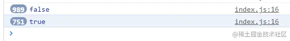
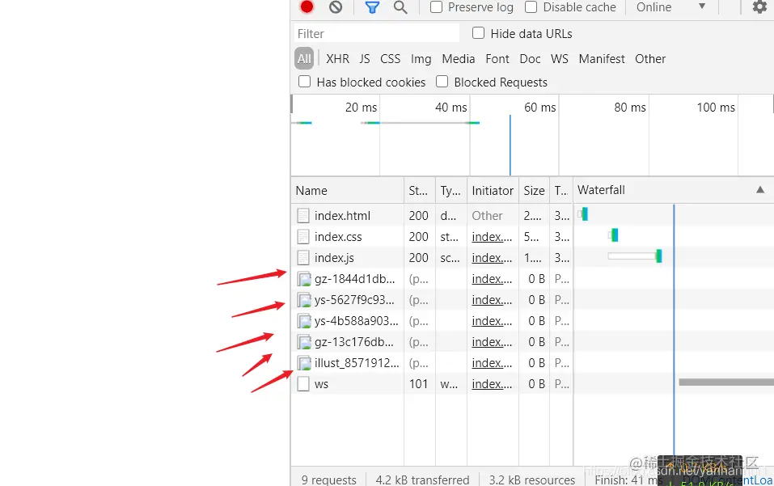

# [JavaScript判断各种资源是否加载完成的方法汇总，资源预加载问题](https://developer.aliyun.com/article/1135711) 

> **[javascript怎么判断页面的全部元素是否加载完成？](https://segmentfault.com/q/1010000004095826)** 
>
> 在页面上DOM元素加载完成可以通过`documentonready`事件来监听
> JS是否加载完毕可以通过监听script的`onreadystatechange`事件来监听
> window `onload`事件将在页面全部资源加载完毕后触发，包括img、link（css），script，Dom元素全部加载完成后触发
> iframe中的资源是否加载完成要在iframe所在的页面中监听，或在其父页面监听`onload`事件
>
> **[vue判断页面是否加载完成后，执行事件](https://blog.csdn.net/weixin_44945942/article/details/108409286)**
>
> 通过定时器，判断document.readyState的状态来执行事件
>
> ```js
> var _this = this
> var timer = setInterval(function () {
>     // 判断文档和所有子资源(图片、音视频等)已完成加载
>     if (document.readyState === 'complete') {
>         //执行方法
>         _this.fn()
>         window.clearInterval(timer)
>     }
> }, 500)
> ```
>
> 

将网站放在服务器后，因为服务器带宽问题，才发现很多资源比如图片、音频在网站打开后1分钟还没有加载，导致无法播放。所以说我决定使用js在最开头加一个判断资源是否加载完成的函数并运行，只有资源全加载完成了才能进入主页面。

在网上查了很多都是说用`onload`，但是这只能判断文档dom树是否解析完成，但是音频、图片等等资源加载完成没是无法判断的。

下面我将来分享我的方案。

## 1，判断音频/视频是否加载完成

音频，视频元素分别是`<audio>`、`<video>`，这两个元素都有`readyState`属性表示其是否加载完成，我们可以获取其属性值，其属性值对应意义如下：

| 值   | 意义                                                         |
| ---- | ------------------------------------------------------------ |
| 0    | HAVE_NOTHING - 没有关于音频/视频是否就绪的信息               |
| 1    | HAVE_METADATA - 关于音频/视频就绪的元数据                    |
| 2    | HAVE_CURRENT_DATA - 关于当前播放位置的数据是可用的，但没有足够的数据来播放下一帧/毫秒 |
| 3    | HAVE_FUTURE_DATA - 当前及至少下一帧的数据是可用的            |
| 4    | HAVE_ENOUGH_DATA - 可用数据足以开始播放                      |

那么，判断该属性值为4时，既可以知道加载完成了。

与此同时，音频和视频元素可以设定其`preload`属性设置其是否预加载，属性值如下：

| 值       | 意义                     |
| -------- | ------------------------ |
| auto     | 当页面加载后载入整个音频 |
| metadata | 当页面加载后只载入元数据 |
| none     | 当页面加载后不载入音频   |

默认这个值是`metadata`，只加载元数据。因此如果想要音频即时使用建议修改其属性为`auto`，然后再来查看其`readyState`属性来判断加载完成没，但这样网页打开可能会慢一点。

例如设定音频为自动加载：

```html
<audio src="./testAudio.wav" preload="auto"></audio>
```

在我的一台很慢的服务器上面通过下列js每秒读取100次一个audio标签是否加载完成：

```js
setInterval(() => {
  console.log(document.querySelector('.succeedAduio-2').readyState);
}, 10);
```

结果如下：


可见一开始没加载好就是0，最后才是4。

根据这个我们就可以知道音频组件是否加载完成，加载完成了才能播放。

视频元素也是一样的。

## 2，图片img元素

img元素不像音视频元素，它没有`readyState`这个属性，不过可以通过其`complete`属性来获取。当图片加载完成时，该属性值为`true`，否则为`false`。

例如我这里有个img元素：

```html

```

还是向上面一样，我用js每秒读取100次该属性：

```js
let img = document.querySelector('img'); //获取img元素
setInterval(() => {
  console.log(img.complete);
}, 10);
```

结果如下：



可见对于img元素，通过其complete属性即可知道是否加载完成。

## 3，div元素的背景图片

div没有上述两个属性，但是对于有背景图片的div元素来说，又应该怎样才能知道其是否加载完成呢？

我们可以通过js获取div的`style.backgroundImage`的值来获取div的背景图片的地址，再以该地址为参数在js创建一个Image对象，Image对象也有`complete`属性，根据新建对象来判断是否加载完成。

在此先写一个函数获取div的背景图片地址：

```js
/**
 * 获取div元素的背景图片地址
 * @param {*} divElement div元素
 */
function getDivImage(divElement) {
  let imgurl = window.getComputedStyle(divElement, null).getPropertyValue('background-image');
  return imgurl.substring(5, imgurl.lastIndexOf('\"'));
}
```

需要说明的是，`window.getComputedStyle`方法可以获取元素所有样式，具体用法可以去MDN上面查看。

例如我有一个div元素：

```html
<div class="divImg"></div>
```

它已经通过css设定了背景图片：

```css
.divImg {
  position: relative;
  width: 200px;
  height: 150px;
  background: url("https://file.moetu.org/images/2021/03/03/ys-4b588a903494b1e90.png") no-repeat center/cover;
}
```

然后我在js中获取这个元素，并通过上述自定义函数获取其背景图片地址，创建Image对象，并每秒读取100次是否加载完成：

```js
let divImg = document.querySelector('.divImg'); //获取div元素
let getImg = new Image(); //新建Image对象
getImg.src = getDivImage(divImg); //给Image元素指定地址
setInterval(() => {
  console.log(getImg.complete);
}, 10);
```

结果如下：


上述测试图都很大，所以可见这加载了大几十秒甚至1分钟才好。

## 4，资源预加载问题

要想实现资源预加载其实很简单，视频音频元素上面有提到，改其`preload`属性为`auto`即可。而图片预加载只需要在js里面创建一个`Image`对象，并指定其`src`即会预加载图片。例如我要预加载我所需的所有图片：

```js
//将所需的图片地址存入一个数组
const imgurls = ['https://file.moetu.org/images/2021/03/04/gz-1844d1db4a9a2d0dc3.png',
  'https://file.moetu.org/images/2021/03/04/ys-5627f9c93bc08ad29.png',
  'https://file.moetu.org/images/2021/03/03/ys-4b588a903494b1e90.png',
  'https://file.moetu.org/images/2021/03/03/gz-13c176dbd1ced48543.png',
  'https://file.moetu.org/images/2021/02/10/illust_85719128_20201120_19253792efd4d4d825d6e1.jpg'
];
//遍历数组中的图片地址并创建Image对象
for (let i = 0; i < imgurls.length; i++) {
  let img = new Image();
  img.src = imgurls[i];
}
```

上述代码中，我们只是用js循环遍历图片地址依次创建Image对象。其实在创建了Image对象并设定了其src属性后，图片就开始加载了！加载好后HTML中调用就无需再次加载，直接使用。

在一个没有写任何元素的HTML中调用这个js脚本执行上诉语句，可以发现虽然页面不显示任何东西，但是已经开始加载图片资源了：



预加载后资源可以即时使用，但是也会相应地使网站速度打开变慢，所以一般不要预加载太多资源。