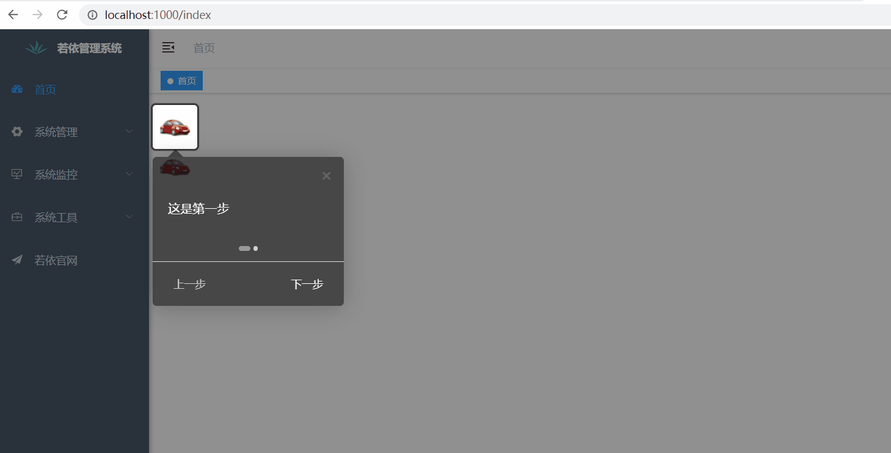

# 使用introjs插件实现页面引导效果（main.js全局引入）及设置Options(设置中文显示)示例

若依前后端分离版手把手教你本地搭建环境并运行项目：

https://blog.csdn.net/BADAO_LIUMANG_QIZHI/article/details/108465662

在上面的基础上，实现页面引导/新手指引的效果如下



## intro.js

官网Hello World!示例： [Hello World!](https://introjs.com/docs/examples/basic/hello-world) 

## 实现

1、插件安装

```js
npm install intro.js --save
```

2、在main.js中全局引入并挂载

```js
import intro from "intro.js"; // introjs库
import "intro.js/introjs.css"; // introjs默认css样式

// introjs还提供了多种主题，可以通过以下方式引入
import "intro.js/themes/introjs-modern.css"; // introjs主题

// 加到prototype中，直接通过vue实例就能调用intro了
Vue.prototype.$intro = intro;
```

3、页面添加元素，并设置data-intro和data-step属性，这里设置引导为两个img

```html
<template>
  <div>
    
    <br />
    
  </div>
</template>
```

4、页面mounted方法中设置Option属性使上一 步、下一步、完成为中文显示，然后调用start()启用

```js
  mounted() {
    this.$intro()
      .setOption("nextLabel", " 下一步 ")
      .setOption("prevLabel", " 上一步 ")
      .setOption("doneLabel", " 完成 ")
      .start();
  },
```

5、其他选项属性参考[官网](https://introjs.com/docs/intro/options).

6、页面完整代码

```vue
<template>
  <div>
    
    <br />
    
  </div>
</template>

<script>
export default {
  name: "intro",
  data() {
    return {};
  },
  mounted() {
    this.$intro()
      .setOption("nextLabel", " 下一步 ")
      .setOption("prevLabel", " 上一步 ")
      .setOption("doneLabel", " 完成 ")
      .start();
  },
  methods: {},
};
</script>

<style scoped lang="scss">

</style>
```