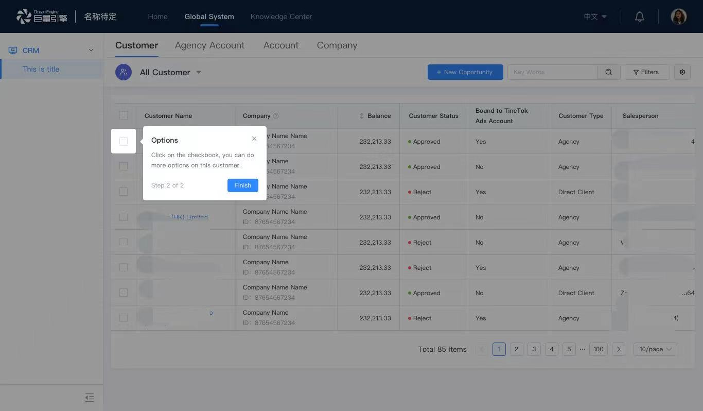
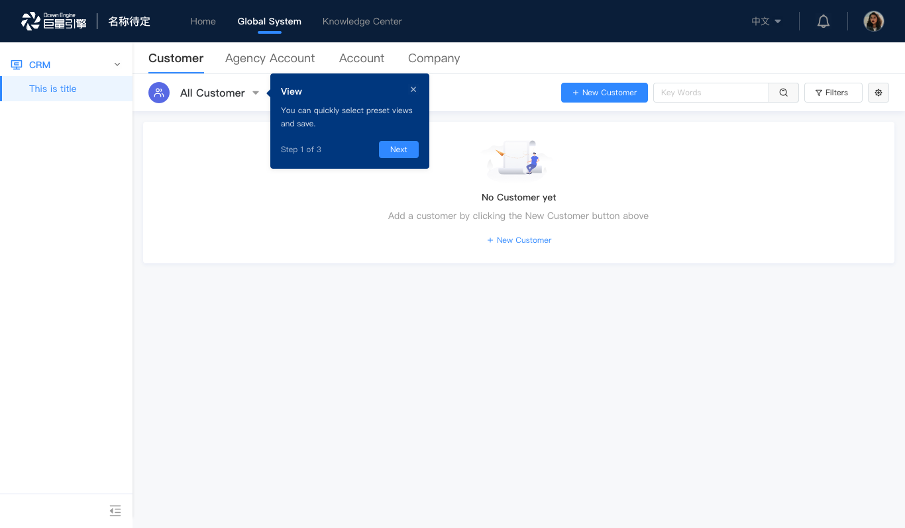

# 其他产品步骤引导库

## vue-intro-step

[vue2版本的组件库](https://github.com/Mjhuu/vue-intro-step) 

[vue3的系统步骤引导组件](https://github.com/Mjhuu/vue3-intro-step) 

## guide

基于 `react` 实现的新手引导组件，用于新功能引导，支持带蒙层/不带蒙层两种模式。

[Hi~ 这将是一个通用的新手引导解决方案（设计方案/思路）](https://juejin.cn/post/6960493325061193735#heading-11) 

源码地址：[gitHub](https://github.com/bytedance/guide)

## 组件推荐及分析

> [**新手引导组件我为什么选 shepherd.js？**](https://juejin.cn/post/7066477408303448100#heading-1) 
>
> 文中提到的组件：
>
> [vue-tour](https://pulsardev.github.io/vue-tour/) [源码地址](https://github.com/pulsardev/vue-tour) 
> [driver.js](https://kamranahmed.info/driver.js/)
> [shepherd.js](https://shepherdjs.dev/)
> [@wytxer/shepherd-vue-（作者封据`shepherd.js`装的组件）](https://github.com/wytxer/shepherd-vue) 参考 [`shepherd.js`官网文档](https://shepherdjs.dev/docs/index.html)

> [**7个很棒的JavaScript产品步骤引导库，不信你用不上**](https://juejin.cn/post/6844904128393510919#heading-12) 
>
> 文中提到的组件：
>
> [Intro.js](https://introjs.com/)
>
> [Shepherd](https://shepherdjs.dev/)
>
> [Bootstrap Tour](https://bootstraptour.com/)
>
> [Chardin.js]() // 地址失效
>
> [PageGuide](http://tracelytics.github.io/pageguide/)
>
> [Hopscotch](https://github.com/LinkedInAttic/hopscotch)
>
> [Tourist.js](https://github.com/easelinc/tourist)

## [vue实现用户指引组件](https://juejin.cn/post/6854573217961476110#comment)

作者依赖 [`html2canvas`](https://github.com/niklasvh/html2canvas) 自己封装了组件，思路独特

