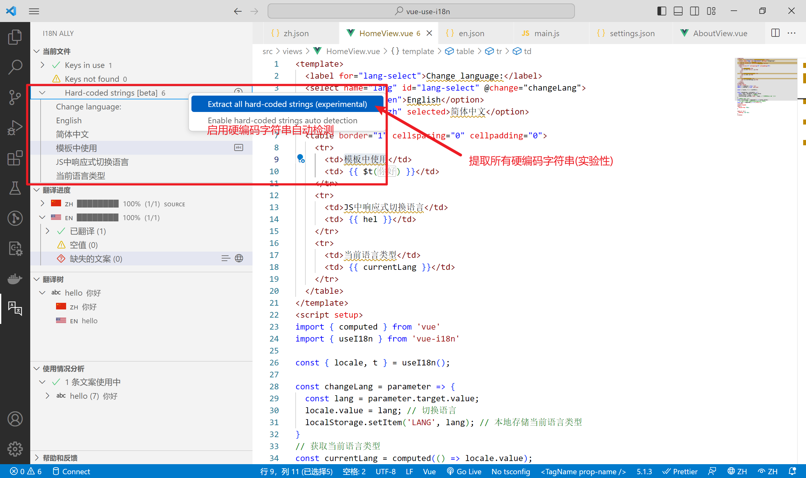

# VSCode插件i18n Ally

[toc]

说明文档：[i18n ally](https://github.com/lokalise/i18n-ally/wiki)

## VSCode中安装`i18n Ally`插件


## 启用 `i18n Ally`

> 前提是项目中需要安装 `vue-i18n` 插件！

## 配置说明

这里有两种方式

1. 在VSCode设置文件中设置
2. 在项目文件中设置（推荐）


**在项目文件中设置：**

项目根目录中找到`.vscode`文件夹，添加`settings.json`

或者自动生成：

> 使用记录中，完成创建实例步骤后，需要重启VSCode，
>
> 又下角弹出如下提示：自动检测到翻译文件夹 "src/lang"
>
> 会在项目根目录`.vscode`目录下，自动新建文件`settings.json`

需手动配置：

> 文件位置：`.vscode/settings.json`
>
> 基本配置说明：[说明文档](https://github.com/lokalise/i18n-ally/wiki/Configurations) 

```json
{
  "i18n-ally.localesPaths": ["src/lang"], // 翻译文件路径 (自动生成) 相对于项目根目录的语言环境目录路径
  // 如下须要手动配置
  "i18n-ally.keystyle": "nested", // 翻译路径格式 (翻译后变量格式 nested：嵌套式  flat:扁平式)
  "i18n-ally.sortKeys": false, // 生成文案key值排序
  "i18n-ally.namespace": true,
  "i18n-ally.enabledParsers": ["json"], // 翻译文件可允许的格式，默认json
  "i18n-ally.sourceLanguage": "zh", // 翻译源语言 (源文件) 根据此语言文件翻译其他语言文件的变量和内容
  "i18n-ally.displayLanguage": "zh", // 显示语言 (显示文件/翻译文件)
  "i18n-ally.translate.engines": ["deepl", "google"], // 翻译器
  "i18n-ally.extract.keygenStyle": "camelCase", // 翻译字段命名样式采用驼峰
  "i18n-ally.enabledFrameworks": ["vue"],
}
```


> 配置好后，若未生效，可尝试右下角的`修改源语言`，
>
> 显示语言（`i18n-ally.displayLanguage`）不要写死，否则显示语言固定，`修改显示语言`不生效
>
> 
>
> 
>
>
> ---
>
> 
>
> 翻译文件可允许的格式(`i18n-ally.enabledParsers`)，填写 `JSON` 或 `YAML` 格式，功能全面。前面创建的两个语言配置文件`zh.json`和`en.json`，所以这里填写`["json"]`
>
> [**支持的语言环境格式**](https://github.com/lokalise/i18n-ally/wiki/Locale-Formats)
>
> | Format（格式） | Read（读） | Write（写） | Annotations（附注） | Note（注意）     |
> | -------------- | ---------- | ----------- | ------------------- | ---------------- |
> | **JSON**       | ✅          | ✅           | ✅                   |                  |
> | **YAML**       | ✅          | ✅           | ✅                   | *评论将不被保留* |
> | **JSON5**      | ✅          | ✅           | ❌                   | *评论将不被保留* |
> | INI            | ✅          | ✅           | ❌                   | *评论将不被保留* |
> | properties     | ✅          | ✅           | ❌                   | *评论将不被保留* |
> | POT            | ✅          | ✅           | ❌                   |                  |
> | JavaScript     | ✅          | ❌           | ❌                   | *只读*           |
> | TypeScript     | ✅          | ❌           | ❌                   | *只读*           |
> | PHP            | ✅          | ❌           | ❌                   | *只读*           |
>
> 
>
> 
>
> ---
>
> 插件的翻译器挂VPN才能使用
>
> 

### 效果

配置完成之后，展示效果如下：

> `EN hello` 之后的图标，依次为：
>
> - 打开审阅：对文案进行批注
> - 翻译文案：在配置中设置的**翻译源语言**（`"i18n-ally.sourceLanguage": "zh"`）是中文，所以对其他语种有翻译功能
> - 编辑文案：对该文案进行快捷编辑
> - 转到定义：跳转到原文件


## 使用说明

打开一个有文字内容的vue文件

打开 `i18n Ally` 的控制面板

## 快捷提取文案（两种操作方式）

> 提取到的文案会写入到显示语言设置的对应翻译文件中：`"i18n-ally.displayLanguage": "zh"`

- 展开`Hard-coded strings [beta]`这一项，可单个提取文案（可以自定义key值）

  

- 右击`Hard-coded strings [beta]`这一项，选择**提取所有**，采用默认key值。

  汉语使用拼音拼接，可在设置中将翻译字段命名样式采用驼峰：`i18n-ally.extract.keygenStyle": "camelCase"`

  

### 提取单个文案

无注意点。


### 提取所有文案

可以看到，template模板中的文案都已被成功替换，但js语法中的替换还是vue2中的语法。


可以选择单个替换，选择对应的替换代码。也可以提取后更改所有匹配项`this.$t`。


`zh.json`中已被成功写入：

```json
{
  "hello": "你好",
  "haHaHa": "哈哈哈",
  "dangQianYuYanLeiXing": "当前语言类型",
  "jsZhongXiangYingShiQieHuanYuYan": "JS中响应式切换语言",
  "moBanZhongShiYong": "模板中使用",
  "jianTiZhongWen": "简体中文",
  "english": "English",
  "changeLanguage": "Change language:"
}
```

## 翻译缺失文案

还有一个是翻译缺失文案的功能，翻译之后可直接将文案添加到对应文件，需要挂VPN才能使用，手动编辑也可以。

> 翻译依据为 ` "i18n-ally.sourceLanguage": "zh"` 设置的翻译源语言
>


> [Magic VPN - 最好的免费代理工具](https://microsoftedge.microsoft.com/addons/detail/magic-vpn-%E6%9C%80%E5%A5%BD%E7%9A%84%E5%85%8D%E8%B4%B9%E4%BB%A3%E7%90%86%E5%B7%A5%E5%85%B7/dgbhmbogkcdheijkkdmfhodkamcaiheo?form=MT001Y&hl=zh-CN&gl=CN) 
>
> Edge浏览器下载插件，再下载客户端，即可挂VPN

### 操作示例

如下，开启VPN后，点击缺失文案，即可依据`zh.json`文件中的JSON字段，将翻译后的文案，自动写入`en.json`文件中。

> 若开启VPN后翻译失败，显示日志打印：
>
> `ERROR: Error: connect ECONNREFUSED 127.0.0.1:xxxxx`
>
> 这是因为使用VSCode打开此项目后才开启VPN的原因，重启VSCode即可。


翻译结果如下：

```json
{
  "hello": "hello",
  "changeLanguage": "Change language:",
  "dangQianYuYanLeiXing": "current language type",
  "english": "English",
  "haHaHa": "Hahaha",
  "jianTiZhongWen": "Simplified Chinese",
  "jsZhongXiangYingShiQieHuanYuYan": "Responsive switching language in JS",
  "moBanZhongShiYong": "used in the template"
}
```

