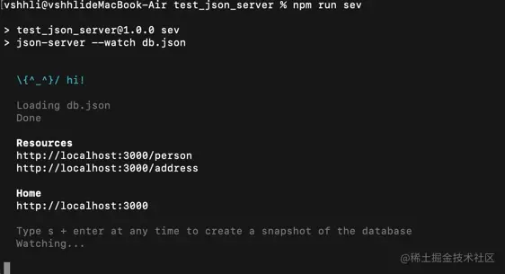
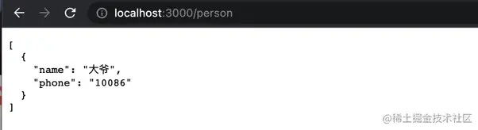

# [详细讲解所有mock数据方案](https://juejin.cn/post/7066811231230754823) 

mock翻译过来是‘模拟’的意思，也就是模拟接口返回的信息，用已有的信息替换接口返回的信息，从而提供仿真环境，实现模拟数据下的功能测试；

mock分为两种：一类是前端对接的mock，一类是涉及后端的mock；

六类常用的mock方案说明

## 1. 直接在代码中写死

直接在代码中写死mock数据，但是正式server环境的切换非常麻烦； 

例如：直接请求本地的JSON数据；

## 2. 接口管理工具

   - swagger：https://swagger.io/
   - moco：https://github.com/dreamhead/moco
   - yapi：https://hellosean1025.github.io/yapi/
   - rap：http://thx.github.io/RAP/index_zh.html
   - Apifox：https://apifox.com/
   - Postman

> 优点：配置功能强大，后端修改mock也跟着改；
>
> 缺点：配置复杂，mock数据都依赖后端控制，增加后端负担；

Apifox：Apifox的中文界面以及简约风格的UI给人一种舒适到极致的体验，在功能上不仅仅提供接口管理，还提供接口调试、自动化测试，还能为接口输入接口文档，强化接口管理，大大提升工作效率；

> 接口管理工具一般会作为大团队的基础建设而存在，小团队或者个人项目没有使用接口管理工具的必要；

## 3. 使用node服务器

   代表：`json-server`、`jsonplaceholder`；

> 优点：配置简单，自定义成都高，增删改查真实模拟；
>
> 缺点：无法随着后端的接口的修改而自动修改；

   Json-server使用

   在windows电脑终端输入：npm install json-server -g (安装全局，局部安装也可)

   在mac电脑：sudo npm install json-server -g (加上sudo是为了解决权限问题)

   然后新建一个文件夹，在终端进入这个文件夹输入 ：npm init

   创建文件db.json,数据如下

   ```js
   {
     "person":[
       {
         "name":"大爷",
         "phone":"10086"
       }
     ],
     "address":[
       {
         "id": 1,
         "info":"天津"
       },
       {
         "id": 2,
         "info":"天津"
       },
       {
         "id": 3,
         "info":"天津"
       }
     ]
   }
   ```

   打开pageage.json在scripts下添加"sev":"json-server --watch db.json"

   在终端运行：npm run dev，可以看到如下图的运行结果：

 然后在浏览器输入 [http://localhost:3000/person](https://link.juejin.cn/?target=http%3A%2F%2Flocalhost%3A3000%2Fperson) 即可访问到person下的数据:



## 4. 请求拦截[mockjs]

通过拦截特定ajax请求，并生成数据模拟后端提供的接口；

使用数据模版定义，随机生成定义数据的自由度大，使用mock.js工具类的方法定义，这种方式自由度小，只能随机出Mock.js提供的数据类型。

通过配合其他库使用或单独在项目中使用或者通过反向代理实现；

以mock.js为例：

```js
//使用格式说明：
Mock.mock(url?,type?,template|function(option))
url:拦截url的地址；
type:拦截的请求类型；
template|function(option):拦截后返回的数据；
//随机生成
Mock.mock('@color')  //#ffffff  随机生成颜色
Mock.mock('@email')  //aaa.com  随机生成邮箱
Mock.mock('@region')  //东北	随机生成区域地址
Random.image()	//随机生成图片 （并可传参配置图片大小、颜色等）
Random.data()/Random.data('yyy-MM-dd')  //2022-02-20 随机生成日期
Random.time()/Mock.mock('@time')  //14:22.23  随机生成时间
Mock.mock({'string|1-10':'**'})	//{'string':'**'}  随机生成数量为1-10个'*'字符串
Mock.mock({'string|3':'***'})		//{'string':'***'} 生成制定数量的'*'字符串
Mock.mock({'number|1-100':100})  //{'number':84} 生成1-100范围内的数字
Mock.mock({'number|1-100.1-10':1})	//{'number':72.4353}  生成1-100的数字，随机保留1-10位小数
/*生成制定数量的数组*/
Mocl.mock('{object|2-4}'{
          '110000':'北京市',
          '120000':'天津市',
          '130000':'河北市',
          '140000':'山西市'
})	//{'object',{'110000':'北京市','120000':'天津市'}}  随机生成对象中的2-4项
/*生成对象数组*/
Mock.mock({
  //list指定了数组当中对象数量，其中1-10个元素
  'list|1-10':[{
    //属性id是一个字增书，起始站为1，每次增1
    'id|+1':1
  }]
})	//{'list':[{'id:1'},{'id':2}]}
```

其他优化：

 在npm script 中增加命令并添加mock环境变量，开发环境用该命令启动。在入口文件中使用mock环境变量判断是否加载mock.js,使mock数据和业务代码彻底分离；

## 5. 抓包工具

   利用Charles、Fidler等代理工具；

   Fidler:截取http和https网络封包、支持重发网络请求，方便后端调试，支持修改完网络请求参数、支持网络请求的截取并动态修改、支持模拟慢速网络；

   Charles:功能与fildder类似，优点是可以自定义网速、External Proxy、反向代理配置简单、可解析AMF协议数据等；

   常见的处理方式有：

    将URL映射到本地文件；（调试APP混合开发等）
    
    debugger某个url，修改响应数据；
    
    拦截后放回本地的数据，若charles，直接采用maplocale或者map Remote的方式

   优点：mock便于混合开发的问题排查、线上问题排查等；

   缺点：调试相对繁琐；

## 6. 组合模式

- easy-mock：https://mock.presstime.cn/

  > （提供在线服务和接口代理，支持mockjs、swagger、restapi风格）

- FastMock：https://www.fastmock.site/#/projects

- node框架生成器+json-server+mockjs。

​	