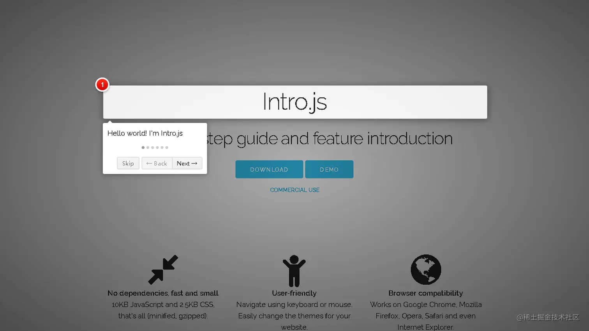
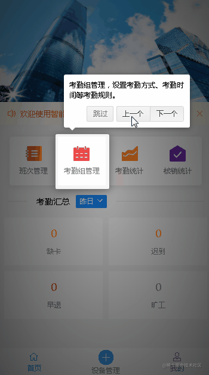

# intro.js实现分步骤帮助引导(utils常用工具封装)

[intro.js](https://introjs.com/docs)不管是在pc端还是手机端，都可以使用。代码将结合vue来实现分步骤帮助引导。



## 安装

```bash
npm install intro.js --save
```

## 新建一个intro.js文件配置intro

`src\utils\intro.js` 

```js
import introJs from 'intro.js'
import 'intro.js/introjs.css'

const intro = introJs()
// 更多配置参数请到官方文档查看
intro.setOptions({
  nextLabel: '下一个',  // 下一个按钮文字
  prevLabel: '上一个',  // 上一个按钮文字
  skipLabel: '跳过',    // 跳过按钮文字
  doneLabel: '立即体验',// 完成按钮文字
  hidePrev: true,       // 在第一步中是否隐藏上一个按钮
  hideNext: true,       // 在最后一步中是否隐藏下一个按钮
  exitOnOverlayClick: false,  // 点击叠加层时是否退出介绍
  showStepNumbers: false,     // 是否显示红色圆圈的步骤编号
  disableInteraction: true,   // 是否禁用与突出显示的框内的元素的交互，就是禁止点击
  showBullets: false          // 是否显示面板指示点
})

export default intro
```

## 使用

### 方式一：使用HTML属性

- data-intro：步骤的提示文本
- data-step：（可选）定义步骤的编号（优先级）
- data-tooltipClass：（可选）为提示定义CSS类
- data-highlightClass：（可选）将CSS类附加到helperLayer
- data-position：定义提示的位置，top，left，right，bottom，bottom-left-aligned（同bottom）， bottom-middle-aligned，bottom-right-aligned或auto（检测元件的位置，并自动分配正确的位置）。默认是bottom
- data-scrollTo：滚动到的元素，element或tooltip。默认值为element。
- data-disable-interaction：是否禁用与突出显示的框内的元素的交互，true或false（也可（1或0））。

```html
<section class="nav-menu">
    <ul>
        <li :data-step="homeSteps.shifts.step" :data-intro="homeSteps.shifts.intro" :data-position="homeSteps.shifts.position" :data-disable-interaction="true">班次管理</li>
        <li :data-step="homeSteps.attendGroup.step" :data-intro="homeSteps.attendGroup.intro" :data-position="homeSteps.attendGroup.position" :data-disable-interaction="true">考勤组管理</li>
        <li :data-step="homeSteps.attendCount.step" :data-intro="homeSteps.attendCount.intro" :data-position="homeSteps.attendCount.position" :data-disable-interaction="true">考勤统计</li>
        <li :data-step="homeSteps.writeOff.step" :data-intro="homeSteps.writeOff.intro" :data-position="homeSteps.writeOff.position" :data-disable-interaction="true">核销统计</li>
    </ul>
</section>
```

```js
import Intro from '@/utils/intro'  // 引入写好的配置文件
export default {
    data () {
        homeSteps: {
          shifts: {
            step: '1',
            intro: '班次管理，配置上下班时间及各种人性化设置。',
            position: 'top'
          },
          attendGroup: {
            step: '2',
            intro: '考勤组管理，设置考勤方式、考勤时间等考勤规则。邀请人功能在这里。',
            position: 'top'
          },
          attendCount: {
            step: '3',
            intro: '考勤统计，随时可查看团队每日/月出勤情况。支持修改打卡结果。',
            position: 'top'
          },
          writeOff: {
            step: '4',
            intro: '核销统计，可查看修改打卡结果的历史记录。',
            position: 'top'
          }
        }
    },
    mounted () {
        if (!localStorage.getItem('isShowHelp')) {
          this.$nextTick(() => {
            // 开始
            Intro.start()
          })
          // 退出引导回调函数
          Intro.onexit(function () {
            localStorage.setItem('isShowHelp', 1)
          })
        }
    }
}
```


### 方式二：使用JSON配置

```html
<section class="nav-menu">
    <ul>
        <li id="step1">班次管理</li>
        <li id="step2">考勤组管理</li>
        <li id="step3">考勤统计</li>
        <li id="step4">核销统计</li>
    </ul>
</section>
```

```js
import Intro from '@/utils/intro'  // 引入写好的配置文件
export default {
    mounted () {
        if (!localStorage.getItem('isShowHelp')) {
          // 配置
          Intro.setOptions({
            steps: [
              {
                element: '#step1',  // 目标元素
                intro: '班次管理，配置上下班时间及各种人性化设置。',   // 提示文本
                position: 'top'     // 提示位置
              },
              {
                element: '#step2',
                intro: '考勤组管理，设置考勤方式、考勤时间等考勤规则。邀请人功能在这里。',
                position: 'top'
              },
              {
                element: '#step3',
                intro: '考勤统计，随时可查看团队每日/月出勤情况。支持修改打卡结果。',
                position: 'top'
              },
              {
                element: '#step4',
                intro: '核销统计，可查看修改打卡结果的历史记录。',
                position: 'top'
              }
            ]
          })
          this.$nextTick(() => {
            // 开始
            Intro.start()
          })
          // 退出引导回调函数
          Intro.onexit(function () {
            localStorage.setItem('isShowHelp', 1)
          })
        }
    }
}
```


